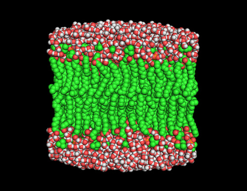

.. E-CAM documentation master file, created by
   sphinx-quickstart on Thu Sep 15 17:56:17 2016.
   You can adapt this file completely to your liking, but it should at least
   contain the root `toctree` directive.

.. _readme_classical_md:

********************
Classical MD Modules
********************

Introduction
============

.. sidebar:: General Information

    .. contents:: :depth: 2

    * :ref:`contributing`
    * :ref:`search`

This is a collection of the modules that have been created by E-CAM_ community
within the area of Classical MD. This documentation is created using
ReStructured Text and the git repository for the documentation source files can
be found at https://gitlab.e-cam2020.eu/e-cam/E-CAM-Library which are
open to contributions from E-CAM members.

In the context of E-CAM, the definition of a software module is any piece of
software that could be of use to the E-CAM community and that encapsulates some
additional functionality, enhanced performance or improved usability for people
performing computational simulations in the domain areas of interest to us.

This definition is deliberately broader than the traditional concept of a module
as defined in the semantics of most high-level programming languages and is
intended to capture inter alia workflow scripts, analysis tools and test suites
as well as traditional subroutines and functions. Because such E-CAM modules
will form a heterogeneous collection we prefer to refer to this as an E-CAM
software repository rather than a library (since the word library carries a
particular meaning in the programming world). The modules do however share with
the traditional computer science definition the concept of hiding the internal
workings of a module behind simple and well-defined interfaces. It is probable
that in many cases the modules will result from the abstraction and refactoring
of useful ideas from existing codes rather than being written entirely de novo.

Perhaps more important than exactly what a module is, is how it is written and
used. A final E-CAM module adheres to current best-practice programming style
conventions, is well documented and comes with either regression or unit tests
(and any necessary associated data). E-CAM modules should be written in such a
way that they can potentially take advantage of anticipated hardware
developments in the near future (and this is one of the training objectives of
E-CAM).

Rare events and path sampling
=============================

In many simulations, we come across the challenge of bridging timescales.
The desire for high resolution in space (and therefore time) is inherently
in conflict with the desire to study long-time dynamics. To study molecular
dynamics with atomistic detail, we must use timesteps on the order of a
femtosecond. However, many problems in biological chemistry, materials
science, and other fields involve events that only spontaneously occur after
a millisecond or longer (for example, biomolecular conformational changes,
or nucleation processes). That means that we would need around
:math:`10^{12}` time steps to see a single millisecond-scale event. This is
the problem of "rare events" in theoretical and computational chemistry.

While modern supercomputers are beginning to make it possible to obtain
trajectories long enough to observe some of these processes (such as
`millisecond dynamics of a protein
<http://pubs.acs.org/doi/abs/10.1021/acs.jpcb.6b02024>`_), even then, we may
only find one example of a given transition. To fully characterize a
transition (with proper statistics), we need many examples. This is where
path sampling comes in. Path sampling approaches obtain many trajectories
using a Markov chain Monte Carlo approach: An existing trajectory is
perturbed (usually using a variant of the "shooting" move), and the
resulting trial trajectory is accepted or rejected according to conditions
that preserve the distribution of the path ensemble. As such, path sampling
is Monte Carlo in the space of paths (trajectories). Conceptually, this
enhances the sampling of transitions by focusing on the transition region
instead of the stable states. In direct MD, trajectories spend much more
time in stable states than in the transition region (exponential population
differences for linear free energy differences); path sampling skips over
that time in the stable states.

The main path sampling approaches used in the modules below are `transition
path sampling <http://aip.scitation.org/doi/abs/10.1063/1.475562>`_ (TPS)
and `transition interface sampling
<http://aip.scitation.org/doi/abs/10.1063/1.1562614>`_ (TIS). In practice,
TPS is mainly used to characterize the mechanism of a transition, while TIS
(which is more expensive than TPS) is used to calculate rates and free
energy landscapes. Overviews of these methods, as well as other rare events
methods, can be found in the following review articles:

* `2010 review by Bolhuis and Dellago in Reviews in Computational Chemistry
  <http://onlinelibrary.wiley.com/doi/10.1002/9780470890905.ch3/summary>`_
* `2008 review by Dellago and Bolhuis in Advances in Polymer Science
  <https://link.springer.com/chapter/10.1007%2F978-3-540-87706-6_3>`_

In addition, several other resources are available on the web to teach path
sampling, including:

* `Wikipedia entry on path sampling
  <https://en.wikipedia.org/wiki/Transition_path_sampling>`_
* `Aaron Dinner's tutorial on path sampling
  <https://sites.google.com/site/aaronskeys/resources/tutorials/transition-path-sampling>`_

Since the problem of bridging timescales, which path sampling addresses, is
a generic one, path sampling can be used in many fields. Indeed, there's
nothing in the methodology that even restricts it to molecular simulation.
However, it is best known in the field of classical MD simulations, where
path sampling methods have shown many successes, including:

* `Mechanisms of complex chemical reactions, such as autoionization of water
  <http://science.sciencemag.org/content/291/5511/2121>`_
* `Mechanism of hydrophobic assembly
  <http://pubs.acs.org/doi/abs/10.1021/jp077186+>`_
* `Evidence that the glass transition is a first-order phase transition
  <http://science.sciencemag.org/content/323/5919/1309>`_
* `Mechanism of crystal nucleation
  <https://journals.aps.org/prl/abstract/10.1103/PhysRevLett.106.085701>`_
* `Mechanism of cavitation <http://www.pnas.org/content/113/48/13582>`_
* `Identifying new mechanisms in catalytic systems
  <http://www.sciencedirect.com/science/article/pii/S0920586105002099>`_
* `Characterization of the conformational dynamics networks in proteins
  <http://www.pnas.org/content/107/6/2397>`_

As computational resources become more powerful, path sampling has the
promise to provide insight into rare events in larger systems, and into
events with even longer timescales. For example:

* Drug/protein binding and unbinding (timescales of minutes), which is
  essential for predicting the efficacy of drugs
* Association processes of proteins (large systems), which is at the core of
  communication in biochemical pathways
* Self assembly processes for complex systems (many intermediates), which
  can be important for the design of new materials

Further, applying the known successes of path sampling methods to larger
systems can also be quite valuable. Path sampling can shed light on the
networks of conformational dynamics for large proteins and protein
complexes, and on the mechanisms and rates of complex reactions and phase
transitions. The range of possibilities is so broad that it is impossible
to enumerate -- both academics and industry will benefit greatly from having
software for these methods.

The modules listed here deal with software to perform path sampling methods,
as well as other approaches to rare events. 

OpenPathSampling
================

Several modules were developed based on 
`OpenPathSampling (OPS) <http://openpathsampling.org>`_. These include modules 
that have been incorporated into the core of OPS, as well as some that remain 
separate projects. The modules that were incorporated into the core are:

.. toctree::
    :glob:
    :maxdepth: 1

    ./modules/OpenPathSampling/ops_path_density/readme
    ./modules/OpenPathSampling/ops_direct_rate_flux/readme
    ./modules/OpenPathSampling/ops_network_input/readme
    ./modules/OpenPathSampling/ops_new_wham/readme
    ./modules/OpenPathSampling/ops_flux_rate_analysis/readme
    ./modules/OpenPathSampling/ops_snapshot_features_1/readme
    ./modules/OpenPathSampling/ops_two_way_shooting/readme
    ./modules/OpenPathSampling/ops_committor_analysis/readme
    ./modules/OpenPathSampling/ops_channel_analysis/readme
    ./modules/OpenPathSampling/ops_new_tis_analysis/readme
    ./modules/OpenPathSampling/ops_resampling_statistics/readme
 
The modules that are based on OPS, but remain separate, are:

.. toctree::
    :glob:
    :maxdepth: 1
   
    ./modules/annotated_trajectories/readme
    ./modules/ops_piggybacker/readme
    ./modules/contact_maps/readme
    ./modules/contact_maps_parallelization/readme
    ./modules/dw_dimer_testsystem/readme
    ./modules/lammps_ops/readme

Nine of these modules were part of 
`E-CAM Deliverable 1.2 <https://www.e-cam2020.eu/deliverables/>`_. Those modules
provided improvements and new features in software for trajectory sampling and 
for studying the thermodynamics and kinetics of rare events.

Pilot Projects
==============

One of primary activity of E-CAM is to engage with pilot projects with industrial partners. These projects are conceived
together with the partner and typically are to facilitate or improve the scope of computational simulation within the
partner. The related code development for the pilot projects are open source (where the licence of the underlying
software allows this) and are described in the modules associated with the pilot projects.

More information on Classical MD pilot projects can be found on the main E-CAM website:

* `Project on binding kinetics <https://www.e-cam2020.eu/pilot-project-biki/>`_
* `Project on food and pharmaceutical proteins <https://www.e-cam2020.eu/pilot-project-food-proteins/>`_

The following modules were developed specifically for the Classical MD pilot projects.

.. toctree::
    :glob:
    :maxdepth: 1

    ./modules/contact_maps/readme
    ./modules/contact_maps_parallelization/readme
    ./modules/contact_concurrences/readme

Extended Software Development Workshops (ESDWs)
===============================================

The first ESDW for the Classical MD workpackage was held in Traunkirchen, 
Austria, in November 2016, with a follow-up to be held in Vienna in April 2017. 
The following modules have been produced:

.. toctree::
    :glob:
    :maxdepth: 1

    ./modules/OpenPathSampling/ops_tse/readme
    ./modules/OpenPathSampling/ops_reactive_flux/readme
    ./modules/OpenPathSampling/ops_maxlikelihood/readme
    ./modules/OpenPathSampling/ops_interface_optimization/readme

The second ESDW for the Classical MD workpackage was held in Leiden, Holland, in 
August 2017. The following modules have been produced:

.. toctree::
    :glob:
    :maxdepth: 1

    ./modules/OpenPathSampling/ops_spring_shooting/readme
    ./modules/OpenPathSampling/ops_sr_shooter/readme
    ./modules/OpenPathSampling/ops_web_throwing/readme
    ./modules/OpenPathSampling/ops_plumed_wrapper/readme
    ./modules/OpenPathSampling/ops_s_shooting/readme

The third ESDW for the Classical MD workpackage was held in Turin, Italy in July
2018. The following have been produced as a result:

.. toctree::
    :glob:
    :maxdepth: 1

    ./modules/HTC/decorators/readme
    ./modules/HTC/configuration/readme
    ./modules/HTC/mpi/readme
    ./modules/HTC/easybuild/readme

.. _E-CAM: https://www.e-cam2020.eu/
