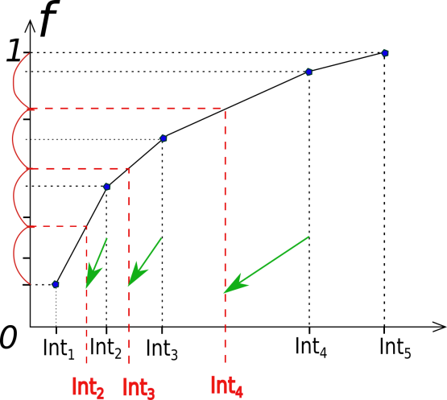

.. _ops_interfaceoptimization:

######################
Interface Optimization
######################

.. sidebar:: Software Technical Information

  The information in this section describes OpenPathSampling as a whole.
  Information specific to the additions in this module are in subsequent
  sections.

  Language
    Python (2.7)

  Documentation Tool
    Sphinx, numpydoc format (ReST)

  Application Documentation
    http://openpathsampling.org

  Relevant Training Material
    http://openpathsampling.org/latest/examples/

  Licence
    LGPL, v. 2.1 or later

.. contents:: :local:

Author: Anastasiia Maslechko

This module consist of functions to evaluate the new values of the interface positions in Transition Interface Sampling (TIS) calculation. Two approaches are implemented (for more details please look in the `Background Information`_).

.. For more details and the syntax for further functionality, see the generic example module in the ``modules/example_module/`` directory (:ref:`example`).

Purpose of Module
_________________

.. Give a brief overview of why the module is/was being created.

In TIS calculations the full path space is investigated through several ensembles by putting the interfaces. For each interface during the simulation crossing probability is evaluated. At the end the reaction rate depends on the  crossing probabilities obtained from each ensemble. Without a full knowledge of the reaction mechanism and information about free energy profile user most likely fails to set up manually initial setting, which are going to lead to the efficient usage of the software resources, and most importantly to low statistical errors in the simulation run.

One of the challenges in Transition Path Sampling is to define a proper `collective variable` (`CV`). Interface-optimization module is a way to improve code performance within selected `CV`.

Background Information
______________________

This module builds on OpenPathSampling, a Python package for path sampling
simulations. To learn more about OpenPathSampling, you might be interested in
reading:

* OPS documentation: http://openpathsampling.org
* OPS source code: http://github.com/openpathsampling/openpathsampling

In the Interface Optimization module a search of the optimal set of the interfaces is done in iterative manner. The key idea is described in the papers (please, see the references below), and the goal is to approach almost the same crossing probabilities in each ensemble:

* Ernesto E. Borrero and Fernando A. Escobedo. Optimizing the sampling and staging for simulations of rare events via forward flux sampling schemes. The Journal of Chemical Physics 129, 024115 (2008); doi: http://dx.doi.org/10.1063/1.2953325
* Ernesto E. Borrero, Marcus Weinwurm, and Christoph Dellago. Optimizing transition interface sampling simulations. The Journal of Chemical Physics 134, 244118 (2011); doi: http://dx.doi.org/10.1063/1.3601919

The first thing to do is to start the simulation for some number of cycles with initial guess (set of interfaces). On the basis of the obtained data analysis is done as follows: values of the current interface positions and the "crossing probabilities" (these are most likely non-converged values due to the least number of cycles) are used in the interface-optimization calculation. Note: termination of the simulation and getting of the interfaces and crossing probabilities must be done by an experimenter. 

The next step is to build a mapping function `f`, which satisfies several properties:

1. The form of the function helps to "equalize" the crossing probabilities on the next simulation run.

2. It is bijective.

3. It is monotonic in order to have inverse image.

The next step is to find the number of the interfaces (`n_int`) to satisfy users requirements. After that we need to divide a region from the starting point til 1 on the ordinate on the `n_int - 1` intervals: by mapping of the obtained points on the function curve we can get a new set of interfaces.

Important functions implemented in this module: 

* ``find_interface_and_cross`` : reads the output of the analyze-tool after a certain number of cycles (defined by the user). Object like `TISTransition`  must be used as an input.

* ``save_n_interfaces`` : a method to calculate the new interface positions, using first approach: the number of interfaces kept the same, only the values of their positions are going to be changed.

* ``save_p_interfaces`` : a method to calculate the new interface positions, using second approach: the number of the interfaces might be changed, "expected" crossing probability for each ensemble has a predefined value.

Testing
_______

Tests in OpenPathSampling use the `nose`_ package.

.. IF YOUR MODULE IS IN OPS CORE:

.. This module has been included in the OpenPathSampling core. Its tests can
.. be run by setting up a developer install of OpenPathSampling and running
.. the command ``nosetests`` from the root directory of the repository.

.. IF YOUR MODULE IS IN A SEPARATE REPOSITORY

The tests for this module can be run by downloading its source code (check the section ``Source Code`` below), installing its requirements, and running the command ``nosetests`` in a root directory (or in particular for the file ``test_interface_optimization.py``).

Examples
________

To check an example look for the file ``toy_mistis_interface_optimization.ipynb`` in the source code (or in the directory ``toy_model_mistis`` from the OPS-examples section). To open it use ``jupyter notebook toy_mistis_interface_optimization.ipynb`` (see Jupyter notebook documentation at http://jupyter.org/ for more details). In order to run it download the data from http://www.dropbox.com/s/qaeczkugwxkrdfy/toy_mistis_1k_OPS1.nc, as described inside of the example-file.

Source Code
___________

.. link the source code

.. IF YOUR MODULE IS IN OPS CORE

.. This module has been merged into OpenPathSampling. It is composed of the
.. following pull requests:

.. * link PRs

.. IF YOUR MODULE IS A SEPARATE REPOSITORY

The source code for this module can be found in: https://gitlab.e-cam2020.eu:10443/Classical-MD_openpathsampling/Interface.

.. CLOSING MATERIAL -------------------------------------------------------

.. Here are the URL references used

.. _nose: http://nose.readthedocs.io/en/latest/

