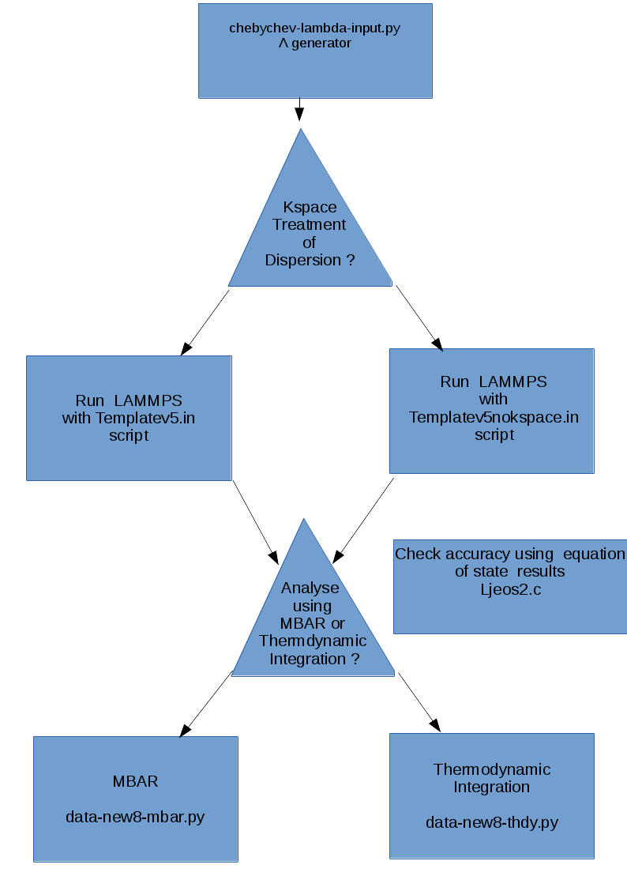

.. _Particle_Insertion_core:

#######################
Particle Insertion Core
#######################

.. sidebar:: Software Technical Information

  This is the core module for the particle insertion suite of codes

  Languages
    C, Python 2.7, LAMMPS Scripting language

  Licence
    MIT -however note that LAMMPS is now changing from GPL to  LGPL so when used
    together with LAMMPS LGPL applies

  Documentation Tool
    ReST

  Application Documentation
    See `PIcore repository <https://gitlab.e-cam2020.eu/mackernan/particle_insertion/tree/master/PIcore>`_

  Relevant Training Material
    None

.. contents:: :local:

.. Add technical info as a sidebar and allow text below to wrap around it

Purpose of the Module
_____________________

This software module computes the change in free energy associated with the insertion
or deletion of Lennard Jones particles in dilute or dense
conditions in a variety of Thermodynamic Ensembles, where statistical sampling through
molecular dynamics is performed under `LAMMPS <https://lammps.sandia.gov/>`_ but
will be extended to other molecular dynamics engines at a later date. Lennard-Jones
type interactions are the key source of
difficulty associated with particle insertion or deletion, which is why this module
is a core module, as other interactions including
Coulombic and bond, angle and dihedral interactions will be added in a second module.
It differs from the main community approach used to
date to compute such changes as it does not use soft-core potentials. Its key
advantages over soft-core potentials are: (a) electrostatic interactions
can in principle be performed simultaneously
with particle insertion (this and other functionalities will be added in a new module);
and, (b) essentially exact long-range dispersive interactions
using `dispersion Particle Mesh Ewald <https://doi.org/10.1063/1.4764089>`_ (PMME)  or
EWALD if desired  can  be selected at runtime  by  the user.

Background Information
______________________

Particle insertion can be used to compute the free energy associated with
hydration/drying, the insertion of cavities in fluids/crystals,
changes in salt levels, changes in solvent mixtures, and alchemical changes such as the
mutation of amino-acids.   in crystals. It can also
be used to compute the free energy of solvent mixtures and the addition of salts, which
is used in the purification processing
industrially, for instance in the purification of pharmaceutical active ingredients.
Particle insertion can in principle also be
used to compute the free energy associated with changes in the pH, that is the proton
transfer from a titratable site to the bulk,
for example in water. 

Our approach consists  of rescaling the effective size of inserted atoms through a
parameter  :math:`\lambda` so that all interactions between
nserted atoms and  interactions between inserted atoms and atoms already present in
the system are zero when  :math:`\lambda = 0`,  creating at most an
integrable singularity which we can safely handle.  In the context of Lennard-Jones
type pair potentials,
our approach at a mathematical level is similar to Simonson, who investigated the
mathematical conditions required to `avoid the
singularity of insertion <https://doi.org/10.1080/00268979300102371>`_. It turns out
that a non-linear dependence of the
interaction on  :math:'\lambda'  between inserted
atoms and those already present is required (i.e. a simple linear dependence on
:math: '\lambda' necessarily introduces a singularity).

This module and  upcoming modules include computing the free energy changes associated
with the following applications

   (a) hydration and drying;
   (b) the addition of multiple molecules into a condenses environment;
   (c) residue mutation and alchemy;
   (d) constant pH simulations, this also will also exploit modules created in E-CAM
       work package 3 (quantum dynamics); and,
   (e) free energy changes in chemical potentials associated with changes in solvent
       mixtures.
    

    
    
General Formulation
___________________

Consider a  system consisting of :math:`N+M` degrees of freedom  and the Hamiltonian

.. math::
  H(r,p,\lambda) =&H_0 + KE_{insert} +  \Delta V(r, \lambda)

where :math:`H_0` corresponds to an unperturbed Hamiltonian, and the perturbation
:math:`\Delta V(r, \lambda)` depends
nonlinearly on a control parameter :math:`\lambda`. The first set of N degrees of
freedom is denoted by A and the second
set of  M degrees of freedom is denoted by B.  To explore equilibrium properties of
the system, thermostats, and barostats
are used to sample either the NVT (canonical) ensemble or the NPT (Gibbs) ensemble. The
perturbation is devised so that
when  :math:`\lambda = 0`, :math:`\Delta V(r, \lambda) = 0`, B is in purely virtual.
When :math:`\lambda = 1`, B
corresponds to a  fully physical augmentation of the original system.

In the present software module, we consider only interaction Lennard Jones atoms. 

.. math::
  \Delta V(r,\lambda) = V_{lj}(r,\lambda)

where for each inserted atom i

.. math::
  \hat{\sigma}( \lambda)_i &= \lambda \sigma_i   \\

  \hat{\epsilon}( \lambda)_i &= \lambda \epsilon_i   \\

  

and the mixing rule for Van der Waals diameters and binding energy between different
atoms uses the geometric mean.
The dependence of :math:`\sigma` on :math:`\lambda` has the  consequence that the mean 
:math:`\sigma` between a pair of inserted atoms scales as :math:`\lambda`, but scales
as :math:`\sqrt{\lambda}` when one atom in the pair is
inserted and the other is already present. These choices of perturbations guarantees
that the particle insertion and deletion catastrophes are avoided.

Algorithms
__________

At the core of the PI core module there are four functions/codes.  The first written
in python generates the interpolation points  which are
the zero's of suitably transformed Chebyshev functions. 

The second code written ln LAMMPS scripting language performs the simulation in
user-defined ensembles at the selected
interpolation values of :math:'lambda', at a user-specified frequency, computing
two-point central difference estimates of derivatives of the
potential energy needed for thermodynamic integration,  computing the energy
functions for all values of :math:'lambda' in the context of MBAR.  The user
also specifies the locations of the inserted particles.
The user also specifies whether 
Particle Mesh Ewald or EWALD  should be used for dispersive interactions. 

The third code written in python takes the output data from LAMMPS, prepares it so
that free energy differences in the
selected ensemble can be computed using MBAR provided by the pymbar suite of
Python codes of the Chodera group.

The fourth code, also written in python take the LAMMPS output and performs the
thermodynamic integration.

Source Code
___________

All files can be found in the ``PIcore`` subdirectory of the
`particle_insertion git repository <https://gitlab.e-cam2020.eu/mackernan/particle_insertion>`_.

Compilation and Linking
_______________________

See `PIcore README <https://gitlab.e-cam2020.eu/mackernan/particle_insertion/tree/master/PIcore/README.rst>`_
for full details.
    
Scaling  and Performance
________________________

As the module uses LAMMPS, the performance and scaling of this module should
essentially be the same, provided data for thermodynamic integration and
MBAR are not generated too often, as is demonstated below. In the case of thermodynamic
integration, this is due to the central difference approximation of derivatives, and
in the case
of MBAR, it is due to the fact that many virtual moves are made which can be extremely
costly if the number of interpolating points is large. Also, when using
PMME, the initial setup cost is computationally expensive, and should, therefore, be
done as infrequently as possible. A future module in preparation will
circumvent the use of central difference approximations of derivatives. The scaling
performance of PI-CORE was tested on Jureca multi node.
The results for weak scaling (where the number of core and the system size are
doubled from 4 to 768 core) are as follows.

Weak Scaling:

==================  ===========  
Number of MPI Core  timesteps/s
==================  ===========
4                   1664.793 
8                   1534.013
16                  1458.936
24                  1454.075
48                  1350.257
96                  1301.325 
192                 1263.402
384                 1212.539 
768                 1108.306
==================  ===========

and for the strong scaling (where the number of core are doubled from 4 to 384 but the
system size is fixed equal to 768 times the original system
size considered for one core/processor for weak scaling) Strong Scaling:

==================  =============  
Number of MPI Core  timesteps/s 
==================  =============
4                   9.197
8                   17.447
16                  34.641
24                  53.345
48                  104.504
96                  204.434
192                 369.178
384                 634.022
==================  =============
