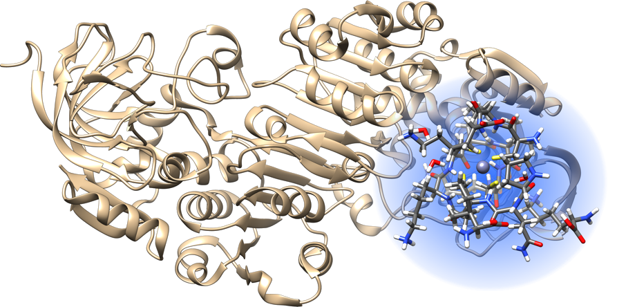

.. E-CAM documentation master file, created by
   sphinx-quickstart on Thu Sep 15 17:56:17 2016.
   You can adapt this file completely to your liking, but it should at least
   contain the root `toctree` directive.

.. sidebar:: General Information

    .. contents:: :depth: 2

    * :ref:`contributing`
    * :ref:`search`

.. _readme_electronic_structure:

****************************
Electronic Structure Modules
****************************

Introduction
============

This is a collection of the modules that have been created by E-CAM community within the area of Electronic Structure. This documentation is created using ReStructured Text and the git repository for the documentation 
source files can be found at 
https://gitlab.e-cam2020.eu/e-cam/E-CAM-Library which are
public and open to contributions.

In the context of E-CAM, the definition of a software module is any piece of software that could be of use to the E-CAM community and that encapsulates some additional functionality, enhanced performance or improved usability for people performing computational simulations in the domain areas of interest to us. 

This definition is deliberately broader than the traditional concept of a module as defined in the semantics of most high-level programming languages and is intended to capture inter alia workflow scripts, analysis tools and test suites as well as traditional subroutines and functions. Because such E-CAM modules will form a heterogeneous collection we prefer to refer to this as an E-CAM software repository rather than a library (since the word library carries a particular meaning in the programming world). The modules do however share with the traditional computer science definition the concept of hiding the internal workings of a module behind simple and well-defined interfaces. It is probable that in many cases the modules will result from the abstraction and refactoring of useful ideas from existing codes rather than being written entirely de novo.

Perhaps more important than exactly what a module is, is how it is written and used. A final E-CAM module adheres to current best-practice programming style conventions, is well documented and comes with either regression or unit tests (and any necessary associated data). E-CAM modules should be written in such a way that they can potentially take advantage of anticipated hardware developments in the near future (and this is one of the training objectives of E-CAM). 

Extended Software Development Workshops
=======================================
    
ESDW Zaragoza 2016
------------------

The first Electronic Structure ESDW in Zaragoza in June 2016 was the starting point for the modules below.

.. toctree::
    :glob:
    :maxdepth: 1

    ./modules/MatrixSwitch/readme
    ./modules/libOMM/readme
    ./modules/FDF/readme
    ./modules/pspio/readme
    ./modules/escdf/readme
    ./modules/poke/readme
    ./modules/sqare-grids-doc/readme
    ./modules/sqare-ode-doc/readme
    ./modules/sqare-states-doc/readme
    ./modules/esl-demo/readme

ESDW San Sebastian 2016
-----------------------

The ESDW in San Sebastian in September 2016 was the starting point for the modules below.

.. toctree::
    :glob:
    :maxdepth: 1

    ./modules/Symmetry-Adapted-Wannier-Functions/readme
    ./modules/Wannier90-TB-Interface/readme
    ./modules/Non-Collinear-Spin/readme
    ./modules/Adaptively-Refined-Mesh/readme
    ./modules/FORD-Documentation-Tool-Integration/readme
    ./modules/Improvement-Wannier90-Z2pack-Interface/readme
    ./modules/Improvements-Makefiles/readme
    ./modules/Use_WS_Distance/readme
    ./modules/Test-Suite-Travis-CI-Integration/readme

ESDW Lausanne 2018
------------------

The ESDW in Lausanne in February 2018 was the starting point for the modules below.

.. toctree::
    :glob:
    :maxdepth: 1

    ./modules/esl-bundle/readme
    ./modules/ELPA_easyblock/readme

ESDW Dublin 2019
-----------------

The ESDW in Dublin in January 2019 was the starting point for the modules below.

.. toctree::
    :glob:
    :maxdepth: 1

    ./modules/esl-easyconfigs/readme
    ./modules/ELSI/readme

Other Modules
-------------

Modules not coming from ESDWs

.. toctree::
     :glob:
     :maxdepth: 1

     ./modules/flook/readme
     ./modules/libgridxc/readme
     ./modules/libvdwxc/readme
     ./modules/MatrixSwitchDBCSR/readme

Pilot Projects
==============

One of primary activity of E-CAM is to engage with pilot projects with industrial partners. These projects are conceived
together with the partner and typically are to facilitate or improve the scope of computational simulation within the
partner. The related code development for the pilot projects are open source (where the licence of the underlying
software allows this) and are described in the modules associated with the pilot projects.

Below is a list of the modules developed directly within the context of the pilot projects within E-CAM:
  
.. toctree::
    :glob:
    :maxdepth: 1
                                                                                    
    ./modules/Geomoltools/readme   
    ./modules/GRASP_Sampling/readme   
    ./modules/GROMACS_interface/README   
    ./modules/Gaussian_interface/README   
    ./modules/Selectively-Localized-Wannier-Functions/readme
    ./modules/Gaussian_interface/README  
    ./modules/Differential_Evolution/README  
    ./modules/Gaussian_interface/README
    ./modules/WLRR/README   
    ./modules/SCDM_WFs/readme
    ./modules/W90_MaX_collab/readme
    ./modules/W90_solution_booklet/readme
    ./modules/FFTXlib/readme
    ./modules/W90_cube_format_non-orthogonal/readme
    ./modules/miniPWPP/readme
    ./modules/PANNA-GVECT/readme
    ./modules/PANNA-TFR/readme
    ./modules/PANNA-TRAIN/readme
    ./modules/PANNA-EVAL/readme
    ./modules/PANNA-Charges/readme

.. _E-CAM: https://www.e-cam2020.eu/
