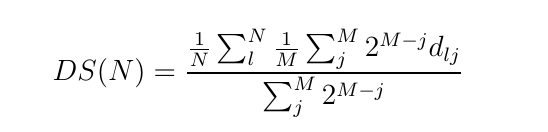
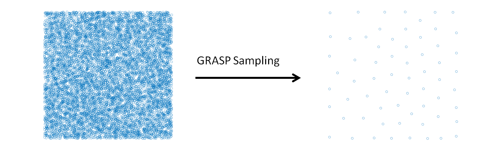

####################
GRASP Sampling
####################

.. sidebar:: Software Technical Information

  Language
    C

  Licence
    MIT

  Documentation Tool
    Doxygen

Purpose of the Module
_____________________

This module performs a stratified sampling of the configurations, described by vectors, of a system to build a representative training set in a fitting procedure. Given a list of candidate configurations, and selected the size (N) of the training set required, the module executes the combinatorial optimization that maximizes the following dissimilarity score (DS) among the elements of the training set: 

In this formula, the j-th configuration in the sum is the j-th nearest one to the l-th configuration and :math:`d_{lj}` is the Euclidean distance between the l-th and j-th configurations. M is the number of the nearest configurations considered in the score. The exponential weight makes the score near independent from the particular value of M, if it is larger than 4-6.

The combinatorial optimization that maximizes the dissimilarity score is performed using the GRASP algorithm. A stratified sampling can be performed without a combinatorial optimization using classical statistical techniques (for example Latin hypercube sampling), the GRASP sampling becomes useful when the selection is restricted to a predeterminated set of configurations, generated or sampled with specific internal constrains. This is the case of the molecular configurations generated in a molecular dynamics simulation.

Background Information
______________________

The GRASP algorithm is illustrated in the paper "Feo T. A., Resende M. G., Greedy randomized adaptive search procedures. Journal of global optimization 6, 109-133 (1995)". The application of the GRASP algorithm to perform a stratified sampling is described in the work "Force Field Parametrization of Metal Ions from Statistical Learning Techniques. J. Chem. Theory Comput., 2018, 14(1), pp 255-273".

Input/Output Structure
______________________

The input file, "candidates.txt", must have the form of an array :math:`N_{Sample} \times N_{dim}`, where :math:`N_{Sample}` is the number of the candidates and :math:`N_{dim}` is the dimension of the vectors. The application of the algorithm provides the files "solution_v_A_B.txt" and "solution_i_A_B.txt" that includes the selected configurations and the corresponding indeces respectively. "A" and "B" in the files of the solutions are the number of the selected configurations in the current application of the algorithm and the total number of configurations included in the solutions. A and B can differ because the algorithm can be applied in cumulative mode. The parameters of the algorithm are set in the file "input.gra" (an example is provided in the repository).

Source Code
___________

The source code of the algorithm is included in the "grasp.c" file. To compile the code execute the Makefile. The GNU Scientific Library is necessary.

Testing
_______

In the example of the "candidates.txt" file are collected 10000 two-dimensional vectors generated randomly, the application of the module produces the selection of a stratified subset that covers all the space of the basin sample. This can be appreciated observing the scatter plot of the two sets. The command to run the test is 

 $ ./grasp

provided that the "candidates.txt" and "input.gra" files are in the same directory of the executable file. Examples of "candidates.txt" and "input.gra" files are provided in the ./test directory. The name of "input.gra" file cannot be changed, while the name of file where the candidate configurations are defined must be indicated in the first line of the "input.gra" file. 

 

