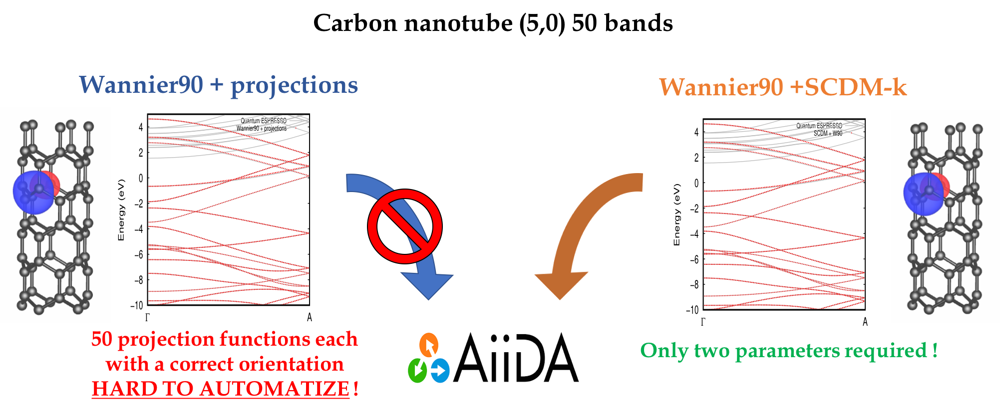

..  sidebar:: Software Technical Information

  Name
    Selected columns of density matrix Wannier functions

  Language
    Fortran95

  Licence
    `GPL <https://opensource.org/licenses/gpl-license>`_ 

  Documentation Tool
    `Ford <http://fortranwiki.org/fortran/show/FORD>`_ online link to different Wannier90 source files `<http://www.wannier.org/ford/>`_

  Application Documentation
    Wannier90 `User guide pdf <http://www.wannier.org/doc/user_guide.pdf>`_ and Quantum-ESPRESSO `documentation <http://www.quantum-espresso.org/wp-content/uploads/Doc/user_guide/>`_

  Relevant Training Material
    'Not currently available.'

  Software Module Developed by
    Valerio Vitale

..  In the next line you have the name of how this module will be referenced in the main documentation (which you  can
    reference, in this case, as ":ref:`example`"). You *MUST* change the reference below from "example" to something
    unique otherwise you will cause cross-referencing errors. The reference must come right before the heading for the
    reference to work (so don't insert a comment between).

.. _SCDM_in_Wannier90:

######################
SCDM Wannier Functions
######################

..  Let's add a local table of contents to help people navigate the page

..  contents:: :local:

..  Add an abstract for a *general* audience here. Write a few lines that explains the "helicopter view" of why you are
    creating this module. For example, you might say that "This module is a stepping stone to incorporating XXXX effects
    into YYYY process, which in turn should allow ZZZZ to be simulated. If successful, this could make it possible to
    produce compound AAAA while avoiding expensive process BBBB and CCCC."

Purpose of Module
_________________

.. Keep the helper text below around in your module by just adding "..  " in front of it, which turns it into a comment

.. Give a brief overview of why the module is/was being created, explaining a little of the scientific background and how

Wannier90 [1]_ is a post-processing tool for the computation of the Maximally Localised Wannier Functions (**MLWFs**) [2]_ [3]_ [4]_, which have been increasingly adopted by the electronic structure community for different purposes.  The reasons are manifold: **MLWFs** provide an insightful chemical analysis of the nature of bonding,
and its evolution during, say, a chemical reaction. They play for solids a role similar to localized orbitals in molecular systems. In the condensed matter community, they are used  in the construction of model Hamiltonians for, e.g., correlated-electron and magnetic systems.
Also, they are pivotal in first-principles tight-binding Hamiltonians, where chemically-accurate Hamiltonians are constructed directly on the Wannier basis, rather than fitted or inferred from macroscopic considerations, and many other applications, e.g. dielectric response and polarization in materials, ballistic transport, analysis of phonons, photonic crystals, cold atom lattices, and the local dielectric responses of insulators, for reference see [2]_.
This module is a first step towards automation of **MLWFs**. In the original Wannier90 framework, automation of **MLWFs** is hindered by the difficult step of choosing a set of initial localized functions with the correct symmetries and centers to use as initial guess for the optimization. As a result, high throughput calculations (**HTC**) and big data analysis with **MLWFs** have proved to be problematic to implement. 

The SCDM-k method [5]_ removes the need for an initial guess altogether by using information contained in the single-particle density matrix. In fact, the columns of the density matrix are localised in real space, 
:math:`\rho(\mathbf{r},\mathbf{r'}) \propto \exp\left[-\gamma|\mathbf{r} - \mathbf{r'}|\right]` 
and can be used as a vocabulary to build the localised Wannier Functions. The SCDM-k method can be used in isolation to generate well localised WFs. More interestingly, is the possibility of coupling the SCDM-k method to Wannier90. The core idea is to use WFs generated by the SCDM-k method as initial guess in the optimisation procedure within Wannier90.
This module is a big step towards automation of Wannier Functions and simplification of the use of the Wannier90 program. The module is therefore   intendedfor all the scientists that benefit from the use of Wannier Functions in their research. Furthermore, by making the code more accessible and easier to use, this module will certainly increase the popularity of the Wannier90 code.  

The module is part of the pw2wannier interface between the popular quantum ESPRESSO code `link <http://www.quantum-espresso.org>`_ and Wannier90. It will be part of the next version of quantum ESPRESSO v.6.3 and Wannier90. Moreover, it has been successfully added in a developer branch of the `AiiDA <http://www.aiida.net>`_ workflow [6]_ to perform **HTC** on large material datasets.

.. [1] Com. Phys. Comm. **178**, 685-699 (2008)
.. [2] Rev. Mod. Phys. **84**, 1419 (2012)
.. [3] Phys. Rev. B **56**, 12847 (1997)
.. [4] Phys. Rev. B **65**, 035109 (2001)
.. [5] J.Comp.Phys. **334**, 1-15 (2017)
.. [6] Comp. Mat. Sci. **111**, 218-230 (2016)

Background Information
______________________

.. Keep the helper text below around in your module by just adding "..  " in front of it, which turns it into a comment

Wannier90 source code is available from the eponymous git-hub repository `<http://github.com/wannier-developers/wannier90>`_, which contains the official repository. Documentation about the source code is done via FORD, an online version of this documentation is available `online <http://www.wannier.org/ford/>`_. Instrunction on how to install Wannier90 on a variety of architectures may be found in the `user guide <http://www.wannier.org/doc/user_guide.pdf>`_. Quantum ESPRESSO source code is available from the git-hub repository `<https://github.com/QEF/q-e>`_, and a very detailed web documentation may be found `here <http://www.quantum-espresso.org/wp-content/uploads/Doc/user_guide/>`_. Instruction for the installation of the python-based AiiDA workflow are available online at `<http://aiida-core.readthedocs.io/en/stable/>`_. 

Building and Testing
____________________

.. Keep the helper text below around in your module by just adding "..  " in front of it, which turns it into a comment

For building the module one "simply" has to compile the quantum ESPRESSO program (v.6.2 and later), since the actual routine is inside the ``pw2wannier90.f90`` interface. This will produce the executable ``pw2wannier90.x``. Instructions on how to achieve this are given in the quantum ESPRESSO web documentation.
For testing the module one also needs the wannier.x executable.

Source Code
___________

.. Notice the syntax of a URL reference below `Text <URL>`_ the backticks matter!

* `Link to a merge request containing my source code changes
  <https://github.com/wannier-developers/wannier90/pull/167>`_

* `Link to the pull request for the documentation and examples
  <https://github.com/wannier-developers/wannier90/pull/194>`_

* `Link to my feature branch
  <https://github.com/VVitale/wannier90/tree/SCDM_WFs>`_
