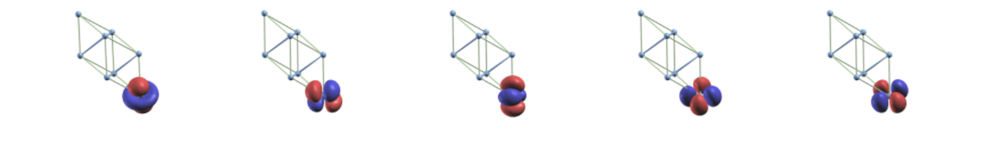

#######################################
Selectively-Localized-Wannier-Functions
#######################################

..  sidebar:: Software Technical Information

  Name
    Selectively Localized Wannier Functions

  Language
    Fortran90

  Licence
    `GPL <https://opensource.org/licenses/gpl-license>`_ 

  Documentation Tool
    `Ford <http://fortranwiki.org/fortran/show/FORD>`_ online link to different Wannier90 source files `<http://www.wannier.org/ford/>`_

  Application Documentation
    Wannier90 `User guide pdf <http://www.wannier.org/doc/user_guide.pdf>`_ and `Tutorial pdf <http://www.wannier.org/doc/tutorial.pdf>`_

  Relevant Training Material
    'Not currently available.'

  Software Module Developed by
    Valerio Vitale

..  In the next line you have the name of how this module will be referenced in the main documentation (which you  can
    reference, in this case, as ":ref:`example`"). You *MUST* change the reference below from "example" to something
    unique otherwise you will cause cross-referencing errors. The reference must come right before the heading for the
    reference to work (so don't insert a comment between).

.. _SLWFs_in_Wannier90:

..  Let's add a local table of contents to help people navigate the page

..  contents:: :local:

..  Add an abstract for a *general* audience here. Write a few lines that explains the "helicopter view" of why you are
    creating this module. For example, you might say that "This module is a stepping stone to incorporating XXXX effects
    into YYYY process, which in turn should allow ZZZZ to be simulated. If successful, this could make it possible to
    produce compound AAAA while avoiding expensive process BBBB and CCCC."

Purpose of Module
_________________

.. Keep the helper text below around in your module by just adding "..  " in front of it, which turns it into a comment

.. Give a brief overview of why the module is/was being created, explaining a little of the scientific background and how

This module is part of bundle to extend the capabilities of the Wannier90 code [1]_. In particular, here we have implemented the
algorithm from Marianetti "*et al.*" [2]_ to generate selectively localized Wannier functions which extend the method of Marzari 
and Vanderbilt [3]_ in two important ways: 1) it allows the user to focus on localizing a subset of orbitals of interest and 
2) to fix centres of these orbitals ensuring the preservation of the point-group symmetry. These features 
are very important when Wannier functions are used in beyond-density-functional-theory methods, such as DMFT, to study transport properties 
of novel technological relevant materials.

The module is part of the Wannier90 code. 

.. [1] Comput. Phys. Commun. **185**, 2309 (2014)
.. [2] Phys. Rev. B **90**, 165125 (2014)
.. [3] Phys. Rev. B **56**, 12847 (1997)

Background Information
______________________

.. Keep the helper text below around in your module by just adding "..  " in front of it, which turns it into a comment

Wannier90 source code is available from the eponymous git-hub repository `<http://github.com/wannier-developers/wannier90>`_, which contains the official repository. Documentation about the source code is done via FORD, an online version of this documentation is available `online <http://www.wannier.org/ford/>`_. Instructions on how to install Wannier90 on a variety of architectures may be found in the `user guide <http://www.wannier.org/doc/user_guide.pdf>`_. Quantum ESPRESSO source code is available from the git-hub repository `<https://github.com/QEF/q-e>`_, and a very detailed web documentation may be found `here <http://www.quantum-espresso.org/wp-content/uploads/Doc/user_guide/>`_. Instruction for the installation of the python-based AiiDA workflow are available online at `<http://aiida-core.readthedocs.io/en/stable/>`_. 

Building and Testing
____________________

.. Keep the helper text below around in your module by just adding "..  " in front of it, which turns it into a comment

For building the module one "simply" has to compile the Wannier90 code as explained in the online documentation. This will produce the executable ``wannier90.x``, which contains the module.

Source Code
___________

.. Notice the syntax of a URL reference below `Text <URL>`_ the backticks matter!

* `Link to a merge request containing my source code changes
  <https://github.com/wannier-developers/wannier90/pull/187>`_

* `Link to my feature branch
  <https://github.com/VVitale/wannier90/tree/Marianetti>`_
