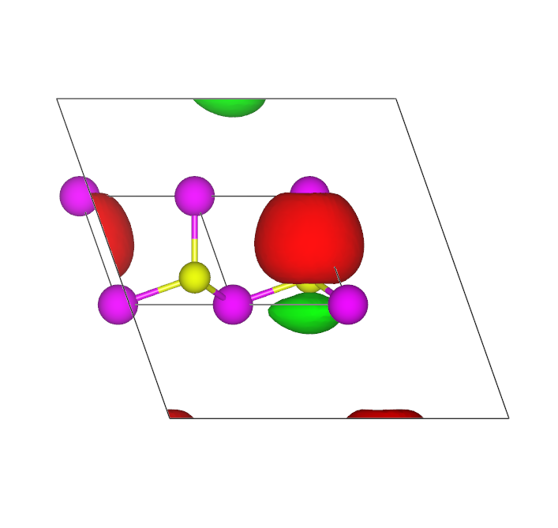

##############################
W90_cube_format_non-orthogonal
##############################

..  sidebar:: Software Technical Information

  Name
    Cube format files for non-orthogonal cells

  Language
    Fortran90

  Licence
    `GPL <https://opensource.org/licenses/gpl-license>`_ 

  Documentation Tool
    `Ford <http://fortranwiki.org/fortran/show/FORD>`_ online link to different Wannier90 source files `<http://www.wannier.org/ford/>`_

  Application Documentation
    Wannier90 `User guide pdf <https://github.com/wannier-developers/wannier90/raw/v3.0.0/doc/compiled_docs/user_guide.pdf>`_ and `Tutorial pdf <https://github.com/wannier-developers/wannier90/raw/v3.0.0/doc/compiled_docs/tutorial.pdf>`_ and `Solution booklet pdf <https://github.com/wannier-developers/wannier90/raw/v3.0.0/doc/compiled_docs/solution_booklet.pdf>`_

  Relevant Training Material
    Training material is accessible via tests and examples as well as a tutorial and its solutions.
    

  Software Module Developed by
    Valerio Vitale

..  In the next line you have the name of how this module will be referenced in the main documentation (which you  can
    reference, in this case, as ":ref:`example`"). You *MUST* change the reference below from "example" to something
    unique otherwise you will cause cross-referencing errors. The reference must come right before the heading for the
    reference to work (so don't insert a comment between).

.. _Cube_format_files_for_cells_with_non-orthogonal_lattice_vectors:

..  Let's add a local table of contents to help people navigate the page

..  contents:: :local:

..  Add an abstract for a *general* audience here. Write a few lines that explains the "helicopter view" of why you are
    creating this module. For example, you might say that "This module is a stepping stone to incorporating XXXX effects
    into YYYY process, which in turn should allow ZZZZ to be simulated. If successful, this could make it possible to
    produce compound AAAA while avoiding expensive process BBBB and CCCC."

    
In many situations it is crucial to inspection the symmetries and shapes of the Wannier functions. To this end, one needs to use a visualisation program such as VESTA or VMD. One of the most popular format to encode volumetric data is the GAUSSIAN CUBE format, which is supported by virtually all molecular visualization programs. This module extends the cability of Wannier90 in generating output files in the CUBE format for periodic calculations with non-orthogonal unit cells.  

Purpose of Module
_________________

.. Keep the helper text below around in your module by just adding "..  " in front of it, which turns it into a comment

.. Give a brief overview of why the module is/was being created, explaining a little of the scientific background and how

This modules allows the User to output volumetric data, e.g. the Wannier functions on a real grid, in the GAUSSIAN CUBE format even when the unit cell of the periodic calculation is defined by non-orthogonal lattice vectors.

The module is part of the Wannier90 code [1]_. 

.. [1] Comput. Phys. Commun. **185**, 2309 (2014)

Background Information
______________________

.. Keep the helper text below around in your module by just adding "..  " in front of it, which turns it into a comment

Wannier90 source code is available from the official repository on Git-hub `<http://github.com/wannier-developers/wannier90>`_. Documentation of the source code is done via the FORD program, an online version of this documentation is available `online <http://www.wannier.org/ford/>`_. Instructions on how to install Wannier90 on a variety of architectures may be found in the `user guide <https://github.com/wannier-developers/wannier90/raw/v3.0.0/doc/compiled_docs/user_guide.pdf>`_.

Building and Testing
____________________

.. Keep the helper text below around in your module by just adding "..  " in front of it, which turns it into a comment

For building the module one "simply" has to compile the Wannier90 code as explained in the online documentation. This will produce the executable ``wannier90.x``, which contains the module. The source code can be found in the src folder within the plot.F90 module.

Source Code
___________

.. Notice the syntax of a URL reference below `Text <URL>`_ the backticks matter!

* `Link to a merge request containing my source code changes
  <https://github.com/wannier-developers/wannier90/pull/162>`_

