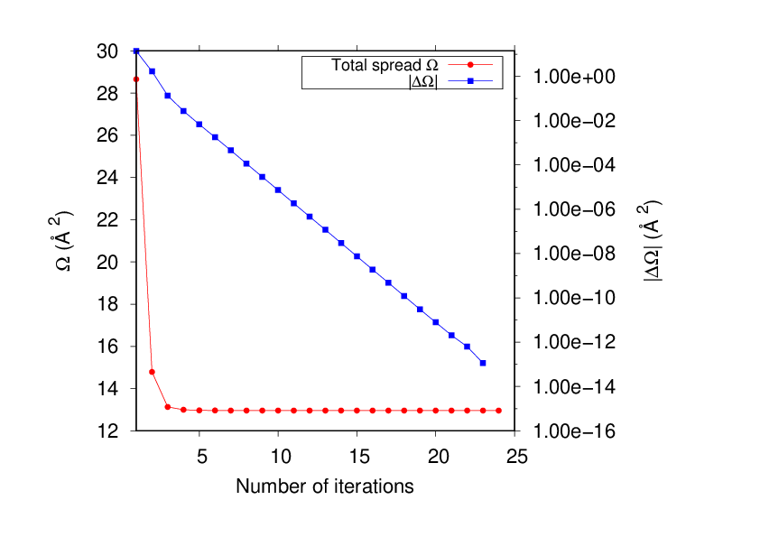

#######################################
W90_solution_booklet
#######################################

..  sidebar:: Software Technical Information

  Name
    Wannier90 Solution Booklet

  Language
    LaTeX

  Licence
    `GPL <https://opensource.org/licenses/gpl-license>`_ 

  Documentation Tool

  Application Documentation
    `Solution booklet pdf <https://github.com/wannier-developers/wannier90/raw/v3.0.0/doc/compiled_docs/solution_booklet.pdf>`_

  Relevant Training Material
    'Not currently available.'

  Software Module Developed by
    Valerio Vitale

..  In the next line you have the name of how this module will be referenced in the main documentation (which you  can
    reference, in this case, as ":ref:`example`"). You *MUST* change the reference below from "example" to something
    unique otherwise you will cause cross-referencing errors. The reference must come right before the heading for the
    reference to work (so don't insert a comment between).

.. _W90_Solution_booklet:

..  Let's add a local table of contents to help people navigate the page

..  contents:: :local:

..  Add an abstract for a *general* audience here. Write a few lines that explains the "helicopter view" of why you are
    creating this module. For example, you might say that "This module is a stepping stone to incorporating XXXX effects
    into YYYY process, which in turn should allow ZZZZ to be simulated. If successful, this could make it possible to
    produce compound AAAA while avoiding expensive process BBBB and CCCC."

    This module is a pedagogical tool for the Wannier90 User's community. It is a detailed document showing the expected results for each of the 21 example in the Wannier90 distribution. In doing so, it shows most of the features of the Wannier90 code and facilitates the understanding of the outputs.

Purpose of Module
_________________

.. Keep the helper text below around in your module by just adding "..  " in front of it, which turns it into a comment

.. Give a brief overview of why the module is/was being created, explaining a little of the scientific background and how

This is the solution booklet for the 21 examples in the Wannier90 (v2.1) Tutorial. It is a comprehensive LaTeX document that for each example describes in details the commands that need to be run and the expected outputs, with texts, plots and figures. Moreover, in the text we tried to addresses most of the issues raised by Users in the Wannier90 mailing list. This module is mostly aimed at reducing the steepness of the learning curve for new Users. 

The module is part of the Wannier90 code [1]_. 

.. [1] Comput. Phys. Commun. **185**, 2309 (2014)

Background Information
______________________

.. Keep the helper text below around in your module by just adding "..  " in front of it, which turns it into a comment

Wannier90 source code is available from the following Git-hub repo `<http://github.com/wannier-developers/wannier90>`_, which contains the official repository. Documentation about the source code is done via FORD, an online version of this documentation is available `online <http://www.wannier.org/ford/>`_. Instructions on how to install Wannier90 on a variety of architectures may be found in the `user guide <https://github.com/wannier-developers/wannier90/raw/v3.0.0/doc/compiled_docs/user_guide.pdf>`_. Quantum ESPRESSO source code is available from the git-hub repository `<https://github.com/QEF/q-e>`_, and a very detailed web documentation may be found `here <http://www.quantum-espresso.org/Doc/user_guide/>`_. 

Building and Testing
____________________

.. Keep the helper text below around in your module by just adding "..  " in front of it, which turns it into a comment

For generating the PDF file for the solution booklet one has to navigate to the doc/solution_booklet/ folder and type "make". This will produce the ``solution_booklet.pdf`` file, which contains the compiled text. You will need pdflatex and bibtex to be installed.

Source Code.
___________

.. Notice the syntax of a URL reference below `Text <URL>`_ the backticks matter!

* `Link to a merge request containing my source code changes
  <https://github.com/wannier-developers/wannier90/pull/233>`_

* `Link to my feature branch
  <https://github.com/VVitale/wannier90/tree/Errata_solution_booklet>`_
