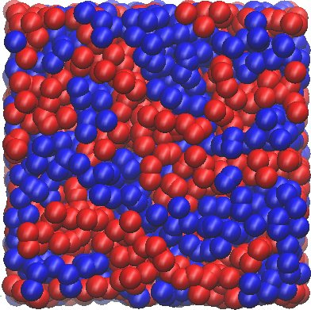

.. E-CAM documentation master file, created by
   sphinx-quickstart on Thu Sep 15 17:56:17 2016.
   You can adapt this file completely to your liking, but it should at least
   contain the root `toctree` directive.

.. sidebar:: General Information

    .. contents:: :depth: 2

    * :ref:`contributing`
    * :ref:`search`

.. _readme_meso_multi:

*****************************
Meso- and Multi-scale Modules
*****************************

Introduction
============

This is a collection of the modules that have been created by E-CAM community 
within the area of Meso- and Multi-scale Modelling. This documentation is 
created using ReStructured Text and the git repository for the documentation 
source files can be found at 
https://gitlab.e-cam2020.eu/e-cam/E-CAM-Library which are
public and open to contributions.

In the context of E-CAM, the definition of a software module is any piece of software that could be of use to the E-CAM community and that encapsulates some additional functionality, enhanced performance or improved usability for people performing computational simulations in the domain areas of interest to us. 

This definition is deliberately broader than the traditional concept of a module as defined in the semantics of most high-level programming languages and is intended to capture inter alia workflow scripts, analysis tools and test suites as well as traditional subroutines and functions. Because such E-CAM modules will form a heterogeneous collection we prefer to refer to this as an E-CAM software repository rather than a library (since the word library carries a particular meaning in the programming world). The modules do however share with the traditional computer science definition the concept of hiding the internal workings of a module behind simple and well-defined interfaces. It is probable that in many cases the modules will result from the abstraction and refactoring of useful ideas from existing codes rather than being written entirely de novo.

Perhaps more important than exactly what a module is, is how it is written and used. A final E-CAM module adheres to current best-practice programming style conventions, is well documented and comes with either regression or unit tests (and any necessary associated data). E-CAM modules should be written in such a way that they can potentially take advantage of anticipated hardware developments in the near future (and this is one of the training objectives of E-CAM). 

Pilot Projects
==============

One of primary activity of E-CAM is to engage with pilot projects with industrial partners. These projects are conceived
together with the partner and typically are to facilitate or improve the scope of computational simulation within the
partner. The related code development for the pilot projects are open source (where the licence of the underlying
software allows this) and are described in the modules associated with the pilot projects.

Software related to Extended Software Development Workshops
===========================================================

DL_MESO_DPD
-----------

The following modules connected to the DL_MESO_DPD code have been produced so far:

.. toctree::
    :glob:
    :maxdepth: 1

    ./modules/DL_MESO_DPD/dipole_dlmeso_dpd/readme
    ./modules/DL_MESO_DPD/format_dlmeso_dpd/readme
    ./modules/DL_MESO_DPD/dipole_af_dlmeso_dpd/readme
    ./modules/DL_MESO_DPD/moldip_af_dlmeso_dpd/readme
    ./modules/DL_MESO_DPD_onGPU/add_gpu_version/readme
    ./modules/DL_MESO_DPD_onGPU/fftw/readme
    ./modules/DL_MESO_DPD/check_dlmeso_dpd/readme
    ./modules/DL_MESO_DPD_onGPU/Ewald/readme
    ./modules/DL_MESO_DPD/tetra_dlmeso_dpd/readme
    ./modules/DL_MESO_DPD_onGPU/multi_gpu/readme
    ./modules/DL_MESO_DPD/sionlib_dlmeso_dpd/readme

ESPResSo++
----------

The following modules connected to the ESPResSo++ code have been produced so far in the context of an `associated Pilot Project <https://www.e-cam2020.eu/pilot-project-composite-materials/>`_:

.. toctree::
    :glob:
    :maxdepth: 1

    ./modules/hierarchical-strategy/components/fixed-local-tuple/readme
    ./modules/hierarchical-strategy/components/md-softblob/readme
    ./modules/hierarchical-strategy/components/minimize-energy/readme
    ./modules/hierarchical-strategy/components/constrain-com/readme
    ./modules/hierarchical-strategy/components/constrain-rg/readme
    ./modules/hierarchical-strategy/simple_one-component_melts/fbloop/readme
    ./modules/hierarchical-strategy/simple_one-component_melts/reinsertion/readme
    ./modules/hierarchical-strategy/simple_one-component_melts/fine-graining/readme
    ./modules/hierarchical-strategy/simple_one-component_melts/coarse-graining/readme

These modules have resulted in the final overarching module that captures the goal of the pilot project:

.. toctree::
    :glob:
    :maxdepth: 1

    ./modules/hierarchical-strategy/simple_one-component_melts/readme

ParaDiS
-------

The following modules connected to the ParaDiS code have been produced so far:

.. toctree::
    :glob:
    :maxdepth: 1

    ./modules/paradis_precipitate/paradis_precipitate_GC/readme
    ./modules/paradis_precipitate/paradis_precipitate_HPC/readme

GC-AdResS 
---------

This modules are connected to the Adaptive Resolution Simulation implementation in GROMACS. 

.. toctree::
    :glob:
    :maxdepth: 1

    ./modules/GC-AdResS/Abrupt_AdResS/readme
    ./modules/GC-AdResS/AdResS_RDF/readme
    ./modules/GC-AdResS/Abrupt_Adress_forcecap/readme
    ./modules/GC-AdResS/AdResS_TF/readme
    ./modules/GC-AdResS/LocalThermostat_AdResS/readme
    ./modules/GC-AdResS/Analyse_Tools/readme
    ./modules/GC-AdResS/Analyse_VACF/readme
    ./modules/GC-AdResS/Analyse_DACF/readme
    ./modules/GC-AdResS/Analyse_ENERGY/readme

.. _ALL_background:

ALL (A Load-balancing Library)
------------------------------

Most modern parallelized (classical) particle simulation programs are based on a spatial decomposition method as an
underlying parallel algorithm: different processors administrate different spatial regions of the simulation domain and
keep track of those particles that are located in their respective region. Processors exchange information

* in order to compute interactions between particles located on different processors
* to exchange particles that have moved to a region administrated by a different processor.

This implies that the workload of a given processor is very much determined by its number of particles, or, more
precisely, by the number of interactions that are to be evaluated within its spatial region.

Certain systems of high physical and practical interest (e.g. condensing fluids) dynamically develop into a state where
the distribution of particles becomes spatially inhomogeneous. Unless special care is being taken, this results in a
substantially inhomogeneous distribution of the processors’ workload. Since the work usually has to be synchronized
between the processors, the runtime is determined by the slowest processor (i.e. the one with highest workload). In the
extreme case, this means that a large fraction of the processors is idle during these waiting times. This problem
becomes particularly severe if one aims at strong scaling, where the number of processors is increased at constant
problem size: Every processor administrates smaller and smaller regions and therefore inhomogeneities will become more
and more pronounced. This will eventually saturate the scalability of a given problem, already at a processor number
that is still so small that communication overhead remains negligible.

The solution to this problem is the inclusion of dynamic load balancing techniques. These methods redistribute the
workload among the processors, by lowering the load of the most busy cores and enhancing the load of the most idle ones.
Fortunately, several successful techniques are known already to put this strategy into practice. Nevertheless, dynamic
load balancing that is both efficient and widely applicable implies highly non-trivial coding work. Therefore it has has
not yet been implemented in a number of important codes of the E-CAM community, e.g. DL_Meso, DL_Poly, Espresso,
Espresso++, to name a few. Other codes (e.g. LAMMPS) have implemented somewhat simpler schemes, which however might turn
out to lack sufficient flexibility to accommodate all important cases. Therefore, the ALL library was created in the
context of an Extended Software Development Workshop (ESDW) within E-CAM (see `ALL ESDW event details <https://www.e-cam2020.eu/legacy_event/extended-software-development-workshop-for-atomistic-meso-and-multiscale-methods-on-hpc-systems/>`_
), where code developers of CECAM community codes were invited together with E-CAM postdocs, to work on the
implementation of load balancing strategies. The goal of this activity was to increase the scalability of these
applications to a larger number of cores on HPC systems, for spatially inhomogeneous systems, and thus to reduce the
time-to-solution of the applications.

.. toctree::
    :glob:
    :maxdepth: 1

    ./modules/ALL_library/tensor_method/readme
    ./modules/ALL_library/staggered_method/readme
