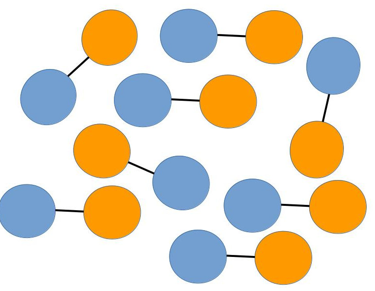

.. _dimers:

##########################
Test case: a dimer solvent
##########################

Here we describe a physical system in which the software modules dealing with
charge dipole moments in DPD simulations can be tested.
It is a *polarizable fluid* made of harmonically bonded dimers
:math:`(+q,-q)`, pictorially represented on the left (not in scale).
Fixing appropriately the partial charge :math:`q`
and the Bjerrum length :math:`l_B`, this system mimics *water in an oil
background*, as long as the dielectric properties are concerned.

We recall that the electric permittivity is :math:`\epsilon_0` for vacuum, and
:math:`\epsilon<\epsilon_0` for a medium. The medium effect can be split into
a background and a relative term :math:`\epsilon/\epsilon_0=\epsilon_b\epsilon_r`.
The background is constant and uniform, whereas the explicit term is due to
dynamic microscopic objects (dimers in this case) which carry a charge dipole
moment. The strength of electrostatic interactions in a background is set by the bare Bjerrum length :math:`l_B=e^2/(4
\pi\epsilon_0 \epsilon_b k_BT)`. On the other hand, from linear response theory, the bulk value of the relative permittivity is
:math:`\epsilon_r = 1 + \frac{\langle\vec{P}^2\rangle_{\vec{E}=\vec{0}}}{3\epsilon_0\epsilon_{b}\, k_BT\,V}`,
where tin-foil boundary conditions are assumed.
      
Two types of beads are present in the simulation, `solp` and `solm`, the solvent positive
and negative partial charges, respectively. We fix the bare Bjerrum length 
:math:`l_B=42` (appropriate for oil [1]_), the repulsion parameter :math:`A=25`, the harmonic spring
constant :math:`k=5`, the bead density :math:`\rho=3`, the partial charges :math:`|q|=0.46` and the Gaussian
smearing length :math:`\sigma=0.5`. All quantities are given in DPD units,
where :math:`k_BT=1`, :math:`r_c=1` and :math:`m=1`.
This fluid has a relative permittivity :math:`\epsilon_r\simeq 40`, as can be checked
using the ``gen_dipole.f90`` utility. This value is compatible with the ratio
of water and oil permittivities :math:`\epsilon^{water}/\epsilon^{oil}\simeq 40`.

The FIELD file defining the composition and interactions for a system of
volume :math:`V=64` is

.. literalinclude:: ./FIELD

.. [1] Notice that the physical length scale is set choosing :math:`r_c`: if we choose :math:`r_c=0.646nm`
       (appropriate to match water density at room temperature if :math:`N_m=3`, i.e., one bead represents
       three water molecules), the Bjerrum length of oil in DPD units is :math:`l_B=27 nm\simeq 42 r_c`,
       hence the value given above for the oil background.

