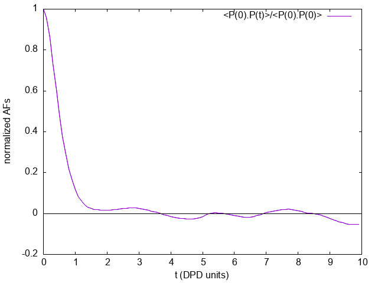

.. _dipole_af:

#######################################################################
Autocorrelation functions of charge dipole moments in DL_MESO_DPD
#######################################################################

.. sidebar:: Software Technical Information

  Language
    FORTRAN 90

  Licence
    BSD

  Documentation Tool
    RST and LaTex-generated .pdf file

  Application Documentation
    :download:`Click to download the manual <manaf.pdf>` with more details

  Relevant Training Material
    See the Testing section

.. contents:: :local:	      
	      

Purpose of Module
_________________

This module, ``gen_dipoleaf.f90``, is a generalization of the ``dipoleaf.f90`` post-processing
utility of DL_MESO_DPD, the Dissipative Particle Dynamics (DPD) code from the DL_MESO_ package.

It processes the trajectory (HISTORY) files to obtain the charge dipole moments
of all the (neutral) molecules in the system, and subsequently computes
the dipole autocorrelation functions (DAFs) for each molecule type.
It produces a file `DIPAFDAT` containing both the un-normalized and normalized
DAFs, and, optionally, a file `DIPAFFFT` containing the
Fourier transform (FT) of the latter.

The module can be applied to systems including molecules with a generic charge structure, as long
as each molecule is neutral (otherwise the charge dipole moment would be
frame-dependent) [1]_. **CAVEAT**: this module only analyzes molecular trajectories. If a charged molecule
is present, an error message will be given, while unbonded charges would not be
detected and would lead to erroneous results. Therefore please keep in mind
**to not apply** the module to systems with unbonded charges.

The charge dipole moment of a neutral molecule is :math:`\vec{p}_{mol}=\sum_{i\in mol}q_i \vec{r}_i` where
:math:`\vec{r}_i` are the bead positions and :math:`q_i` their charges. The
total charge dipole moment of the simulated volume :math:`V` is
:math:`\vec{P}=\sum_{mol\in V} \vec{p}_{mol}`.
If more than one molecular species are present, one can split :math:`\vec{P}`
into the different species contributions: :math:`\vec{P}=\sum_{j = 1}^{nmoldef} \vec{P}_j`.

Given a scalar quantity `A`, its non-normalized autocorrelation function (AF)
is :math:`C_{AA}(t) = \langle A(0)A(t)\rangle`, where :math:`\langle\dots\rangle`
indicates an average over trajectories. The normalized one is 
:math:`c_{AA}(t) = \frac {\langle A(0)A(t)\rangle}{\langle A(0)A(0)\rangle} = \frac{C_{AA}(t)}{C_{AA}(0)}` [2]_.

Here for the :math:`j` -th molecular species we replace :math:`A` with
:math:`\vec{P}_j`, and the product with a scalar product. 
In this case the average over trajectories translates into a sum over different time origins.
      
The output file `DIPAFDAT` contains the DAFs for each molecular species and,
at the end of the file, the DAF for the system *total* charge dipole moment :math:`\vec{P}`.
The output file `DIPAFFFT` contains the FT of these functions, in the same order.

More in detail, the header of the file `DIPAFDAT` contains the simulation title and a line with the
number of snapshots in HISTORY and of those used for the AFs (`naf`). Then a block follows for each
molecule type, started by the *{molecule name}*, then three columns of data, 
:math:`t, C_{\vec{P}\vec{P}},c_{\vec{P}\vec{P}}`. 
It is intended that in any block only the contribution to :math:`\vec{P}` from
a given species is used. The last block is called *{all species}*
and refers to the full system charge dipole moment.
      
The header of the file `DIPAFFFT` is as for `DIPAFDAT` (notice that
the number of points for the FT is also set equal to `naf`). Then a block follows for each
molecule type, started by the molecule name, then three columns of data, 
:math:`\omega, \Re e[\hat{c}_{\vec{P}\vec{P}}(\omega)], \Im m[\hat{c}_{\vec{P}\vec{P}}(\omega)]`,
where :math:`\hat{c}` is the discrete FT of :math:`c(t)`. 
     
Possible uses of the output file are: to analyze it to obtain the decay time of
autocorrelations, which can be used to define an efficient sampling of the
simulation; to compare it with the analogous microscopic one obtained for individual
molecules (see :ref:`moldip_af`).

Background Information
______________________

The base code for this module is DL_MESO_DPD, the Dissipative Particle
Dynamics code from the mesoscopic simulation package DL_MESO_,
developed by M. Seaton at Daresbury Laboratory.
This open source code is available from STFC under both academic (free) and
commercial (paid) licenses. The module is to be used with DL_MESO
in its last released version, version 2.6 (dating November 2015).

Also, the present module requires the library FFTW_ (version 3.x) to be installed.

Testing
_______

The present module ``gen_dipoleaf.f90`` is compiled with the available Fortran90 compiler, e.g.:

``gfortran -lfftw3 -lm -o gen_dipoleaf.exe gen_dipoleaf.f90``

and the executable must be in the same directory of the HISTORY* files to be
analyzed. In case the file `fftw3.f`, containing constants that are necessary for the Fourier
transform, is not found by the compiler, a simple way out is to copy it in the
same directory where the module is run. The user is asked to provide the number of nodes used to run the
simulation, the electric charges for all the types of beads,
and the maximum number of snapshots to be used for the AFs (`naf`).
Finally, the last input is a switch for the Fourier transform: 1 for *yes*, 0 (or any other integer) for *no*.

To input these parameters one can enter them from the keyboard or
write them into a text file (say, `input.txt`), one per line (in the right order) and run the program in this way:

``gen_dipoleaf.exe < input.txt``    

**Test: water in oil**

As a test, we suggest to consider a fluid made of harmonically bonded dimers
:math:`(+q,-q)`. Fixing appropriately the partial charge :math:`q`
and the Bjerrum length :math:`l_B` this system
mimics water in an oil background, as long as the dielectric properties
are concerned. For more details about this model, please see the page :ref:`dimers`.

Run DL_MESO_DPD using for the CONTROL file

.. literalinclude:: ./CONTROL

and for the FIELD file

.. literalinclude:: ./FIELD

Analyzing the HISTORY file with `gen_dipoleaf.exe` choosing *naf=100*, i.e.,
using this input.txt (which assumes a serial run)

.. literalinclude:: ./input-af

this output is printed on
the standard output 

.. literalinclude:: ./out-af

The first line shows the histogram of cluster sizes: in this case,
it correctly gives 96 molecules of two beads.
Since internally the module checks that each molecule is a connected cluster [1]_,
this line should always give a histogram with the molecule sizes
(by default, shown up to ten beads).		    
		    
The `DIPAFDAT` file is (only the first fifteen lines are shown)

.. literalinclude:: ./DIPAFDAT
   :lines: 1-15

and the `DIPAFFFT` file is (only the first fifteen lines are shown)

.. literalinclude:: ./DIPAFFFT
   :lines: 1-15
		    
Below we show a plot of the normalized AF :math:`\frac {\langle \vec{P}(0)\vec{P}(t)\rangle}{\langle\vec{P}(0)\vec{P}(0)\rangle}`
(obtained using the first and third columns of `DIPAFDAT`) 
		    

Source Code
___________
.. literalinclude:: ./gen_dipoleaf.f90
   :language: fortran
   :linenos:

.. Here are the URL references used
.. _DL_MESO: http://www.ccp5.ac.uk/DL_MESO
.. _ReST: http://docutils.sourceforge.net/docs/user/rst/quickref.html
.. _FFTW: http://www.fftw.org/
.. [1] Disambiguation on the concept of molecule. In DL\_MESO a *defined molecule*
         is a set of beads, which can be bonded or not.
         For the purpose of this module it is *required* that each molecule is a
	 connected cluster (via stretching bonds).
	 In fact, this, together with the reasonable assumption that each stretching
	 bond cannot be stretched to more than half the system linear size, allows
	 to univocally define the charge dipole moment of each molecule.
.. [2] M. P. Allen and D. J. Tildesley, "Computer simulation of liquids", Oxford University Press, Oxford (1987).
