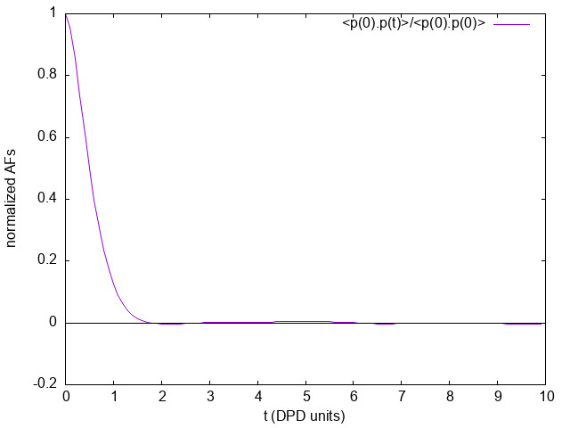

.. _moldip_af:

############################################################################
Autocorrelation functions of individual charge dipole moments in DL_MESO_DPD
############################################################################

.. sidebar:: Software Technical Information

  Language
    Fortran 2003

  Licence
    BSD

  Documentation Tool
    RST and LaTex-generated .pdf file

  Application Documentation
    :download:`Click to download the manual <manaf.pdf>` with more details

  Relevant Training Material
    See the Testing section

.. contents:: :local:	      

Purpose of Module
_________________

This module, ``gen_moldipaf.f90``, is a post-processing utility for
DL_MESO_DPD, the Dissipative Particle Dynamics (DPD) code from the DL_MESO_ package.

It processes the trajectory (HISTORY) files to obtain the charge dipole moments
of all the (neutral) molecules in the system, and subsequently computes
the dipole autocorrelation functions (DAFs) of individual molecules for each
molecule type. It produces a file `MDIPAFDAT` containing both the un-normalized and
normalized DAFs, and, optionally, a file `MDIPAFFFT` containing the
Fourier transform (FT) of the latter.
It is analogous to ``gen_dipoleaf.f90``, but deals with individual (for a
single molecule) rather then macroscopic (for the simulated volume) charge dipole moments.

The module can be applied to systems including molecules with a generic charge structure, as long
as each molecule is neutral (otherwise the charge dipole moment would be
frame-dependent) [1]_.

**CAVEAT**: this module only analyzes molecular trajectories. If a charged molecule
is present, an error message will be given, while unbonded charges will not be
detected and erroneous results may be obtained. Therefore please keep in mind
**to not apply** this module to systems with unbonded charges.

The charge dipole moment of a neutral molecule is
:math:`\vec{p}_{mol}=\sum_{i\in mol}q_i \vec{r}_i` where
:math:`\vec{r}_i` are the bead positions and :math:`q_i` their charges. The
total charge dipole moment of the simulated volume :math:`V` is
:math:`\vec{P}=\sum_{mol\in V} \vec{p}_{mol}`.
If more than one molecular species are present, one can split :math:`\vec{P}`
into the different species contributions:
:math:`\vec{P}=\sum_{j=1}^{N_{moldef}} \vec{P}^{(j)}=
\sum_{j=1}^{N_{moldef}} \sum_{k=1}^{N_{mol}^{(j)}} \vec{p}_k^{\,(j)}`,
where :math:`N_{moldef}` is the number of molecule types (definitions) and
:math:`N_{mol}^{(j)}` the number of molecules of type :math:`j`.

Given a scalar quantity `A`, its non-normalized autocorrelation function (AF) is 
:math:`C_{AA}(t) = \langle A(0)A(t)\rangle`, where :math:`\langle\dots\rangle`
indicates an average over trajectories. The normalized one is 
:math:`c_{AA}(t) = \frac {\langle A(0)A(t)\rangle}{\langle A(0)A(0)\rangle} = \frac{C_{AA}(t)}{C_{AA}(0)}` [2]_.

Here for the :math:`j` -th molecular species we replace :math:`A` with
:math:`\vec{p}^{(j)}`, and the product with a scalar product.
In this case the average over trajectories translates into two sums, one
over different time origins and one over molecules of species :math:`j`.

The output file `MDIPAFDAT` contains the DAFs for each molecular species and,
at the end of the file, the DAF obtained by averaging over *all* the particles.
The output file `MDIPAFFFT` contains the FT of these functions in the same order.

More in detail, the header of the file `MDIPAFDAT` contains the simulation
title and a line with the number of snapshots in HISTORY and of those used
for the AFs (`naf`). Then a block follows for each
molecule type, started by the *{molecule name}*, then three columns of data, 
:math:`t, C_{\vec{p}\vec{p}},c_{\vec{p}\vec{p}}`. 
It is intended that in any block only the molecules for
a given species are summed over. The last block is called *{all species}*
and refers to an average over all the molecules.

The header of the file `MDIPAFFFT` is as for `MDIPAFDAT` (notice that
the number of points for the FT is also set equal to `naf`). Then a block follows for each
molecule type, started by the molecule name, then three columns of data, 
:math:`\omega, \Re e[\hat{c}_{\vec{p}\vec{p}}(\omega)], \Im m[\hat{c}_{\vec{p}\vec{p}}(\omega)]`,
where :math:`\hat{c}` is the discrete FT of :math:`c(t)`. 
      
Possible uses of the output file are: to analyze it to obtain the decay time of
autocorrelations, which can be used to define an efficient sampling time for the
simulation; to compare it with the analogous macroscopic value obtained
for all the molecules (of a given type) in the system (see :ref:`dipole_af`).

Background Information
______________________

The base code for this module is DL_MESO_DPD, the Dissipative Particle
Dynamics code from the mesoscopic simulation package DL_MESO_,
developed by M. Seaton at Daresbury Laboratory.
This open source code is available from STFC under both academic (free) and
commercial (paid) licenses. The module is to be used with DL_MESO
in its most recently released version, version 2.7 (dating December 2018).

A variant of this module for use with a previous version of DL_MESO,
version 2.6 (dating November 2015), can be found in the ``old-v2.6``
directory [3]_.

The present module also requires the library FFTW_ (version 3.x) to be installed.

Testing
_______

The present module ``gen_moldipaf.f90`` is compiled with the available Fortran 2003 compiler, e.g.:

``gfortran -o gen_moldipaf.exe gen_moldipaf.f90 -I/usr/local/include -L/usr/local/lib -lfftw3 -lm``

where ``-I`` indicates the location of the FFTW include file `fftw3.f03`
and ``-L`` points to the directory containing the FFTW library files. The
above command gives the most likely locations for these files, although
these may need to be adjusted if FFTW has been installed somewhere else
on your machine.

The executable must be in the same directory of the HISTORY file to be
analyzed. The user is asked to provide the maximum number of snapshots
to be used for the AFs (`naf`) and a switch for the Fourier transform:
1 for *yes*, 0 (or any other integer) for *no*.

To input these parameters one can either enter them from the keyboard or
write them into a text file (say, `input.txt`), one per line in the right order,
and run the program in this way:

``gen_dipoleaf.exe < input.txt``

**Test: water in oil**

As a test, we suggest considering a fluid made of harmonically bonded dimers
:math:`(+q,-q)`. Appropriately fixing the partial charges :math:`q`
and the Bjerrum length :math:`l_B`, this system
mimics water in an oil background as far as the dielectric properties
are concerned. For more details about this model, please see the page :ref:`dimers`.

Run DL_MESO_DPD using the following CONTROL file:

.. literalinclude:: ./CONTROL

and the FIELD file:

.. literalinclude:: ./FIELD

Analyzing the HISTORY file with `gen_moldipaf.exe` choosing *naf=100*, i.e.,
using this input.txt:

.. literalinclude:: ./input-maf

this output is printed to the standard output:

.. literalinclude:: ./out-maf

The first line shows a histogram of cluster sizes: in this case,
it correctly gives 96 molecules of two beads.
Since internally the module checks that each molecule is a connected cluster [1]_,
this line should always give a histogram with the molecule sizes
(shown up to the maximum number of beads per molecule).

The first fifteen lines of the `MDIPAFDAT` file are as follows:

.. literalinclude:: ./MDIPAFDAT
   :lines: 1-15

and the `MDIPAFFFT` file starts as follows:

.. literalinclude:: ./MDIPAFFFT
   :lines: 1-15

Below we show a plot of the normalized AF
:math:`\frac {\langle \vec{p}(0)\vec{p}(t)\rangle}{\langle\vec{p}(0)\vec{p}(0)\rangle}`
(obtained using the first and third columns of `MDIPAFDAT`).

Source Code
___________
.. literalinclude:: ./gen_moldipaf.f90
   :language: fortran
   :linenos:

.. Here are the URL references used
.. _DL_MESO: http://www.ccp5.ac.uk/DL_MESO
.. _ReST: http://docutils.sourceforge.net/docs/user/rst/quickref.html
.. _FFTW: http://www.fftw.org/
.. [1] Disambiguation on the concept of molecule. In DL\_MESO a *defined molecule*
       is a set of beads, which can be bonded or not.
       For the purpose of this module it is *required* that each molecule is a
       connected cluster (via stretching bonds).
       In fact, this - together with the reasonable assumption that each stretching
       bond cannot be stretched to more than half the system linear size - allows us
       to univocally define the charge dipole moment of each molecule.
.. [2] M. P. Allen and D. J. Tildesley, "Computer simulation of liquids",
       Oxford University Press, Oxford (1987).
.. [3] A small change to specifying charge smearing schemes and lengths in CONTROL
       files has been made since version 2.6: the ``old-v2.6`` folder includes the
       CONTROL file for the test shown here that will work with this version
       of DL\_MESO.
