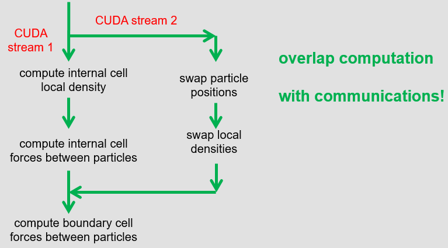

..  In ReStructured Text (ReST) indentation and spacing are very important (it is how ReST knows what to do with your
    document). For ReST to understand what you intend and to render it correctly please to keep the structure of this
    template. Make sure that any time you use ReST syntax (such as for ".. sidebar::" below), it needs to be preceded
    and followed by white space (if you see warnings when this file is built they this is a common origin for problems).

..  We allow the template to be standalone, so that the library maintainers add it in the right place

:orphan:

..  Firstly, let's add technical info as a sidebar and allow text below to wrap around it. This list is a work in
    progress, please help us improve it. We use *definition lists* of ReST_ to make this readable.

..  sidebar:: Software Technical Information

  Name
    DL_MESO 

  Language
    Fortran/CUDA-C

  Licence
    BSD, v. 2.7 or later

  Documentation Tool
    Fortran/C comments

  Application Documentation
    See the `DL_MESO Manual <http://www.scd.stfc.ac.uk/SCD/resources/PDF/USRMAN.pdf>`_

  Relevant Training Material
    See `DL_MESO webpage <http://www.scd.stfc.ac.uk/SCD/support/40694.aspx>`_

  Software Module Developed by
    Jony Castagna

..  In the next line you have the name of how this module will be referenced in the main documentation (which you  can
    reference, in this case, as ":ref:`example`"). You *MUST* change the reference below from "example" to something
    unique otherwise you will cause cross-referencing errors. The reference must come right before the heading for the
    reference to work (so don't insert a comment between).

.. _dl_meso_multiGPU_manybody:

######################################
Many body DPD on DL_MESO_DPD multi-GPU
######################################

..  Let's add a local table of contents to help people navigate the page

..  contents:: :local:

..  Add an abstract for a *general* audience here. Write a few lines that explains the "helicopter view" of why you are
    creating this module. For example, you might say that "This module is a stepping stone to incorporating XXXX effects
    into YYYY process, which in turn should allow ZZZZ to be simulated. If successful, this could make it possible to
    produce compound AAAA while avoiding expensive process BBBB and CCCC."

This module implements the many body DPD algorithm on the multi-GPU version of DL\_MESO\_DPD.

Purpose of Module
_________________

One of the main weak points of the DPD simulation is in its equation of state.
For example, compressible gas or vapor liquid mixtures are difficult, if not impossible, to be simulated correctly.
The many-body DPD approach allows us to overcome this limitation by extending the potential of neighbour 
beads to a large cut off radius.

This module consists in the implementation of many-body DPD on the multi GPU version of DL\_MESO\_DPD. 
The new feature will allow us to 
simulate complex systems liquid drops, phase interactions, etc.

From an implementation point of view, the algorithm requires us to 
first loop over the internal cells of a typical domain 
to calculate the local densities, followed by a second loop to 
find the forces acting between particles.
To achieve good scaling across multiple GPUs, we must allow the overlap of the 
computation of local densities and forces with the swapping of the particle's 
positions and local densities.
This is achieved with a partial sum of the forces based on the 
internal particles first and then adding the forces from the border particles later.
A flowchart of the algorithm is presented in the figure below.

Background Information
______________________

This module is part of the DL\_MESO\_DPD code. Full support and documentation is available at:

* https://www.scd.stfc.ac.uk/Pages/DL_MESO.aspx
* https://www.scd.stfc.ac.uk/Pages/USRMAN.pdf

To download the DL\_MESO\_DPD code you need to register at https://gitlab.stfc.ac.uk. 
Please contact Dr. Micheal Seaton at Daresbury Laboratory (STFC) for further details.

Building and Testing
____________________

.. Keep the helper text below around in your module by just adding "..  " in front of it, which turns it into a comment

The DL\_MESO code is developed using git version control. Currently, 
the multi GPU version is under a branch named ``multi_GPU_version``. After downloading the code, 
checkout the GPU branch and look into the ``DPD/gpu_version`` folder, i.e:

.. code-block:: bash

  git clone https://gitlab.stfc.ac.uk/dl_meso.git
  cd dl_meso
  git checkout multi_GPU_version
  cd ./DPD/gpu_version/bin

To compile and run the code you need to have installed the CUDA-toolkit (>=8.0) 
and have a CUDA enabled GPU device (see http://docs.nvidia.com/cuda/#axzz4ZPtFifjw).
For the MPI library, OpenMPI 3.1.0 has been used. Install ``hwloc`` if you want 
to set the GPU affinity between devices and CPU cores, otherwise remove the 
``-DHWLOC`` flag in the Makefile.

Finally, you need to install the ALL library and make sure the ALL path is set correctly.
ALL handles the load balancing among the GPUs, for details see :ref:`dl_meso_gpu_loadBalance`. 

Use ``make all`` to compile, resulting in the executable ``dpd_gpu.exe``.   

A testloop is added in the ``tests`` folder. Type ``./Tesloop_All`` 
followed by option 2 to and specify 8 as number of GPUs.
Verify the results with option 3. 
No difference should appear in the statistical values and final stress 
values (the final printed positions are randomly particles chosen 
and can be different at every run).

For the current module, the ``test/SurfaceDrop`` test case is a 
good example of combining manybody DPD and load balanced as
presented in :ref:`dl_meso_gpu_loadBalance`.
Below is an snapshot from the simulation based on the 
same input (but large system) using 8 GPUs and for 35k time steps.

.. raw:: html

   <video controls src="../../../../_static/videos/final_8GPUs.mp4"></video>

Source Code
___________

.. Notice the syntax of a URL reference below `Text <URL>`_ the backticks matter!

This module has been merged into DL\_MESO code. It is composed of the
following commits (you need to be registered as collaborator):

* https://gitlab.stfc.ac.uk/dl_meso/dl_meso/-/commit/5d5db87433f21e31afcb61343f500728af52cd0a

