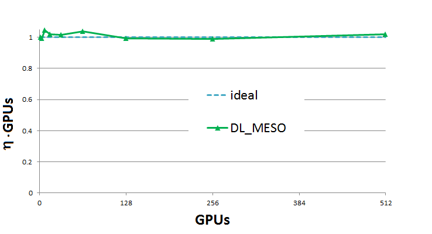
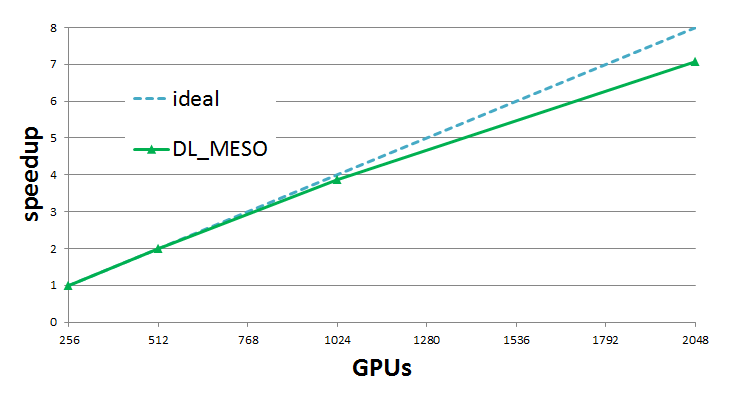

################################
Multi-GPU version of DL_MESO_DPD
################################

.. sidebar:: Software Technical Information

  The information in this section describes the DL_MESO_DPD GPU versions as a whole.

  Language
    Fortran/CUDA-C (cuda toolkit 7.5)

  Documentation Tool
    ReST files

  Application Documentation
    See the `DL_MESO Manual <http://www.scd.stfc.ac.uk/SCD/resources/PDF/USRMAN.pdf>`_

  Relevant Training Material
    See `DL_MESO webpage <http://www.scd.stfc.ac.uk/SCD/support/40694.aspx>`_

  Licence
    BSD, v. 2.7 or later

.. contents:: :local:

Authors: Jony Castagna

This module implements the first version of the DL_MESO_DPD code multi NVidia Graphical Processing Unit (GPU). More details about it can be found in the following sections.

Purpose of Module
_________________

.. Give a brief overview of why the module is/was being created.

In this module the main framework of a multi-GPU version of the DL_MESO_DPD code has been developed. The exchange of data between GPUs overlaps with the computation of the forces
for the internal cells of each partition (a domain decomposition approach based on the MPI parallel version of DL_MESO_DPD has been followed). 
The current implementation is a proof of concept only and relies on slow transfers of data from the GPU to the host and vice-versa. Faster implementations will be explored in future modules.

In particular, the transfer of data occurs in3 steps:  x-y planes first, x-z planes with halo data (i.e.  the values which will fill the ghost cells) from 
previous swapand finally the y-z planes with all halos. This avoid the problems of the corner cells, which usually requires a separatecommunication 
reducing the number of send/receive calls from 14 to 6.The multi-GPU version has been currently tested with 8 GPUs and successfully reproduced same results of a 
singleGPU within machine accuracy resolution. 

Future plans include benchmarking of the code with different data transfer implementations other than the current (trivial) GPU-host-GPU transfer mechanism.
These are: of Peer To Peer communication within a node, CUDA-aware MPI and CUDA-aware MPI with Direct Remote Memory Access (DRMA).

.. references would be nice here...

Background Information
______________________

This module is part of the DL_MESO_DPD code. Full support and documentation is available at:

* http://www.scd.stfc.ac.uk/SCD/support/40694.aspx
* http://www.scd.stfc.ac.uk/SCD/resources/PDF/USRMAN.pdf

To download the DL_MESO_DPD code you need to register at https://ccpforge.cse.rl.ac.uk/gf/. Please contact Dr. Micheal Seaton at Daresbury Laboratory (STFC) for further details.

Testing
_______

The DL_MESO code is developed using git version control. Currently the GPU version is under a branch named "add_gpu_version". After downloading the code, checkout the GPU branch and look into the "DPD/gpu_version" folder, i.e:

* git clone DL_MESO_repository_path
* cd dl_meso
* git checkout gpu_version
* cd ./DPD/gpu_version
* make all

To compile and run the code you need to have installed the CUDA-toolkit (>=8.0) and have a CUDA enabled GPU device (see http://docs.nvidia.com/cuda/#axzz4ZPtFifjw). For the MPI library the OpenMPI 3.1.0 has been used.

The current version has been tested ONLY for the `Mixture_Large` test case available in the DEMO/DPD folder. To run the case, compile the code using the "make all" command from the "bin" directory, copy the "FIELD" and "CONTROL" files in this directory and run "./dpd_gpu.exe".

Attention: the HISTORY file produced is currently NOT compatible with the serial version, because this is written in the C binary data format (Fortran files are organised in records, 
while C are not. See https://scipy.github.io/old-wiki/pages/Cookbook/FortranIO.html). 

However, you can compare the "OUTPUT" and the "export" files to verify your results. For more details see the README.rst file in the "gpu_version" folder.

Performance
___________
A test case a two phase mixture separation with 1.8 billion particles has been used and run for 100 time steps without IO operations.A weak scaling efficiency (:math:`\eta`) related plot up to 512 GPUs (1.2 billion particles) is presented below.  This plot is obtained by taking the ratio between the wall time for the GPU count and a reference walltime of two GPUs (the singleGPU version uses a non-scalable, faster, alternative implementation which would skew the results).  As can be seen, the result (:math:`\eta*GPUs`) oscillates near perfect scalability.

Strong scaling results are obtained using 1.8 billion particles for 256 to 2048 GPUs.  Results show very goodscaling, with efficiency always above 89% for 2048 GPUs (note that 2048 P100 GPUs on PizDaint is equivalent to almost10 Petaflops of raw double precision compute performance).

Examples
________

See the Mixture_Large case in the DL_MESO manual.

Source Code
___________

.. link the source code

This module has been merged into DL_MESO code. It is composed of the
following commits (you need to be registered as collaborator):

* https://gitlab.stfc.ac.uk/dl_meso/dl_meso/commit/7f3e7abe7bb1c8010dd6a5baa0de4907ffe2f003 

.. IF YOUR MODULE IS A SEPARATE REPOSITORY

.. The source code for this module can be found in: URL.

.. CLOSING MATERIAL -------------------------------------------------------

.. Here are the URL references used

.. _nose: http://nose.readthedocs.io/en/latest/
