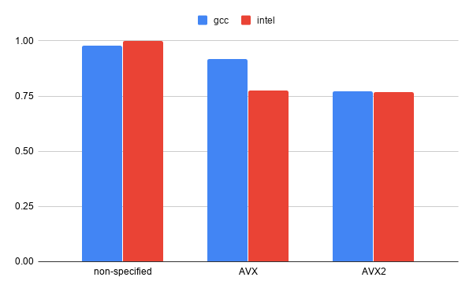

..  sidebar:: Software Technical Information

  Name
    ParaDiS_Precipitate_GC optimized for AMD Zen2

  Language
    C++

  Licence
    Extension is based on ParaDIS version 2.5.1. The additions in the
    extension are GPL.

  Documentation Tool
    Sphinx

  Application Documentation
    http://paradis.stanford.edu/

  Relevant Training Material
    https://version.aalto.fi/gitlab/csm_open/paradis_version_diffs/tree/master/test_run

  Software Module Developed by
    Phuong Nguyen (phuong.nguyen@csc.fi)

.. _paradis_rome:

################################################
ParaDiS with precipitates optimized for AMD Zen2
################################################

..  contents:: :local:

Discrete dislocation dynamics (DDD) simulations usually treat with "pure"
crystals and dislocations in them. An extension of the ParaDIS DDD code (LLNL,
http://paradis.stanford.edu/) that includes dislocation/precipitate
interactions has been developed (E-CAM module: `ParaDiS with precipitates`_).

This module provides a guide for optimal porting of the
`ParaDiS with precipitates`_ to the AMD Rome CPUs, in preparation for the
`Mahti supercomputer`_ service at CSC, Finland.
Mahti is an Atos BullSequana XH2000 system consisting of 1404 nodes each with
two 64-core AMD Zen2 CPUs (AMD EPYC 7H42, 2.6GHz). 
Since Mahti is not ready for general access at this moment, the module was
prepared based on a single testing node which has 2 AMD EPYC 7742 @2.25GHz
(128 cores in total).

By choosing a suitable compiler and compiler optimization flags, the application
works
more efficiently on the target platform. On the testing node, Intel compilers with
either AVX or
AVX2 vector sets gives the best performance for *ParaDiS with precipitates*.
Alternatively, GCC compilers with AVX2 vector support is competitive with
the Intel compilers.

Purpose of Module
_________________

This module helps to run simulations of the *ParaDiS with precipitates* more
efficiently. By using a suitable set of optimization flags for compilers,
especially the one determining vectorization type, the best library routines
can be chosen.

Background Information
______________________

The module is based on the ParaDiS (http://paradis.stanford.edu/)
extension `ParaDiS with precipitates`_.

Building and Testing
____________________

Build instructions for `ParaDiS with precipitates`_ are provided with the
extension.

Different compilers and compiler options were tested to find the most optimal
ones for the Zen2 architecture. Figure 1 (below) shows a comparison
of normalized running times between different vectorization extensions and
compilers. On the testing platform, Intel compilers with either AVX or AVX2 helps the
application to achieve good performance. Alternatively, GCC compilers with AVX2 can
be used to obtain the same performance as the Intel ones.

Table 1 presents a comparison of different optimization flags
for the Intel and GCC compilers. For the Intel compilers, the optimal performance
is reached with the compiler 
options: ``-O3 -mavx2`` or ``-O3 -mavx``. For the GCC compilers,
``-O2 -march=znver2 -pipe -fomit-frame-pointer -ftree-vectorize`` compiler options
help the application to achieve good performance.

  Figure 1: Comparison of normalized times between different compilers and
  vectorization extensions (smaller is better)

*Table 1: Comparison between different optimization flag options*

.. list-table::
   :widths: 15 40 15
   :header-rows: 1

   * - Compilers
     - Flags
     - Time (s)
   * - Intel
     - -O2 -axCORE-AVX2
     - 328
   * -
     - -O2 -axHASWELL
     - 360
   * -
     - -O2 -mavx2
     - 309
   * -
     - -O3 -mavx2
     - 295
   * -
     - -O3 -mavx
     - 298
   * -
     - -Ofast -mavx2
     - 301
   * -
     - -O3 -mavx2 -funroll-all-loops
     - 317
   * - GCC
     - -O2 -march=znver1 -pipe -fomit-frame-pointer -ftree-vectorize
     - 352
   * - 
     - -O2 -march=znver2 -pipe -fomit-frame-pointer -ftree-vectorize
     - 296
   * -
     - -O3 -march=znver2
     - 382
   * -
     - -O2 -march=haswell -pipe -fomit-frame-pointer -ftree-vectorize
     - 352

``*`` *The input case in these tests are different to the ones at*
`ParaDiS with precipitates optimized for Puhti`_ .

In the `ParaDiS with precipitates optimized to HPC environment`_,
it's written that using multiple threads through a hybrid OpenMP and MPI model speeds up
the calculation up to a factor of 1.5, especially for large-scale simulations.
However, this combination did not give an advantage of performance on the Zen2
testing machine. Thus, using a single thread for each MPI process is recommended.

Source Code
___________

Source code modifications for the extension *ParaDiS with precipitates* are
available here:
https://version.aalto.fi/gitlab/csm_open/paradis_version_diffs.git.

.. _ParaDiS with precipitates: https://e-cam.readthedocs.io/en/latest/Meso-Multi-Scale-Modelling-Modules/modules/paradis_precipitate/paradis_precipitate_GC/readme.html
.. _ParaDiS with precipitates optimized to HPC environment: https://e-cam.readthedocs.io/en/latest/Meso-Multi-Scale-Modelling-Modules/modules/paradis_precipitate/paradis_precipitate_HPC/readme.html
.. _ParaDiS with precipitates optimized for Puhti: https://gitlab.csc.fi/hpc-support/e-cam-library/tree/paradis-rome/Meso-Multi-Scale-Modelling-Modules/modules/paradis_precipitate/paradis_optimized_puhti
.. _Mahti supercomputer: https://research.csc.fi/techspecs~Mahti
