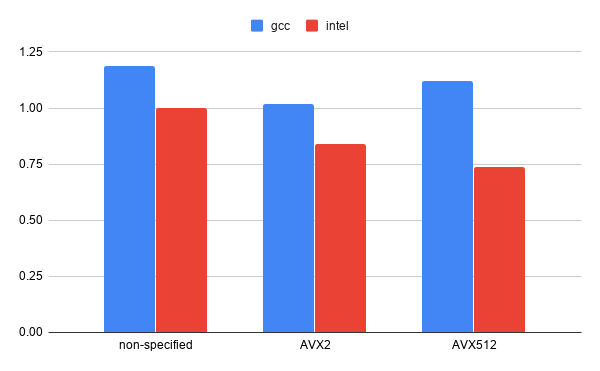

..  sidebar:: Software Technical Information

  Name
    ParaDiS_Precipitate_GC optimized for Puhti

  Language
    C++

  Licence
    Extension is based on ParaDIS version 2.5.1. The additions in the
    extension are GPL.

  Documentation Tool
    Sphinx

  Application Documentation
    http://paradis.stanford.edu/

  Relevant Training Material
    https://version.aalto.fi/gitlab/csm_open/paradis_version_diffs/tree/master/test_run

  Software Module Developed by
    Phuong Nguyen (phuong.nguyen@csc.fi)

.. _paradis_puhti:

#############################################
ParaDiS with precipitates optimized for Puhti
#############################################

..  contents:: :local:

Discrete dislocation dynamics (DDD) simulations usually treat with “pure”
crystals and dislocations in them. An extension of the ParaDIS DDD code (LLNL,
http://paradis.stanford.edu/) that includes dislocation/precipitate
interactions has been developed (E-CAM module: `ParaDiS with precipitates`_).

This module provides a guide for optimal porting of the
`ParaDiS with precipitates`_ to the `Puhti supercomputer`_ at CSC, Finland.
Puhti is an Atos BullSequana X400 system consisting of 682 nodes each with two
20-core Intel Cascade Lake CPUs (Intel Xeon Gold 6230, 2.1GHz). By choosing
a suitable compiler and compiler optimization flags, the application works
more efficiently on the target platform. On Puhti, Intel compilers with
AVX-512 vector sets gives the best performance for *ParaDiS with
precipitates*.

.. _Puhti supercomputer: https://docs.csc.fi/computing/system/

Purpose of Module
_________________

This module helps to run simulations of the *ParaDiS with precipitates* more
efficiently. By using a suitable set of optimization flags for compilers,
especially the one determining vectorization type, the best library routines
can be chosen.

Background Information
______________________

The module is based on the ParaDiS (http://paradis.stanford.edu/)
extension `ParaDiS with precipitates`_.

Building and Testing
____________________

Build instructions for `ParaDiS with precipitates`_ are provided with the
extension.

Different compilers and compiler options were tested to find the most optimal
ones for the Puhti supercomputer. Figure 1 (below) shows a comparison
of normalized running times between different vectorization extensions and
compilers. On the Puhti platform, Intel compilers with AVX-512 helps the
application to achieve the best performance.

Table 1 presents a comparison of different optimization flags
for the Intel compiler. The optimal performance is reached with the compiler
options: ``-O2 -axCASCADELAKE``.

  *Figure 1: Comparison of normalized times between different compilers and
  vectorization extensions (smaller is better)*

*Table 1: Comparison between different optimization flag options*

.. list-table::
   :widths: 40 15
   :header-rows: 1

   * - Flags
     - Time (s)
   * - -O2 -axCORE-AVX2
     - 273
   * - -O2 -axCORE_AVX2 -mtune=cascadelake
     - 338
   * - -O2 -axCORE-AVX2 -mtune=broadwell
     - 298
   * - -O2 -xCORE-AVX2 -axCASCADELAKE
     - 254
   * - -O2 -axCOMMON-AVX512
     - 321
   * - -O2 -axCORE-AVX512
     - 249
   * - -O2 -axCASCADELAKE
     - 240
   * - -O2 -axCASCADELAKE -mtune=cascadelake
     - 280
   * - -O3 -axCASCADELAKE
     - 270

In the `ParaDiS with precipitates optimized to HPC environment`_, it's written
that using multi threads through the hybrid OpenMP and MPI model speeds up
the calculation up a factor of 1.5, especially for the large-scale simulations.
However, this combination did not give an advantage of performance on the Puhti.
Thus,
using single thread for each MPI process is recommended.

Source Code
___________

Source code modifications for the extension *ParaDiS with precipitates* are
available here:
https://version.aalto.fi/gitlab/csm_open/paradis_version_diffs.git.

.. _ParaDiS with precipitates: https://e-cam.readthedocs.io/en/latest/Meso-Multi-Scale-Modelling-Modules/modules/paradis_precipitate/paradis_precipitate_GC/readme.html
.. _ParaDiS with precipitates optimized to HPC environment: https://e-cam.readthedocs.io/en/latest/Meso-Multi-Scale-Modelling-Modules/modules/paradis_precipitate/paradis_precipitate_HPC/readme.html

