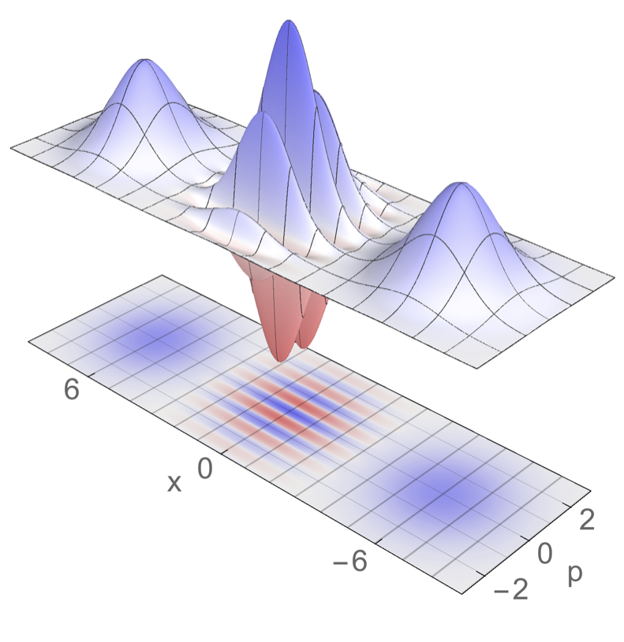

.. E-CAM documentation master file, created by
   sphinx-quickstart on Thu Sep 15 17:56:17 2016.
   You can adapt this file completely to your liking, but it should at least
   contain the root `toctree` directive.

.. _readme_quantum_dynamics:

************************
Quantum Dynamics Modules
************************

Introduction
============

.. sidebar:: General Information

    .. contents:: :depth: 2

    * :ref:`contributing`
    * :ref:`search`

This is a collection of the modules that have been created by the E-CAM community 
within the area of Quantum Dynamics. This documentation is created using ReStructured Text and the git repository for the documentation. 
Source files can be found at 
https://gitlab.e-cam2020.eu/e-cam/E-CAM-Library which are open to contributions from E-CAM members.

In the context of E-CAM, the definition of a software module is any piece of software that could be of use to the E-CAM
community and that encapsulates some additional functionality, enhanced performance or improved usability for people
performing computational simulations in the domain areas of interest to the project.

This definition is deliberately broader than the traditional concept of a module as defined in the semantics of most
high-level programming languages and is intended to capture internal workflow scripts, analysis tools and test suites
as well as traditional subroutines and functions. Because such E-CAM modules will form a heterogeneous collection we
prefer to refer to this as an E-CAM software repository rather than a library (since the word library carries a
particular meaning in the programming world). The modules do however share with the traditional computer science
definition the concept of hiding the internal workings of a module behind simple and well-defined interfaces. It is
probable that in many cases the modules will result from the abstraction and refactoring of useful ideas from existing
codes rather than being written entirely de novo.

Perhaps more important than exactly what a module is, is how it is written and used. A final E-CAM module adheres to
current best-practice programming style conventions, is well documented and comes with either regression or unit tests
(and any necessary associated data). E-CAM modules should be written in such a way that they can potentially take
advantage of anticipated hardware developments in the near future (this is one of the training objectives of E-CAM).

Objectives of E-CAM WP3 Quantum Dynamics
========================================

Software development in quantum dynamics has so far been less systematic than in other fields of modelling, 
such as classical molecular dynamics or electronic structure. Although some packages have been developed to 
implement specific methods, e.g. `Quantics <http://chemb125.chem.ucl.ac.uk/worthgrp/quantics/doc/index.html>`_ 
for wave packet dynamics, or subroutines added to electronic structure 
packages, e.g. Surface Hopping and Ehrenfest in CPMD_, these efforts are not the standard. 

One of the goals of E-CAM's WP3 is then to provide an environment to stimulate the transition from in-house
codes, often developed and used by single groups, to the development of modular, well documented community-based
software packages capable of multiple functionalities and adopting a common set of standards and benchmarks.

To foster this development, we have initiated five parallel activities: 

*  Creating software for benchmarking and testing based on exact integration schemes for low dimensional systems and standard potentials.

*  Creating an environment to transform in-house software to modules that adhere to the E-CAM best practices.

*  Disseminating this initiative to attract coding efforts from leading groups in the field to the E-CAM repository.

*  Interact with industrial partners to enrich our repository with software targeted at their needs.

*  Training young code developers.

.. _CPMD: http://www.cpmd.org/

Pilot Projects
==============

One of primary activity of E-CAM is to engage with pilot projects with industrial partners. These projects are conceived
together with the partner and typically are to facilitate or improve the scope of computational simulation within the
partner. The related code development for the pilot projects are open source (where the licence of the underlying
software allows this) and are described in the modules associated with the pilot projects.

The `pilot project <https://www.e-cam2020.eu/pilot-project-ibm/>`_ of the WP3 in collaboration with IBM_ is 
related to quantum computing and improvements of the quantum computer technology.
One of our main topic was development of software for construction of control pulses necessary for operating quantum logical gates 
between qubits in a universal quantum computer using the Local Control Theory. [PLCT]_
More information can be found on the `pilot project <https://www.e-cam2020.eu/pilot-project-ibm/>`_ web site. 
Below are listed the pilot project modules created so far:

.. toctree::
    :glob:
    :maxdepth: 1

    ./modules/LocConQubit/readme

**LocConQubit** is a code for the construction of controlled pulses on isolated qubit systems using the Local Control Theory.

.. toctree::
    :glob:
    :maxdepth: 1

    ./modules/OpenQubit/readme

**OpenQubit** is an extension to the LocConQubit code for the construction of controlled pulses in a more realistic environment with 
dissipating effects.

Extended Software Development Workshops
=======================================

ESDW Maison de la Simulation (Paris 2016)
-----------------------------------------

The first Quantum Dynamics ESDW was held in June-July 2016 at the `Maison de la Simulation`_ near Paris. 10 students
and 6 tutors, including Dr. Ivano Tavernelli representing the industrial partner of the WP3, IBM_, worked to develop
software modules in the following areas:

- Exact quantum propagation methods for low dimensional systems to be used to provide benchmarks for approximate schemes

- Development of a library of single and multi surface potentials for benchmark systems

- Calculation of approximate quantum time correlation functions

Work was performed by teams of 2-4 students, assisted by the senior participants and by E-CAM's Software Manager, 
Dr. Alan O'Cais, and the Software Developer associated to WP3, Dr. Liang Liang. 

In addition to the software development activities, the Workshop enjoyed lively scientific discussions 
centered on presentations made by the students and the senior participants. The on-line E-CAM tools for software 
development, including the Git repository, and tools for the documentation (Doxygen) and performance analysis 
were presented by E-CAM staff members and participants were instructed on their use via tutorials. 
The program was further enriched by the interactions with experts on software and hardware development working 
at Maison de la Simulation who gave talks on topics such as architectures and programming paradigms and the 
use of advanced visualization tools such as the Image wall hosted by the Maison de la Simulation.

.. _Maison de la Simulation: http://www.maisondelasimulation.fr/en/index.php?a

ESDW University College Dublin (2017)
-------------------------------------

The second Quantum Dynamics ESDW was held in July 2017 (first part) and March 2018 (wrap up meeting) at 
`University College Dublin <http://www.ucd.ie/>`_. 21 participants, including the representative of WP3’s 
current industrial partner IBM_, worked to develop and upload on the E-CAM repositories software 
modules in the following areas:

- Calculation of approximate quantum time correlation functions via the PaPIM code;

- Mixed quantum-classical algorithms, with specific reference to Surface Hopping and Wigner-Liouville methods;

- Implementation of the factorization scheme for quantum dynamics in CPMD_;

- Interfacing of quantum codes with electronic structure codes;

- Grid based exact propagation schemes;

- Design and optimization of qubit control pulses.

Teams of coders assisted by senior tutors, E-CAM’s Software Manager, Dr. Alan O’Cais, and WP3 Software 
Developer, Dr. Liang Liang, performed the work. 
Specific discussions on optimal parallelization strategies for the E-CAM’s quantum dynamical codes 
(PaPIM and Quantics) were also initiated and implemented.
The coding work was accompanied by scientific presentations on the themes of the workshops and by 
the instruction from E-CAM personnel on the CoE’s tools for software production, testing, documentation 
and maintaining. 
The participants benefitted also from the proximity of software and hardware experts from the 
`ICHEC <https://www.ichec.ie/>`_ supercomputing center that offered, in particular, a set of 
lectures and tutorials on OpenMP parallelization.

.. _IBM: https://www.zurich.ibm.com/

List of available Modules
=========================

.. toctree::
    :glob:
    :maxdepth: 1

    ./modules/SODLIB/sod_readme

The **SodLib** module provides exact wavefunction propagation using the second-order differencing (SOD) integrator
scheme to solve the time-dependent Schrödinger equation. This routine has been implemented and tested as an added
functionality within the Quantics_ quantum dynamics package.

.. toctree::
    :glob:
    :maxdepth: 1

    ./modules/cheb_doc/cheb_readme

The **ChebLib** module implements the Chebyshev integration scheme for exact wavefunction propagation on the grid. This
routine  has been implemented and tested as an added functionality within the Quantics_ quantum dynamics package.

.. toctree::
    :glob:
    :maxdepth: 1

    ./modules/PhysConst_module/readme

The **PhysConst** enables the use of physical constants and the correct isotopic masses.

.. toctree::
    :glob:
    :maxdepth: 1

    ./modules/QuantumModelLib/readme

The **QuantumModelLib** use potential energy surfaces extracted from the literature and can be linked to quantum dynamics codes.

.. toctree::
    :glob:
    :maxdepth: 1

    ./modules/QQ-Interface/qq-interface.rst

The **Quantics-QChem-Interface** is an interface between Quantics and QChem. The DFT algorithm implemented in QChem can be used to provide electronic structure information for direct dynamics simulations using the Quantics program package.

PaPIM
-----

PaPIM is a code for calculation of equilibrated system properties (observables). Some properties can be directly obtained from
the distribution function of the system, while properties that depends on the exact dynamics of the system, such as the structure
factor, [Mon2]_ infrared spectrum [Beu]_ or reaction rates, can be obtained from the evolution of appropriate time correlation functions.
PaPIM samples either the quantum (Wigner) or classical (Boltzmann) density functions and computes approximate quantum and 
classical correlation functions. 
The code is highly parallelized and suitable for use on large HPC machines.
The code's modular structure enables an easy update/change of any of its modules.
Furthermore the coded functionalities can be used independently of each other.
The code is specifically design with simplicity and readability in mind to enable any user to easily implement its own functionalities.
The code has been extensively used for the calculation of the infrared spectrum of the :math:`\text{CH}_{5}^{+}` cation in gas phase,
while recently new calculations on the water dimer, and protonated water dimer systems were started.

.. toctree::
    :glob:
    :maxdepth: 1

    ./modules/PaPIM/readme

**PaPIM** is the current version of the code, including all available functionalities.

The following modules make up the PaPIM code and can be used as stand-alone software libraries for e.g. 
sampling of the Wigner distribution, sampling of the classical Boltzmann distribution, or building MPI 
parallelized Fortran codes. 
Such libraries are rarely available to the community in a Fortran program format.
Some of the functionalities within the code are specifically designed for computation of infrared spectra, and serve as a template
for the user to implement its own functionalities.

.. toctree::
    :glob:
    :maxdepth: 1

    ./modules/PIM_wd/readme

**PIM_wd** samples, via the Phase Integration Method, [Mon1]_ the system's quantum Wigner density function. 
The function is given in the phase-space representation and is the basis for any further calculation of system's quantum observables.

.. toctree::
    :glob:
    :maxdepth: 1

    ./modules/PIM_qcf/readme

**PIM_qcf** is a library of quantum correlation functions for computing system's time-dependent properties.

.. toctree::
    :glob:
    :maxdepth: 1

    ./modules/ClassMC/readme

**ClassMC** samples, via Metropolis Monte Carlo algorithm, the system's classical Boltzmann distribution function and calculates
the classical time-dependent correlation functions from the sampled phase space.
Results obtained from classical sampling can be used to assess the relevance of quantum effects for a given system.

.. toctree::
    :glob:
    :maxdepth: 1

    ./modules/PotMod/readme

**PotMod** is a library of potential energy functions and interfaces for external potential energy calculation codes.
Currently available in the library are the harmonic and Morse potentials (different molecular systems can be simulated depending on parameters
provided by the user);  empirical potential of the ground state of :math:`\text{CH}_{5}^{+}` based on high level
electronic structure calculations [RJin]_.

.. , and interface to the ab initio `CP2K code <https://www.cp2k.org/>`_.

.. _CP2K: https://www.cp2k.org/

.. toctree::
    :glob:
    :maxdepth: 1

    ./modules/AuxMod/readme

**AuxMod** is a library of subroutines which enables any user to easily construct its own Fortran input parser.
It also contains a library of adapted MPI subroutines for easier programming of Fortran MPI parallel codes.

.. toctree::
    :glob:
    :maxdepth: 1

    ./modules/Openmpbeads/readme

**Openmpbeads** is a patch to the PaPIM code which enables parallelization of the sampling of the  
polymer chains within the PIM algorithm, improving efficiency in sampling of the Wigner density.

.. toctree::
    :glob:
    :maxdepth: 1

    ./modules/PaPIM-CP2K_Interface/readme

**PaPIM-CP2K_Interface** is a PaPIM's code interface to the CP2K program package to increase its functionalities.

References
==========

.. [PLCT] B. F. E. Curchod, T. J. Penfold, U. Rothlisberger, I. Tavernelli *Phys. Rev. A* 
          **84** (2012) 042507 `DOI: 10.1103/PhysRevA.84.042507 
          <https://journals.aps.org/pra/abstract/10.1103/PhysRevA.84.042507>`_
.. [Mon1] M. Monteferrante, S. Bonella, G. Ciccotti *Mol. Phys.* **109** (2011) 3015 `DOI: 10.1080/00268976.2011.619506
          <http://dx.doi.org/10.1080/00268976.2011.619506>`_
.. [Mon2] M. Monteferrante, S. Bonella, G. Ciccotti *J. Chem. Phys.* **138** (2013) 054118 `DOI: 10.1063/1.4789760
          <http://dx.doi.org/10.1063/1.4789760>`_
.. [Beu] J. Beutier, M. Monteferrante, S. Bonella, R. Vuilleumier, G. Ciccotti *Mol. Sim.* **40** (2014) 196 `DOI:
         10.1080/08927022.2013.843776 <http://dx.doi.org/10.1080/08927022.2013.843776>`_
.. [RJin] Z. Jin, B. Braams, J. Bowman *J. Phys. Chem. A* **110** (2006) 1569 `DOI: 10.1021/jp053848o
         <https://pubs.acs.org/doi/abs/10.1021/jp053848o>`_

