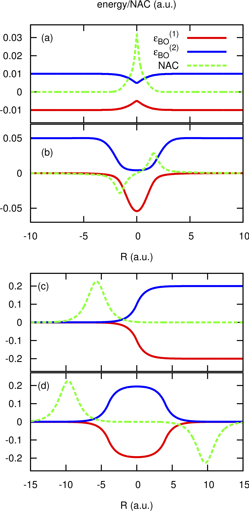

.. _CTMQC:

####################
CTMQC
####################

.. sidebar:: Software Technical Information

  Language
    Fortran 90

  License
    don't know yet

  Documentation Tool
    doxygen

.. contents:: :local:

Purpose of Module
_________________

**CTMQC** is a module for excited-state nonadiabatic dynamics, therefore it is used to simulate the coupled dynamics of electrons and nuclei (ideally in gas phase molecular systems) in response to, for instance, an initial electronic excitation.

The purpose of the module is to familiarize the user with a new simulation technique, i.e., the CTMQC method, for treating problems where electronic excited states are populated during the molecular dynamics. Photo-activated ultrafast processes are typical situations in which an approach like CTMQC can be used to predict molecular properties, like structures, quantum yields, or quantum coherence.

As clarified below, the CTMQC module is based on the coupled-trajectory mixed quantum classical algorithm [CTMQC1]_ [CTMQC2]_ that has been derived starting from the evolution equations in the framework the exact factorization of the electron-nuclear wavefunction [EF1]_ [EF3]_. The CTMQC algorithm belongs to the family of quantum-classical methods, as the time evolution of the nuclear degrees of freedom is treated within the classical approximation, whereas electronic dynamics is treated fully quantum mechanically. Basically, the nuclei evolve as point particles, following classical trajectories, while the electrons *generate* the potential inducing such time evolution.

In its current implementation, the module cannot deal with arbitrary nuclear dimensions, but it is restricted to treat 3-dimensional problems, which gives the possibility to compare quantum-classical results easily and directly with quantum wavepacket dynamics. CTMQC has been analyzed and benchmarked against exact propagation results on typical low-dimensional model systems [CTMQC3]_, and applied for the simulation of the photo-initiated ring-opening process of Oxirane [CTMQC4]_. For this study, CTMQC has been implemented in a developer version of the CPMD electronic structure package based on time-dependent density functional theory. Concerning electronic input properties, the CTMQC module requires a grid representation of the adiabatic potential energy surfaces and of the nonadiabatic coupling vectors, since the electronic dynamics is represented and solved in the adiabatic basis. This feature allows the algorithm to be easily adaptable, in the current form, to any quantum chemistry electronic structure package. The number of electronic states to be included is not limited, and can be specified as input.

Coupled-Trajectory Mixed Quantum-Classical Dynamics
___________________________________________________

The *exact factorization of the electron-nuclear wavefunction* [EF1]_ provides a prescription for decomposing the time-dependent Schrödinger equation for a system of interacting electrons and nuclei into the coupled dynamics of the subsystems, i.e., the electronic and the nuclear. The time-dependent molecular wavefunction, :math:`\Psi(\mathbf r, \mathbf R,t)`, is the solution of the TDSE :math:`\hat H\Psi = i\partial_t\Psi`, with Hamiltonian `\hat H(\mathbf r,\mathbf R) = \hat T_n(\mathbf R) + \hat H_{BO}(\mathbf r,\mathbf R)`, containing the nuclear kinetic energy, :math:`\hat T_n`, and the electronic Born-Oppenheimer Hamiltonian, :math:`\hat H_{BO}`, defined as the sum of the electronic kinetic energy and of the interaction potentials. Here, the symbols :math: `\mathbf r,\mathbf R` indicate all electronic and nuclear coordinates, respectively. The full wavefunction can be exactly written as the product

:math:`\Psi(\mathbf r,\mathbf R,t) = \chi(\mathbf R,t)\Phi_{\mathbf R}(\mathbf r,t)`,

where :math:`\chi(\mathbf R,t)` can be considered a genuine nuclear wavefunction, yielding the exact nuclear many-body density and current density, and :math:`\Phi_{\mathbf R}(\mathbf r,t)`, the electronic function, depends parametrically on the nuclear configuration. 

Inserting the exact-factorization form of the full wavefunction into the time-dependent Schrödinger equation yields the coupled evolution equations for the two components of the molecular wavefunction, namely

:math:`\Big[\hat H_{BO} +\hat U_{en}^{coup} - \epsilon\Big]\Phi_{\mathbf R}(\mathbf r,t) = i\hbar\partial_t\Phi_{\mathbf R}(\mathbf r,t)`

:math:`\Bigg[\sum_{\nu=1}^{N_n}\frac{[-i\hbar\nabla_\nu+\mathbf A_\nu]^2}{2M_\nu}+\epsilon\Bigg]\chi(\mathbf R,t) = i\hbar\partial_t\chi(\mathbf R,t)`

where the new quantities introduced will be discussed below. The derivation of these equations can be found in [EF2]_. Nuclear masses are indicated by the symbol :math:`M_\nu$`, with the index :math:`\nu` running over the :math:`N_n` nuclei. In the electronic equation, the operator :math:`\hat U_{en}^{coup}[\Phi_{\mathbf R},\chi]` couples the electronic evolution to the nuclear dynamics as it depends on the nuclear wavefunction,

:math:`\hat U_{en}^{coup} [\Phi_{\mathbf R},\chi]= \sum_{\nu=1}^{N_n} \frac{1}{M_\nu}\Bigg[\frac{[-i\hbar \nabla_\nu-\mathbf A_\nu]^2}{2}+\left(\frac{-i\hbar\nabla_\nu\chi}{\chi}+\mathbf A_\nu\right)\cdot\left(-i\hbar\nabla_\nu-\mathbf A_\nu\right)\Bigg].`

The scalar potential, or time-dependent potential energy surface :math:`\epsilon(\mathbf R,t)`, and the time-dependent vector potential :math:`\mathbf A_\nu(\mathbf R,t)`, are defined by 

:math:`\epsilon(\mathbf R,t) = \left\langle \Phi_{\mathbf R}(t)\right|\hat H_{BO}+\hat U_{en}^{coup}-i\hbar\partial_t\left|\Phi_{\mathbf R}(t)\right\rangle_{\mathbf r}`

:math:`\mathbf A_\nu(\mathbf R,t) = \left\langle \Phi_{\mathbf R}(t)\right|\left.-i\hbar\nabla_\nu\Phi_{\mathbf R}(t)\right\rangle_{\mathbf r}`,

respectively, where :math:`\langle\,\cdot\,\rangle_{\mathbf r}` stands for an integration over the electronic coordinates. In the nuclear time-dependent Schrödinger equation, the time-dependent potentials fully account for electronic nonadiabatic effects, i.e., excited-state effects, on nuclear motion.

Approximating the nuclear time-dependent Schrödinger equation classically, the force generating the trajectory along which the :math:`\nu`th nucleus evolve is determined

:math:`\mathbf F_\nu = \mathbf F_\nu^{\textrm{Eh.}}+ \mathbf F_\nu^{\textrm{qm}}`.

In this expression the classical force is decomposed in a -- more standard -- Ehrenfest-like contribution

:math:`\mathbf F_\nu^{\textrm{Eh.}}= -\sum_k\left|C_k(t)\right|^2\nabla_\nu\epsilon_{BO}^{(k)}-\sum_{k, l} C_l^*(t)C_k(t)\left(\epsilon_{BO}^{(k)}-\epsilon_{BO}^{(l)}\right)\mathbf d_{lk,\nu}`

and a new *coupled-trajectory* contribution, depending on the quantum momentum, whose expression is

:math:`\mathbf F_\nu^{\textrm{qm}}\sum_{k}\left|C_k(t)\right|^2\left(\sum_{\nu'=1}^{N_n} \frac{2\mathbf Q_{\nu'}}{\hbar M_{\nu'}}\cdot\mathbf f_{l,\nu'}\right)\Bigg[\mathbf f_{k,\nu}-\sum_{l}\left|C_l(t)\right|^2\mathbf f_{l,\nu}\Bigg]`.

Several new symbols have been introduced in these expressions: :math:`C_k(t)` represents the :math:`k`th coefficient of the expansion of the electronic wavefunction on the adiabatic basis, thus the index :math:`k` runs over the :math:`n` states that are included in the expansion; :math:`\epsilon_{BO}^{(k)}` is the energy eigenvalue of the Hamiltonian :math:`\hat H_{BO}` on the :math:`k`th eigenstate; :math:`\mathbf d_{lk,\nu}` stands for the nonadiabatic coupling vector between the electronic adiabatic states :math:`l` and :math:`k` and calculated from the displacement of the nucleus :math:`\nu`; :math:`\mathbf f_{k,\nu}(t) = \int^t[-\nabla_\nu \epsilon_{BO}^{(k)}(\mathbf R^{cl}(t'))] dt'` is the adiabatic force integrated over time along the trajectory (indicated here as the multi-dimensional vector :math:`\mathbf R^{cl}(t)`); :math:`\mathbf Q_{\nu}(t)` is the *quantum momentum*, whose expression will be given below. It is worth underlying at this point that all quantities depending on nuclear positions, such as the adiabatic energies or the nonadiabatic coupling vectors, become, in the quantum-classical picture, function of the trajectory.
 
Expressing the electronic evolution equation in the adiabatic basis (formed by the set of eigenstates of the Born-Oppenheimer Hamiltonian :math:`\hat H_{BO}`), one gets a set of :math:`n` coupled evolution equations for the coefficients :math:`C_k(t)` of such expansion, namely

:math:`\dot C_k(t) = \dot C_k^{\textrm{Eh.}}(t) + \dot C_k^{\textrm{qm}}(t)`

where, once again, the first term is a standard Ehrenfest-like contribution

:math:`\dot C_k^{\textrm{Eh.}}(t)= -\frac{i}{\hbar}\epsilon_{BO}^{(k)}C_k(t) - \sum_{\nu=1}^{N_n}\dot{\mathbf R}_\nu^{cl}(t)\cdot\sum_{l}\mathbf d_{kl,\nu}C_l(t)`,

whereas the second term is a *coupled-trajectory* contribution, depending on the quantum momentum, 

:math:`\dot C_k^{\textrm{qm}}(t)=\sum_{\nu=1}^{N_n} \frac{\mathbf Q_\nu}{\hbar M_\nu}\cdot\Bigg[\mathbf f_{k,\nu}-\sum_{l}\left|C_l(t)\right|^2\mathbf f_{l,\nu}\Bigg]C_k(t)`.

The quantum momentum is a function of nuclear positions, thus as consequence of the classical treatment of the nuclei, it becomes a function of the trajectory, namely

:math:`\mathbf Q_\nu(\mathbf R^{cl}(t),t) = -\frac{\hbar}{2} \frac{\nabla_\nu|\chi(\mathbf R^{cl}(t),t)|^2}{|\chi(\mathbf R^{cl}(t),t)|^2}.`

Notice that the quantum momentum tracks the spatial variation of the nuclear density, as it contains its spatial derivative. At each time step, the nuclear density has to be reconstructed, for instance by computing a histogram from the distribution of classical trajectories. Such calculation requires that at the end of each step of dynamics, the trajectories *communicate* -- all at the same time -- information about their positions, in order to compute the quantum momentum. Once :math:`\mathbf Q_\nu(\mathbf R^{cl}(t),t)` is known, the trajectories can perform a new step of dynamics. On-the-fly calculation of the quantum momentum is possible only if the trajectories are propagated all at the same time, that is why the underlying algorithm has been dubbed ``coupled-trajectory''-MQC.

Applications of the Module
__________________________

The module is designed to apply the CTMQC procedure to one-, two-, and three-dimensional model systems where an arbitrary number of electronic states are coupled via the nuclear dynamics. Tully model systems [Tully]_ are within the class of problems that can be treated by the module, as well as a wide class of multidimensional problems involving, for instance, ultrafast radiationless relaxation of photo-excited molecules [CI]_ through conical intersections.

Installation
____________

The CTMQC is a fortran90 based code. Compilation of the code requires the gfortran compiler, and Lapack libraries. Tests have been performed with GCC 4.x 5.x and 6.x, and confirmed that consistent results are obtained with these three versions of the gfortran compiler; for the moment, GCC 7.x should be avoided for compilation as the benchmark results provided with the module cannot be reproduced.

Once the main directory CTMQC has been downloaded, go to the directory and

::

        cd ./src 

        make

Running the command *make* will compile the source code and generate the executable *main.x*.
Go back to the CTMQC directory with the command

::

        cd ../

and run the script

::

        ./create_dirs.sh

that creates the directory output where all output files will be generated. Notice that you should run this script in each new directory where you run the executable. The program generates a series of output files that are saved in different directories. Therefore, in order not to obtain errors during the execution of the program, the directories have to be created.

Testing
_______

**CREATE THE OUTPUT DIRECTORY**

The directory output contains several subdirectories. After successful execution of the program, those subdirectories will contain :math:`N_{\textrm{files}} = N_{\textrm{steps}}/N_{\textrm{dump}}` files, with :math:`N_{\textrm{steps}}` the number of total time steps and and :math:`N_{\textrm{dump}}` the number of time steps after which the output is written. In each subdirectory, the files are labelled with an index increasing with time, from 0 to :math:`N_{\textrm{files}}`. In the current version of the code, up to 999 files can be created.

The following subdirectories of the directory *output* will be created, each containing:

::

        coeff: [only for one-dimensional calculations] 

Each file (named *coeff.xxx.dat*) in this directory contains the coefficients of the expansion of the electronic wavefunction in the adiabatic basis as a function of the position of the corresponding trajectory. Each file is in the form: *first column* the position of the trajectory; *following* *n x n* *columns* the real part of :math:`C_k^*C_l` with :math:`k,l=1,n`; following *n x n* columns the imaginary part of :math:`C_k^*C_l` with :math:`k,l=1,n`.

::

        density:  [only for one-dimensional calculations] 

Each file (named *density.xxx.dat*) in this directory contains the nuclear density reconstructed as the sum of :math:`N_{traj}` normlized Gaussian functions centered at the position of the trajectories, with :math:`N_{traj}` the total number of trajectories. The data listed in the file have the form: *first column* the grid in nuclear space, that is read as input from the files containing the potential energy surfaces and nonadiabatic coupling vectors (see section INFORMATION ABOUT THE INPUT FILES below); *second column* the nuclear density. Similarly to this set of files containing the density, additional files are created (named *smooth_density.xxx.dat*) where the density is smoothed by convoluting the density with a Gaussian function of fixed variance.

::

        histo:  [only for one-dimensional calculations]

Each file (named *histo.xxx.dat*) in this directory contains the nuclear density approximated as a histogram that is constructed from the distribution of classical trajectories. The data listed in the file have the form: *first column* the position along the nuclear coordinated (coarser that the original grid, but defined in the same domain); *second column* the normalized histogram.

::

        trajectories

Each file (named *RPE.xxx.dat*) in this directory contains the values of the phase-space variables and the value of the gauge-invariant part of the time-dependent potential energy surface :math:`\epsilon(\mathbf R,t)`, that is the first two terms of its expression (see for instance [EF3]_). The data listed in the file have the form: *first* :mathbf:`n_{\textrm{d.o.f.}}` *columns* the positions of the trajectories, with :mathbf:`n_{\textrm{d.o.f.}}` the number of nuclear degrees of freedom, therefore ranging from 1 to 3; *following* :mathbf:`n_{\textrm{d.o.f.}}` *columns* the momenta of the trajectories; *last column* the gauge-invariant part of the time-dependent potential energy surface.

Additionally, the files *BO_population.dat* and *BO_coherences.dat* are created, containing the population of the adiabatic states and the indicator of coherence as function of time (the first columns is the time). They are defined as

:math:`\rho_k(t) = \frac{1}{N_{traj}}\sum_{I=1}^{N_{traj}} \left|C_k^{(I)}(t)\right|^2`

and

:math:`\eta_{kl}(t) = \frac{1}{N_{traj}}\sum_{I=1}^{N_{traj}} \left|C_k^{(I)}(t)C_l^{(I)}(t)\right|^2`

respectively, with :math:`k=1,\ldots,n`.

**INFORMATION ABOUT THE INPUT FILES**

The directory tests contains input files and input data, i.e. potential energy surfaces and nonadiabatic coupling vectors on a grid, for the one-dimensional model systems known as Tully's models. They are

**Tully #1**: single avoided crossing

**Tully #2**: dual avoided crossing

**Tully #3**: extended coupling with reflection

**Tully #4**: double arch
        
Analytical expressions of these models can be found in [Tully]_ [CTMQC2]_ [CTMQC3]_, and they are shown in the figure below.

In the directory *tests*, the subdirectories are *tully_1* (containing subdirectories *k0_10au* and *k0_25au*), *tully_2* (containing subdirectories *k0_16au* and *k0_30au*), *tully_3* (containing subdirectories *k0_10au* and *k0_30au*), and *tully_4* (containing subdirectories *k0_20au* and *k0_40au*). For the model **Tully #1** examples are provided for initial momenta of :math:`k_0=10, 25~a.u.` as clearly indicated by the name of the subdirectories; for the model **Tully #2** examples are provided for initial momenta of :math:`k_0=16, 30~a.u.`; for the model **Tully #3** examples are provided for initial momenta of :math:`k_0=10, 30~a.u.`; for the model **Tully #4** examples are provided for initial momenta of :math:`k_0=20, 40~a.u.`. The benchmark data provided here are the output files *BO_population.dat* and *BO_coherences.dat*; each subdirectory contains examples of input files.

The directories *tully_1*, *tully_2*, *tully_3*, and *tully_4* contain as well input data: the adiabatic potential energy surfaces *l_bopes.dat* with :math:`l=1,\ldots,n` labelling the corresponding eigenstate (in the form: *first column* value of the energy; *following* :mathbf:`n_{\textrm{d.o.f.}}` *columns* the spatial grid in the :math:`x,y,z` directions); the nonadiabatic coupling vectors *nac1-kl_x*, *nac1-kl_y*, *nac1-kl_z* between states :math:`k` and :math:`l` (the form is the same as for the potential energy surfaces), computed as spatial derivatives along the :math:`x`, :math:`y`, :math:`z` directions, respectively.

**EXECUTING THE PROGRAM**

To run the executable from the chosen directory (after having run the script *create_directories.sh*), write the command

::

        ./src/main.x < path_to_input

where path_to_input is the path to the input file. As discussed above, examples of input files are provided in the tests directory, e.g., ./tully_1/k0_10au/input.in .

Source Code
___________

The CTMQC source code and test files can be found at `CTMQC <https://gitlab.e-cam2020.eu:10443/Quantum-Dynamics/CT-MQC>`_.

References
__________

.. [CTMQC1] S. K. Min, F. Agostini, E. K. U. Gross, *Phys. Rev. Lett.* 
          **115** (2015) 073001 `DOI: 10.1103/PhysRevLett.115.073001 
          <https://doi.org/10.1103/PhysRevLett.115.073001>`_

.. [CTMQC2] F. Agostini, S. K. Min, A. Abedi, E. K. U. Gross, *J. Chem. Theory Comput* 
          **5** (2016) 2127 `DOI: 10.1021/acs.jctc.5b01180
          <https://doi.org/10.1021/acs.jctc.5b01180>`_

.. [CTMQC3] Graeme H. Gossel, F. Agostini, Neepa T. Maitra, (2018) `arXiv: 1805.03534 [physics.chem-ph]
          <https://arxiv.org/abs/1805.03534>`_

.. [CTMQC4] S. K. Min, Federica Agostini, I. Tavernelli, E. K. U. Gross, *J. Phys. Chem. Lett.* 
          **8** (2017) 3048 `DOI: 10.1021/acs.jpclett.7b01249
          <https://doi.org/10.1021/acs.jpclett.7b01249>`_

.. [EF1] A. Abedi, N. T. Maitra, E. K. U. Gross, *Phys. Rev. Lett.* 
          **105** (2010) 123002 `DOI: 10.1103/PhysRevLett.105.123002 
          <https://doi.org/10.1103/PhysRevLett.105.123002>`_

.. [EF2] A. Abedi, N. T. Maitra, E. K. U. Gross, *J. Chem. Phys.* 
          **137** (2012) 22A530 `DOI: 10.1063/1.4745836 
          <https://doi.org/10.1063/1.4745836>`_

.. [EF3] A. Abedi, F. Agostini, Y. Suzuki, E. K. U. Gross, *Phys. Rev. Lett.* 
          **110** (2013) 263001 `DOI: 10.1103/PhysRevLett.110.263001 
          <https://doi.org/10.1103/PhysRevLett.110.263001>`_

.. [EF4] F. Agostini, B. F. E. Curchod, R. Vuilleumier, I. Tavernelli, E. K. U. Gross, 
           *TDDFT and Quantum-Classical Dynamics: a Universal Tool Describing the Dynamics of Matter*
           in 'Handbook of Materials Modeling. Volume 1 Methods: Theory and Modeling'', edited by 
           Wanda Andreoni and Sidney Yip, Springer (in production).

.. [Tully] J. C. Tully, *J. Chem. Phys.* 
          **93** (1990) 1061 `DOI: 10.1063/1.459170
          <https://doi.org/10.1063/1.459170>`_

.. [CI] B. F. E. Curchod, F. Agostini, *J. Phys. Chem. Lett.* 
          **8** (2017) 831 `DOI: 10.1021/acs.jpclett.7b00043
          <https://doi.org/10.1021/acs.jpclett.7b000439>`_

