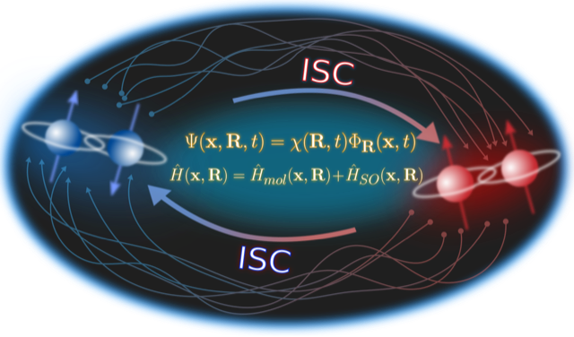

..  In ReStructured Text (ReST) indentation and spacing are very important 
    (it is how ReST knows what to do with your document). For ReST to 
    understand what you intend and to render it correctly please to keep the 
    structure of this template. Make sure that any time you use ReST syntax 
    (such as for ".. sidebar::" below), it needs to be preceded and followed 
    by white space (if you see warnings when this file is built they this is 
    a common origin for problems).

..  Firstly, let's add technical info as a sidebar and allow text below to 
    wrap around it. This list is a work in progress, please help us improve it. 
    We use *definition lists* of ReST_ to make this readable.

..  sidebar:: Software Technical Information

  Name
    G-CTMQC

  Language
    Fortran 90

  Licence
    GNU Lesser General Public License (LGPL)

  Documentation Tool
    doxygen

  Software Module Developed by
    Federica Agostini, Emanuele Marsili, Francesco Talotta

..  In the next line you have the name of how this module will be referenced 
    in the main documentation (which you can reference, in this case, as 
    ":ref:`example`"). You *MUST* change the reference below from "example" 
    to something unique otherwise you will cause cross-referencing errors. 
    The reference must come right before the heading for the reference to 
    work (so don't insert a comment between).

.. _G-CTMQC:

#######
G-CTMQC
#######

..  Let's add a local table of contents to help people navigate the page

..  contents:: :local:

..  Add an abstract for a *general* audience here. Write a few lines that 
    explains the "helicopter view" of why you are creating this module. 
    For example, you might say that "This module is a stepping stone to 
    incorporating XXXX effects into YYYY process, which in turn should allow 
    ZZZZ to be simulated. If successful, this could make it possible to
    produce compound AAAA while avoiding expensive process BBBB and CCCC."

Studies in the domain of photochemistry and photophysics strongly rely on 
simulation methods able to describe strong coupling between electronic and 
nuclear motion on the femtosecond time scale, usually called nonadiabatic 
coupling. Simulations give access to microscopic information in terms of 
molecular structures, electronic populations, vibrational energies that 
can be easily compared to experiments, for instance in the domains of 
time-resolved spectroscopy or 2D spectroscopy. In addition to this, molecular 
dynamics simulations allow to follow in real time the evolution of molecular 
systems, thus providing support to interpret and even predict the outcome of 
experiments.

Photochemical and photophysical reactions are ubiquitous in nature, from 
photosynthesis to vision, and are more and more exploited for technological 
advances, as for the photo-current production in organic photovoltaic devices. 
In addition, it is becoming clear the importance to consider spin-orbit coupling 
even in those systems composed of light elements, such as oxygen and carbon, to 
be able to describe processes such as intersystem crossings in organic light-emitting 
diodes.

G-CTMQC module provides numerical tools to perform simulations of internal 
conversion (spin-allowed) and intersystem crossing (spin-forbidden) phenomena 
underlying photochemical and photophysical reactions. G-CTMQC gives the user the 
flexibility of employing different approaches and, thus, various approximation 
schemes, to achieve dynamical information as accurate as possible, as well as 
ample flexibility in the choice of systems that be studied thanks to the interface 
of G-CTMQC with QuantumModelLib (E-CAM module).

Purpose of Module
_________________

**G-CTMQC** is a module for excited-state molecular dynamics simulations with various 
trajectory-based algorithms, including nonadiabatic coupling and spin-orbit coupling.
Nuclear dynamics can be performed based on the quantum-classical algorithm derived from 
the exact factorization of the electron-nuclear wavefunction [EF]_, dubbed CT-MQC [CT-MQC]_. 
Recently, the extension of the exact-factorization theory has been proposed to include 
spin-orbit coupling [SOC]_. Therefore, the “generalized” algorithm is now able to treat 
(i) standard nonadiabatic situations, where spin-allowed electronic transitions among 
states with the same spin multiplicity are mediated by the coupling to nuclear motion, 
and (ii) spin-orbit interactions, where spin-forbidden electronic transitions among 
states of different spin multiplicity are induced by the spin-orbit coupling.

Electronic evolution is carried out in the adiabatic basis for standard nonadiabatic problems. 
In the case of spin-orbit interactions, **G-CTMQC** offers the options to use the spin-diabatic 
or the spin-adiabatic representations. Information about electronic-structure properties, ie, 
energies, gradients and couplings, is calculated and read on-the-fly at the positions of the 
trajectories at each time step based on the QuantumModelLib library [4] of potentials (which 
**G-CTMQC** is interfaced to).

In addition, the code offers the possibility of performing calculations with the trajectory 
surface hopping algorithm [TSH]_ and the Ehrenfest approach [EH]_. Concerning the trajectory 
surface hopping method, the fewest switches scheme is implemented, along with the energy decoherence 
corrections to fix the overcoherence issue of surface hopping [TSH-EDC]_. For surface hopping and 
Ehrenfest, only nonadiabatic couplings are currently implemented.

Background Information
______________________

.. Keep the helper text below around in your module by just adding "..  " in front of it, which 
turns it into a comment

Detailed information about the exact factorization and CT-MQC [EF]_ can be found in 
`CTMQC <https://e-cam.readthedocs.io/en/latest/Quantum-Dynamics-Modules/modules/CTMQC/readme.html>`_ 
where the original version of the module is described. The generalized CTMQC, **G-CTMQC**, includes 
various new features to original module:

*  spin-allowed, between electronic states of the same spin multiplicity, and spin-forbidden, 
between electronic states of different spin multiplicity, transitions can be simulated; the former 
are mediated by the kinetic, also  called nonadiabatic, coupling between electronic and nuclear 
motion, whereas the latter are induced by spin-orbit coupling;

*  G-CT-MQC calculations, based on the generalized coupled-trajectory mixed quantum-classical 
algorithm, can be performed in the spin-diabatic and spin-adiabatic basis for the electronic subsystem;

*  nonadiabatic calculations based on trajectory surface hopping [TSH]_ and on the Ehrenfest 
approach [EH]_ can be carried out, including energy decoherence corrections in surface hopping 
[TSH-EDC]_; the fewest switches scheme is used for surface hopping;

*  on-the-fly dynamics can be performed based on the calculation of electronic structure information, 
namely energies, gradients and couplings, along the trajectories via the interface to the 
`QuantumModelLib <https://e-cam.readthedocs.io/en/latest/Quantum-Dynamics-Modules/modules/
QuantumModelLib/readme.html>`_ library.

The new features introduced in **G-CTMQC** are documented in Refs. [SOC]_ and [G-CT-MQC]_ concerning 
the inclusion of spin-orbit coupling in the exact factorization and in G-CTMQC, in Refs. [PSB3]_ 
and [IC]_ concerning the inclusion of trajectory surface hopping, Ehrenfest dynamics, and different 
possibilities of sampling the initial conditions. 

Building and Testing
____________________

.. Keep the helper text below around in your module by just adding "..  " in front of it, which turns 
it into a comment

**G-CTMQC** is a fortran90 based code. Compilation of the code requires the gfortran compiler, and 
Lapack libraries. Tests have been performed with GCC 7.x. Note that, before compiling **G-CTMQC** it 
is necessary to compile the potential library available `here <https://e-cam.readthedocs.io/en/latest/
Quantum-Dynamics-Modules/modules/QuantumModelLib/readme.html>`_ and copy the file *libpot.a* into the 
*src* directory of **G-CTMQC**.

Once the main directory CTMQC has been downloaded, go to the directory and

::

        cd ./src 

        make

Running the command *make* will compile the source code and generate the executable *main.x*.
Go back to the CTMQC directory with the command

::

        cd ../

and run the script

::

        ./create_dirs.sh

that creates the directory output where all output files will be generated. Notice that you should 
run this script in each new directory where you run the executable. The program generates a series 
of output files that are saved in different directories. Therefore, in order not to obtain errors 
during the execution of the program, the directories have to be created.

**CREATE THE OUTPUT DIRECTORY**

The directory output contains several subdirectories. After successful execution of the program, 
those subdirectories will contain :math:`N_{\textrm{files}} = N_{\textrm{steps}}/N_{\textrm{dump}}` 
files, with :math:`N_{\textrm{steps}}` the number of total time steps and and :math:`N_{\textrm{dump}}` 
the number of time steps after which a new output file is generated. In each subdirectory, the files 
are labelled with an index increasing with time, from 0 to :math:`N_{\textrm{files}}`. In the current 
version of the code, up to 999 files can be created.

The following subdirectories of the directory *output* will be created.

::

        coeff

Each file (named *coeff.xxx.dat*) in this directory contains the coefficients :math:`C_k^{(I)}(t)` of 
the expansion of the electronic wavefunction in the used electronic basis as a function of the position 
of the corresponding trajectory :math:`I`. Each file is in the form: the *first* :math:`N_{\textrm{dof}}` 
*columns* are the positions of the trajectories for each of the :math:`N_{\textrm{dof}}` nuclear 
degrees of freedom; the *following* *n x n* *columns*  are the real parts of :math:`[C_k^{(I)}
(t)]^*[C_l^{(I)}(t)]` with :math:`k,l=1,n` and :math:`n` the number of electronic states considered 
in the expansion; the *following* *n x n* *columns* are the imaginary parts of :math:`[C_k^{(I)}
(t)]^*[C_l^{(I)}(t)]` with :math:`k,l=1,n`.

::

        histo:  [only for one-dimensional calculations]

Each file (named *histo.xxx.dat*) in this directory contains the nuclear density approximated 
as a histogram that is constructed from the distribution of classical trajectories. The data 
listed in the file have the form: *first column* the position along the nuclear coordinated (coarser 
that the original grid, but defined in the same domain); *second column* the normalized histogram.

::

        trajectories

Each file (named *RPE.xxx.dat*) in this directory contains the values of the phase-space variables 
and the value of the gauge-invariant part of the time-dependent potential energy surface. The data 
listed in the file have the form: the *first* :math:`N_{\textrm{dof}}` *columns* are the positions 
of the trajectories for each of the :math:`N_{\textrm{dof}}` nuclear degrees of freedom; the 
*following* :math:`N_{\textrm{dof}}` *columns* are the momenta of the trajectories for each of 
the :math:`N_{\textrm{dof}}` nuclear degrees of freedom; the *following column* is the gauge-invariant 
part of the time-dependent potential energy surface; the *following* :math:`n` *columns* are the 
adiabatic energies.

Additionally, the files *BO_population.dat* and *BO_coherences.dat* are created, containing the 
population of the adiabatic states and the indicator of coherence as functions of time (the first 
columns is the time in atomic units). They are defined as

:math:`\rho_k(t) = \frac{1}{N_{traj}}\sum_{I=1}^{N_{traj}} \left|C_k^{(I)}(t)\right|^2`

and

:math:`\eta_{kl}(t) = \frac{1}{N_{traj}}\sum_{I=1}^{N_{traj}} \left|C_k^{(I)}(t)C_l^{(I)}(t)\right|^2`

respectively, with :math:`k=1,\ldots,n`.

**PROVIDED TESTS AND INPUT FILE**

In the main CTMQC directory the 

::

        tests

directory provides examples of input files to run one-dimensional calculations with CT-MQC, surface 
hopping and Ehrenfest on Tully model #3 [TSH]_ and some reference calculations.

::

      &SYSTEM
       TYP_CAL            = "XX"       !*character* XX = CT (CT-MQC calculations), EH 
(Ehrenfest calculations), SH (surface hopping calculations)
       SPIN_DIA           = X          !*logical* X = T only for calculations with 
spin-orbit coupling in the spin-diabatic basis, otherwise X = F
       NRG_CHECK          = X          !*logical* X = T to switch off the spin-orbit 
coupling when the energy between states is larger than NRG_GAP
       NRG_GAP            = X          !*real* only for calculations with spin-orbit 
coupling in the spin-diabatic basis
       MODEL_POTENTIAL    = "XXXXX"    !*character* XXXXX = definition of the model as 
it appears in QuantumModelLib
       OPTION             = X          !*integer* X = 1, 2, 3 for Tully's models #1, #2,
 #3 (only used for Tully's models calculations)
       N_DOF              = X          !*integer* X = number of nuclear degrees of freedom
       PERIODIC_VARIABLE  = X,X,X...   !*logical* one value for each nuclear degree of 
freedom with X = T (periodic coordinate) or F 
       PERIODICITY        = X,X,X...   !*real* one value for each nuclear degree of freedom 
with X = the period in units of PI
       NSTATES            = X          !*integer* X = number of electronic states         
       M_PARAMETER        = X,X,X...   !*real* one value for each nuclear degree of freedom 
with X = typical distance to tune the coupling among the trajectories in CT calculations
       QMOM_FORCE         = X          !*logical* X = F to switch off the force from the 
quantum momentum (only) in CT calculations
       DECOHERENCE        = X          !*logical* X = F for surface hopping or T for surface 
hopping with energy decoherence corrections
       C_PARAMETER        = X          !*real* energy parameter for the energy decoherence 
correction in surface hopping
       JUMP_SEED          = X          !*integer* seed for random number generator for the 
hopping algorithm in SH calculation
     /
     &DYNAMICS
      FINAL_TIME       = X             !*real* X = length of the simulation in atomic units
      DT               = X             !*real* X = integration time step in atomic units
      DUMP             = X             !*integer* X = number of time steps after which the 
output is written
      INITIAL_BOSTATE  = X             !*integer* X = initial electronic state
      NTRAJ            = X             !*integer* X = number of classical trajectories
      R_INIT           = X,X,X...      !*real* one value for each nuclear degree of freedom 
with X = average position of the initial nuclear distribution
      K_INIT           = X,X,X...      !*real* one value for each nuclear degree of freedom 
with X = average momentum of the initial nuclear distribution
      SIGMAR_INIT      = X,X,X...      !*real* one value for each nuclear degree of freedom 
with X = variance in position space of the initial nuclear distribution
      SIGMAP_INIT      = X,X,X...      !*real* one value for each nuclear degree of freedom 
with X = variance in momentum space of the initial nuclear distribution
      MASS_INPUT       = X,X,X...      !*real* one value for each nuclear degree of freedom 
with X = the nuclear mass
    /
    &EXTERNAL_FILES
     POSITIONS_FILE     = "XXXXX"      !*character* XXXXX = file containing the list of 
initial positions for the trajectories; if the field is empty, positions are sampled according 
to R_INIT and SIGMAR_INIT
     MOMENTA_FILE       = "XXXXX"      !*character* XXXXX = file containing the list of initial 
momenta for the trajectories; if the field is empty, momenta are sampled according to K_INIT and SIGMAP_INIT
     OUTPUT_FOLDER      = "XXXXX"      !*character* XXXXX = path to the location where the 
output is written
    /

Source Code
___________

.. Notice the syntax of a URL reference below `Text <URL>`_ the backticks matter!

The **G-CTMQC** source code and test files can be found following this 
`link <https://gitlab.com/agostini.work/g-ctmqc>`_.

References
__________

.. [EF] F. Agostini, E. K. U. Gross, *Quantum chemistry and dynamics of excited states: 
        Methods and applications*, edited by L. González and R. Lindh, Wiley (2020).

.. [CT-MQC] S. K. Min, F. Agostini, E. K. U. Gross, *Phys. Rev. Lett.* 
          **115** (2015) 073001 
`DOI: 10.1103/PhysRevLett.115.073001 <https://doi.org/10.1103/PhysRevLett.115.073001>`_

.. [TSH] J. C. Tully, *J. Chem. Phys.* 
          **93** (1990) 1061 `DOI: 10.1063/1.459170 <https://doi.org/10.1063/1.459170>`_

.. [EH] J. C. Tully, *Faraday Discuss.* 
          **110** (1998) 407 `DOI: 10.1039/A801824C <https://doi.org/10.1039/A801824C>`_

.. [TSH-EDC] G. Granucci, M. Persico, *J. Chem. Phys.*
             **126** (2007) 134114 `DOI: 10.1063/1.2715585 <https://doi.org/10.1063/1.2715585>`_

.. [G-CT-MQC] F. Talotta, S. Morisset, N. Rougeau, D. Lauvergnat, F. Agostini, 
*J. Chem. Theory Comput.* **16** (2020) 4833-4848 `DOI: 10.1021/acs.jctc.0c00493 
          <https://dx.doi.org/10.1021/acs.jctc.0c00493>`_

.. [PSB3] E. Marsili, M. Olivucci, D. Lauvergnat and F. Agostini, *J. Chem. Theory Comput.*
          **16** (2020) 6032-6048 `DOI: 10.1021/acs.jctc.0c00679 
<https://dx.doi.org/10.1021/acs.jctc.0c00679>`_

.. [SOC] F. Talotta, S. Morisset, N. Rougeau, D. Lauvergnat, F. Agostini, *Phys. Rev. Lett.* 
         **124** (2020) 033001 `DOI: 10.1103/PhysRevLett.124.033001 
<https://doi.org/10.1103/PhysRevLett.124.033001>`_

.. [IC] C. Pieoroni, E. Marsili, D. Lauvergnat and F. Agostini, *to be submitted*.
