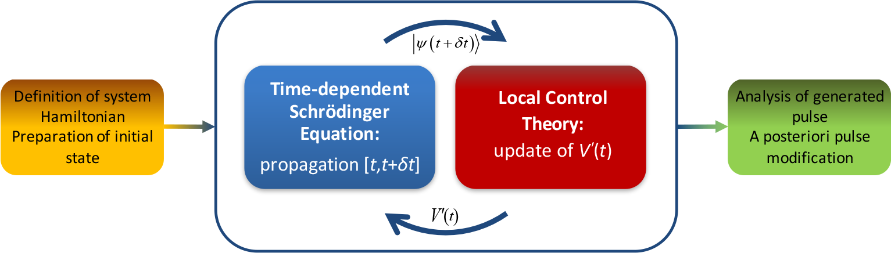

.. _LocConQubit:

####################
LocConQubit
####################

.. sidebar:: Software Technical Information

  Language
    Python 3.5

  License
    MIT license (MIT)

  Documentation Tool
    sphinx

.. contents:: :local:

.. This is an example of what a *module* for E-CAM looks like. Please add to this template any additional items that are
.. straightforward to fill out in the general case. You are free add any level of complexity you wish (within the bounds of
.. what ReST_ can do).

.. To add your module, fork this GitLab repository to your account on GitLab. Clone your repository, make a feature branch
.. and add a directory that will contain your module information. Copy this :download:`readme.rst` file there. Push your
.. changes back to GitLab and immediately open a merge request from your feature branch against our repository. We can
.. discuss your module in the merge request and help you get it accepted.

.. Add technical info as a sidebar and allow text below to wrap around it

Purpose of Module
_________________

LocConQubit is a code for constructing controlled pulses on isolated qubit systems that can either drive the population 
between specific qubit states or work as a logical gates between qubits. 
LocConQubit implements the Local Control Theory (LCT) which generates the required pulses on-the-fly. 
The generated pulses can be further post-processed with a variety of tools accompanying the LocConQubit module in order 
to obtain an optimal control pulse. 

Local Control Theory (LCT)
______________________________

In general Local Control Theory is an on-the-fly procedure for updating the time-dependent Hamiltonian (:math:`\hat{H}(t)`) to achieve 
a population transfer from some initial quantum state to a designated quantum target state (:math:`| \psi \rangle`). [LCT1]_ [LCT2]_ 
LCT achieves its full capacity if the time-dependent component of the full system Hamiltonian :math:`\hat{H}(t)` can be decomposed as an external perturbation 
(:math:`V^{\prime}(t) \times \hat{H}^{\prime}`) acting on a system with a time-independent Hamiltonian (:math:`\hat{H}_{0}`),

:math:`\hat{H}(t) = \hat{H}_{0} + V^{\prime}(t) \times \hat{H}^{\prime}`,

and if the targeted quantum state :math:`| \psi \rangle` is an eigenstate of the same time-independent Hamiltonian :math:`\hat{H}_{0}`,

:math:`\hat{H}_{0} | \psi \rangle = \epsilon | \psi \rangle`.

LCT in this case constructs a time-dependent perturbation :math:`V^{\prime}(t)` from the expression 

:math:`V^{\prime}(t) = -i \langle \Psi(t) | \Big[ \hat{H}^{\prime},| \psi \rangle \langle \psi | \Big] | \Psi(t) \rangle`,

which will achieve the required population transfer from any initial state to the :math:`| \psi \rangle` target state. 
The new time-dependent potential component :math:`V^{\prime}(t)` updates the time-dependent component of the full Hamiltonian 
describing the evolution of the system with the time-dependent Schrödinger equation

:math:`i \frac{\partial}{\partial t} |\Psi(t)\rangle = \hat{H}(t) |\Psi(t) \rangle`.

The LCT procedure is applied sequentially in small integration steps :math:`[t,t+\delta t]` within the propagation of above equation 
until the population has been completely transferred to the designated target state. 
The schematic below illustrates the LCT procedure.

Applications of the Module
__________________________

Application of the LCT module can be found at the `pilot project web page <https://www.e-cam2020.eu/pilot-project-ibm/>`_ .

Installation
____________

The LocConQubit is a Python based code. 
The module requires the presence of QuTip_ (version 4.1 or above) program package and the modules accompanying QuTip 
(namely: numpy (version 1.13 or above), scipy (version 0.18 or above), matplotlib (version 2.10 or above)).
A Python interpreter 3.5 or above is required, because the module has not been used with Python 2 versions. 
Instructions on how to install the QuTip and the accompanying program packages can be found on this link_ . 
Upon the successful installation of QuTip, all other required packages will be present. 
It is highly recommended to verify the QuTip after its installation. Instructions for QuTip testing are provided on 
the installation page_ .

.. _QuTip: http://qutip.org/docs/4.1/index.html
.. _link: http://qutip.org/docs/4.1/installation.html
.. _page: http://qutip.org/docs/4.1/installation.html#verifying-the-installation

Testing
_______

Proper functionality of LocConQubit module can be verified by performing the unit tests simply by executing the below command in the 
directory containing all LocConQubit module files

::

	python test_LCT.py

where `python` is an alias for a Python 3.5 version interpreter or higher. Five unit tests are executed sequentially and all must pass 
successfully in order to use the LocConQubit module.

Source Code
___________

The LocConQubit module source code is located at: https://gitlab.e-cam2020.eu:10443/Quantum-Dynamics/QC

Source Code Documentation
_________________________

The source code is accompanied with `sphinx <http://www.sphinx-doc.org/en/stable/>`_ documentation located in sub-directory *doc*. 

Instractions for sphinx installation can be found `here <http://www.sphinx-doc.org/en/stable/tutorial.html#install-sphinx>`_.

The html documentation files can be obtained by executing the following command in the *doc* sub-directory

::

        cd ./doc

        make html

The generated documentation is located in the *./doc/_build/html/index.html*

References
__________

.. [LCT1] B. F. E. Curchod, T. J. Penfold, U. Rothlisberger, I. Tavernelli *Phys. Rev. A* 
          **84** (2012) 042507 `DOI: 10.1103/PhysRevA.84.042507 
          <https://journals.aps.org/pra/abstract/10.1103/PhysRevA.84.042507>`_

.. [LCT2] B. F. E. Curchod, T. J. Penfold, U. Rothlisberger, I. Tavernelli *Chem. Phys. 
          Chem.* **16** (2015) 2127 `DOI: 10.1002/cphc.201500190
          <http://onlinelibrary.wiley.com/doi/10.1002/cphc.201500190/abstract>`_

