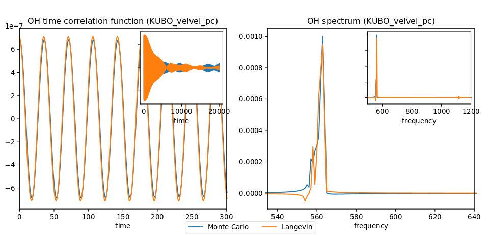
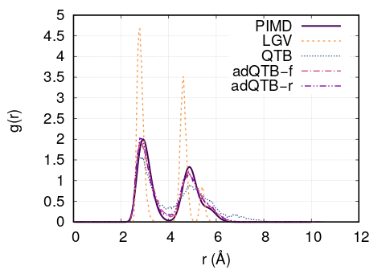

.. _PIM_qtb:

#######
PIM_qtb
#######

.. sidebar:: Software Technical Information

  Language
    Fortran 90/95

  Licence
    MIT license (MIT)

  Documentation Tool
    Sphinx
    Doxygen

.. contents:: :local:

Purpose of Module
=================

Module **PIM_qtb**  generates trajectories according to one of the following stochastic methods:

- Classical Langevin dynamics

- Quantum Thermal Bath [Dam]_

- Adaptive Quantum Thermal Bath [Man]_ 

These trajectories can be used to sample initial conditions for Linearized Semi-Classical Initial Value Representation (LSC-IVR) calculations. 

Description of the module
=========================

The module implements different methods based on Langevin dynamics. 
The trajectories generated can be exploited directly or used to
sample initial conditions for LSC-IVR calculations.
The methods implemented are: classical Langevin dynamics,
Quantum Thermal Bath (QTB) and two variants of adaptive QTB (adQTB-r and
adQTB-f).

Classical Langevin dynamics
---------------------------

Classical Langevin dynamics is described by a stochastic differential
equation :

.. math::  \dot p = -\nabla U - \gamma p + F(t)
   :label: eqLGV

where :math:`p` is the momentum vector of the set of
atoms, interacting via the potential :math:`U` , :math:`\gamma` is the damping coefficient
and :math:`F(t)` is the stochastic force. The random force  :math:`F(t)` 
is a Gaussian white noise: to enforce the classical fluctuation-dissipation theorem, 
its autocorrelation spectrum is given by :

.. math:: C_{FF}(\omega)= \int \limits_{-\infty}^{+\infty} dt \langle F(t) F(t+\tau) \rangle e^{-i \omega t}  = 2m \gamma  k_B T

where :math:`k_B` is the Boltzmann constant and :math:`T` the
temperature.

Quantum Thermal Bath (QTB)
--------------------------

The Quantum Thermal Bath uses a generalized Langevin equation in order 
to approximate nuclear quantum effects [Dam]_ .  In QTB dynamics, the
stochastic force is no longer a white noise but is colored according to the
following formula :

.. math:: C_{FF}(\omega)=2m \gamma  \theta(\omega,T)
       :label: eqQTB

with

.. math:: \theta(\omega,T) = \hbar \omega \left[\frac{1}{2}+\frac{1}{e^{\hbar \beta \omega}-1}\right]

where :math:`\beta = \frac{1}{k_BT}` and :math:`2 \pi \hbar` is the Planck
constant. The function :math:`\theta(\omega,T)` describes the energy
of a quantum harmonic oscillators of angular frequency
:math:`\omega` at a temperature :math:`T` .  The colored random force allows  
approximating zero-point energy contributions to the equilibrium properties of the system. 
The QTB method is known to lead to qualitatively
good results [Bri]_ but as many semi-classical methods, it suffers from zero-point energy leakage
(ZPEL) [Hern]_.

Adaptive Quantum Thermal Bath (adQTB-r/f)
~~~~~~~~~~~~~~~~~~~~~~~~~~~~~~~~~~~~~~~~~

The Adaptive Quantum Thermal Bath is an extension of the QTB method, 
designed to eliminate the zero-point energy leakage by enforcing 
the energy distribution prescribed by the quantum fluctuation-dissipation theorem 
for each degree of freedom and each frequency, all along the trajectories [Man]_ .

In practice, this is done by minimizing the fluctuation-dissipation spectrum 
:math:`\Delta_{FDT}` defined as:

.. math:: \Delta_{FDT} (\omega)  = {\rm{Re}} \left[C_{vF}(\omega)\right] - m \gamma_{r} (\omega) C_{vv} (\omega)  
    :label: eqDFDT
    

where :math:`C_{vF}` is the velocity random force cross-correlation
spectrum, :math:`C_{vv}` the velocity autocorrelation spectrum and
:math:`\gamma_{r}` a set of damping coefficients dependent (or not) on
the frequency.

This minimization is carried out on the fly during the QTB simulation by dissymetrizing 
the system-bath coupling coefficients corresponding to the damping force (dissipation) 
and to the random force (energy injection).
This can be done either by directly modifying the random force spectrum
:math:`F(t)` with frequency dependent damping term
:math:`\gamma_r(\omega)` (adQTB-r variant) or by modifying the memory
kernel of the dissipative force :math:`\gamma_{f} (\omega)` within the framework of a
non-Markovian generalized Langevin equation (adQTB-f variant).

The coefficients :math:`\gamma_r` or :math:`\gamma_f` are slowly
adjusted with a first-order differential equation and an adaptation coefficient
:math:`A_\gamma` :

.. math::  \frac{d }{dt}\gamma_{r/f} (\omega)  \propto  A_\gamma  \gamma \Delta_{FDT,r/f}(\omega,t)
       :label: eqgammadapt

during a preliminary “adaptation time” until they reach convergence. 
Observables are then computed while the adaptive process is kept active.
Further informations and precise implementation details can be found in ref. [Man]_.

Two implementations are currently available in PaPIM:

#. Random force adaptive QTB (adQTB-r):  

   In this variant, the dissipation kernel is left unchanged, i.e. :math:`\gamma_{f}(\omega) = \gamma`
   while the random force is modified according to a frequency-dependent
   set of damping coefficients :math:`\gamma_r(\omega)` to satisfy
   :math:`\Delta_{FDT} = 0` (eq. :eq:`eqDFDT`):

   .. math:: C_{FF}(\omega)=2m \gamma_r(\omega)  \theta(\omega,T)
      :label: eqadQTBr

   This method is applicable only if the initial damping coefficient
   :math:`\gamma` is large enough to compensate effects of a possible
   zero-point energy leakage.

#. Dissipative kernel adaptive QTB (adQTB-f) 

   In this approach, the random force is not modified, i.e.
   :math:`\gamma_{r} (\omega) = \gamma` and remains the same as in the standard QTB
   method (eq. :eq:`eqQTB`)) but the dissipation term is not 
   described by a viscous damping term anymore (:math:`-m \gamma v`) but
   corresponds to a non-Markovian dissipative force. This leads to the following 
   generalized Langevin equation:

   .. math::  \dot p = -\nabla U - \int_0^\infty \  \gamma_f(\tau) p(t-\tau) \ d\tau + F(t)
      :label: eqgenlgv

   In order to avoid solving with brute force this integro-differential
   equation, the dissipative memory kernel is expressed as a sum of
   equally spaced (:math:`\Delta \omega`) lorentzian functions of width
   :math:`\alpha` :

   .. math:: \gamma_f(\omega) = \frac{\Delta \omega}{\pi}\sum_{j=0}^{n_\omega} 
             \frac{ \gamma_{f,j} }{\alpha + i(\omega-\omega_j)} +\frac{ \gamma_{f,j}}{\alpha + i(\omega+\omega_j)}
      :label: eqlorentzgenlgv

The parameter :math:`\gamma_{f,j}` are then modified to satisfy
:math:`\Delta_{FDT} = 0` (eq. :eq:`eqDFDT`). 

Input file
==========

To run PaPIM using one of the Langevin methods, one must set the
parameter *sampling\_type* in the *sampling* section to one of the
following values:

-  classical\_langevin

-  qtb

-  adqtbr

-  adqtbf

| In this case the parameters *n\_equilibration\_steps* and
  *n\_mc\_steps* are ignored and the section *langevin* is read.
|  
| The section *langevin* must specify the following parameters:

-  *dt* : time step of the Langevin dynamics (REAL)

-  *lgv\_nsteps* : number of Langevin steps between each IVR sample
   (INTEGER)

-  *lgv\_nsteps\_therm* : number of thermalization steps (INTEGER)

-  *integrator* : integration method (two splitting methods are
   currently implemented: BAOAB, ABOBA (see reference
   [Lei]_ )) (STRING,
   default=“ABOBA”)

-  *damping* : base damping coefficient for production runs
   (:math:`\gamma` in eq. :eq:eqLGV) (REAL)

-  *damping\_therm* : base damping coefficient for thermalization
   (:math:`\gamma` in eq. :eq:eqLGV) (REAL)

-  *qtb\_frequency\_cutoff* : cutoff frequency for the QTB kernel (REAL)

-  *adqtb\_agammas* : (Only for adqtbr and adqtbf) adaptation speed
   coefficient for adQTB (:math:`A_\gamma` in eq. :eq:`eqgammadapt`)(REAL)

-  *adqtb\_alpha* : (Only for adqtbf) Width of the lorentzian used to
   represent the dissipative kernel :math:`\gamma_f(\omega)`
   (:math:`\alpha` in eq. :eq:`eqlorentzgenlgv`) (REAL)

-  *write\_spectra* : write average random force autocorrelation
   function ff, velocity autocorrelation function vv and velocity random
   force cross-correlation function vf spectra (LOGICAL, default=.FALSE.)

-  *write\_trajectories* : write Langevin trajectories in x,y,z,px,py,pz
   format (LOGICAL, default=.FALSE.)

Remark: all physical quantities are specified in Hartree atomic units.

Output files
============

The Langevin module is plugged to the IVR subroutines and thus can
output the same correlation functions as the classical MC sampling.
Additionally, it can write the Langevin trajectories and spectra
obtained directly from them.

Langevin trajectories
---------------------

If the parameter *write\_trajectories* of the *langevin* section of the
input file is set to TRUE, Langevin trajectories are saved. Trajectory
files follow the following format:

::

    num_of_atoms

        At_symbol(1)   X   Y   Z   Px  Py  Pz 
        At_symbol(2)   X   Y   Z   Px  Py  Pz
           .
           .
        At_symbol(n)   X   Y   Z   Px  Py  Pz
    num_of_atoms

        At_symbol(1)   X   Y   Z   Px  Py  Pz 
        At_symbol(2)   X   Y   Z   Px  Py  Pz
           .
           .
        At_symbol(n)   X   Y   Z   Px  Py  Pz
     .
     .
     .

This corresponds to an extended XYZ format with information on momenta.
It is readable by visualization software such as VMD to display the
trajectories.

The module outputs multiple trajectory files depending on the number of
independent trajectories (blocks) and the number of MPI processes. The
naming follows the rules:

-  ``xp.traj.xyz`` for 1 block and 1 process

-  ``xp_proci.traj.xyz`` for 1 block and multiple processes

-  ``xp_proci_blockj.traj.xyz`` for multiple blocks and processes

QTB analysis files
------------------

In addition to the trajectories, several files can be edited during the
simulations. They are useful to carefully check the convergence of the
adaptive QTB, notably by calculating :math:`\Delta_{FDT}(\omega)` (eq. :eq:`eqDFDT`).

-  ``ff_vv_vf_spectra.out`` spectra of random force and velocity
   autocorrelation and random force velocity cross-correlation functions
   (in atomic units)

   :math:`\omega` :math:`C_{FF} (\omega)`
   :math:`2m \gamma  \theta(\omega,T)` :math:`C_{vv} (\omega)`
   :math:`m \gamma C_{vv} (\omega)` :math:`C_{vF} (\omega)`

-  ``gamas.out`` (for adQTB-r and adQTB-f only) final set of
   :math:`\gamma_{r/f} (\omega)` optimized during the adaptive procedure (in atomic units)

   :math:`\omega` :math:`\gamma_{r/f} (\omega)` :math:`\gamma`

Tests on implemented potentials
===============================

OH anharmonic potential
-----------------------

The classical Langevin has been tested on the OH anharmonic potential.
The left panel of Figure :numref:`fig_oh` shows time correlation functions
obtained with IVR using initial conditions sampled from classical
(Boltzmann) Monte Carlo and from classical Langevin. Its right panel
shows the corresponding spectra obtained by Fourier transform.

.. _fig_oh:

   Left panel: OH time correlation function using IVR with initial
   conditions sampled from MC and from Langevin. Right panel:
   corresponding spectra obtained by FFT.

Lennard-Jones :math:`Ne_{13}` cluster
-------------------------------------

A Lennard-Jones potential has been implemented in
``LennardJonesPot.f90`` with the following pair potential:

.. math::  V(r_{ij}) = \sum\limits_{i=1}^{N} \sum\limits_{j>i}^{N} 
   4 \epsilon  \left(  \left( \frac{\sigma}{r_{ij}} \right)^{12} 
   - \left( \frac{\sigma}{r_{ij}} \right)^6  \right)
   :label: eqLJ_pot

A confining pair potential (useful in the cases of small clusters) can
be added to eq. :eq:`eqLJ_pot`. A 4th order polynomial is used for
distances greater than a chosen distance :math:`r_{cont}`:

.. math:: V_{conf}(r_{ij}) = \sum \limits_{i=1}^{N} \sum \limits_{j > i}^{N} 
   \epsilon \left ( r_{ij} - r_{cont} \right)^4
   :label: eqLJ_cont

Parameters for this potential are specified in an external text file.
The file name is given in the input file using the parameter
*lennard\_jones\_parameters* in section *system*. The parameters to
specify are:

-  *epsil* : depth of the potential well :math:`\epsilon` (in Kelvin)
   (eq. :eq:`eqLJ_pot`)

-  *sigma* : distance for which the potential cancels :math:`\sigma` (in
   Å) (eq. :eq:`eqLJ_pot`)

-  *r\_cont* : minimum distance for which a confining potential
   :math:`r_{cont}` defined in eq. :eq:`eqLJ_cont` is applied (in Å)

The QTB and both adaptive methods were tested on a Ne13 cluster in order
to reproduce results from reference [Man]_.
The Lennard-Jones parameters which have been used are
:math:`epsil=34.9`, :math:`sigma=2.78` and :math:`r\_cont=10.` 5 runs of
8000 steps with 16000 initial time steps are used with all four methods
(Langevin, QTB, adQTB-r,adQTB-f). Damping term is set to 5.0e-5 atomic
units and adaptive coefficients :math:`A_\gamma` and :math:`\alpha` for
adQTB-f to 5.0e-6 atomic units. Pair correlation function is then
computed from the trajectories output with a Python script
``compute_g2r.py``. Results are shown in figure :numref:`fig_Ne13g2r` and are in
agreement with the ones of ref. [Man]_.

.. _fig_Ne13g2r:

   
   Pair correlation function of Ne\ :math:`_{13}` cluster obtained with
   Langevin, QTB, adQTB-r and adQTB-f implemented with Langevin module
   in PaPIM. Reference curve calculated with Path Integral Molecular
   Dynamics (PIMD)

In this particular case, adaptive QTB leads to significantly better
results than both classical Langevin and QTB when comparing them to the
reference results obtained with PIMD (Path Integral Molecular Dynamics).

Implementation
==============

Langevin module is built with the fewest modifications possible in the
main and previous code of PaPIM. The main program of the sampler is in
the file ``langevin.f90``. It is structured in the same fashion as the
existing samplers (``PIM.f90`` and ``ClassMC.f90``) and only provides
the subroutine *langevin\_sampling* to the main program.

Source files
------------

The Langevin module is divided in multiple files:

-  ``langevin.f90``: contains the Langevin sampler and links the main
   code with the other files of the module

-  ``langevin_integrator.f90``: subroutines to integrate Langevin
   equations

-  ``langevin_analysis.f90``: spectral analysis tools for Langevin and
   (ad)QTB trajectories

-  ``qtb_random.f90``: generation of QTB colored noise and adaptation
   subroutines for adQTB

Other modifications
-------------------

Some other routines have been modified during the implementation of
Langevin module.

-  ``PaPIM.f90``: main code ; add calls to Langevin module

-  ``GlobType.f90``: add declarations for Langevin

-  ``ReadFiles.f90``: read input files

Compiling
=========

A Fortran 90/95 compiler with MPI wrapper is required for successful compilation of the code. 
Although the correlation function subroutines are serial, the remaining code is parallelized so MPI wrappers have to be used. 
The code must be compiled using the FFTW library.
Quantum correlation subroutines within PIM_qtb modules are compiled by executing the command ``make`` in the ``./source`` directory. 
The same make command generates a ``PaPIM.exe`` executable for testing of the correlation functions. 

Testing
=======

For PIM_qtb test purposes the ``numdiff`` package is used for automatic comparison purposes and should be made
available before running the tests, otherwise the ``diff`` command will be used automatically instead but the user
is warned that the test might fail due to numerical differences.
The user is advised to download and install ``numdiff`` from `here <http://www.nongnu.org/numdiff/>`_.
Tests and corresponding reference values are located in sub-directories ``./tests/xxx``, where ``xxx`` stands 
for ``oh`` and ``lj`` systems. 
``lj`` tests also requires a Python distribution.
Before running the tests the code has to be properly compiled by running the ``make`` command in the 
``./source`` sub-directory:

Tests can be executed automatically by running the command in the ``./tests`` sub-directory :
#. ``./test+lgv.sh`` for tests on OH bonds compared to previous classical implementation  
#. ``./test_lj.sh`` for tests on a Ne:. 
All test are executed on one processor core.
Due to small numerical discrepancies between generated outputs and reference values which can cause the tests to fail, 
the user is advised to manually examine the numerical differences between generated output and the corresponding 
reference values in case the tests fail. 

Source Code
===========

The PIM_qtb module source code is located at: https://gitlab.e-cam2020.eu:10443/thomas.ple/PIM.git (Temporary link).

Source Code Documentation
=========================

The documentation can also be compiled by executing the following commands in ``./doc/QTB_doc`` directory with "Sphinx" (documentation tool) python module installed:

::

   sphinx-build -b html source build
   make html

The source code documentation can be generated automatically in ``./doc`` sub-directory, 
html and latex format, by executing the following command in the ``./doc`` directory:

::

	doxygen PIMqcf_doxygen_settings

References
==========
.. [Dam] H. Dammak, Y. Chalopin, M. Laroche, M. Hayoun, J.-J. Greffet,  Quantum Thermal Bath for Molecular Dynamics Simulation, Phys. Rev. Lett. 103 (2009) 190601.

.. [Man] E. Mangaud,  S. Huppert,  T. Plé,  P. Depondt,  S. Bonella,  F. Finocchi, The Fluctuation–Dissipation Theorem as a Diagnosis and Cure for Zero-Point Energy Leakage in Quantum Thermal Bath Simulations, J. Chem. Th. Comput. 15 (2019) 2863-2880.

.. [Bri] F. Brieuc, Y. Bronstein, H. Dammak, P. Depondt, F. Finocchi, M. Hayoun,  Zero-point energy leakage in quantum thermal bath molecular dynamics simulations,  J. Chem. Th. Comput. 12 (2016) 5688–5697.

.. [Hern] J.  Hern'andez-Rojas,  F.  Calvo,  E.  G.  Noya,   Applicability  of  Quantum Thermal Baths to Complex Many-Body Systems with Various Degrees of Anharmonicity, Journal of Chemical Theory and Computation 11 (2015) 861–870.

.. [Lei] B. Leimkuhler,  C. Matthews,  Rational Construction of Stochastic Numerical Methods for Molecular Sampling, Applied Mathematics Research eXpress (2012).

