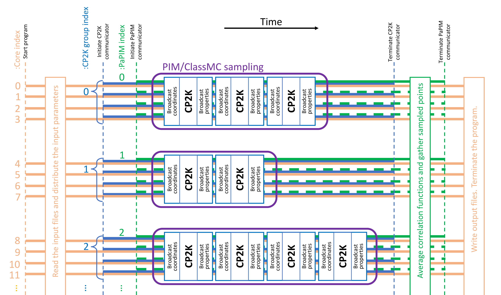

.. _PaPIM-CP2K_Interface:

####################
PaPIM-CP2K_Interface
####################

.. sidebar:: Software Technical Information

  Language
    Fortran 90/95

  Licence
    MIT license (MIT)

  Documentation Tool
    Doxygen

  Software Module Developed by
    Momir Mališ, Ari P. Seitsonen

.. contents:: :local:

Purpose of Module
_________________

Module **PaPIM-CP2K_Interface** couples the :ref:`PaPIM code <PaPIM>` with the 
`CP2K program package <https://www.cp2k.org/about>`_, where the latter is used for calculation of system 
electronic structure properties. 
It directly links CP2K as a library for potential energy calculations to the PaPIM code and avoids the 
significantly slower exchange of information between the two codes by reading and writing to an external file. 
The CP2K program package provides a general framework for different modeling methods such as DFT using 
the mixed Gaussian and plane waves approaches, semi-empirical methods and classical force fields. 
This enables virtually calculation of time-dependent correlation functions for any system, without depending on 
the availability of analytical potentials for the studied system, as was the previous case in PaPIM code. 
Using the MPI split communicator approach the CP2K subroutines can be executed on multiple cores for each 
sampling trajectory, enabling a parallel calculation of system potential energy and gradient values. 

Applications of the Module
__________________________

The inclusion of CP2K for computation of system's electronic structure properties enables calculation of 
time-dependent correlation functions to a vast range of systems, while CP2K can perform atomistic simulations 
of solid state, liquid, molecular, periodic, material, crystal, and biological systems. 
The PaPIM code has also been upgraded with periodic boundary conditions to enable simulations of solid and 
liquid state systems. 
For any system whose properties can be determined with the CP2K code, a corresponding time-dependent correlation 
function can be computed now with the PaPIM code. 

Compiling
_________

In order to compile this module the CP2K program package has to be properly set-up and the CP2K has to be 
compiled as a library as well. 
In the latter case, the CP2K root directory contains a sub-directory ``lib`` which 
contains the corresponding library files. 
In the absence of the latter, CP2K cannot be linked to PaPIM code. 
For information on installing the CP2K code and compiling it as a library the user is advise to examine the 
CP2K installation documentation at this `link <https://www.cp2k.org/howto:compile>`_. 

Fortran compiler with a MPI wrapper together with lapack libraries have to be available to successfully 
compile the code. 
The user is advise to examine the ``Makefile`` in the ``./source`` sub-directory prior to code compilation 
in order to select an appropriate compiler and to check or adapt the compiler's options 
to his local environment, or to generally modify the compiler options to his requirements. 
Special care should be made on the CP2K paths to the corresponding library files on certain systems. 
The ``Makefile`` contains two example cases encountered on cluster systems (which use Intel compilers) 
but any other variation is possible. 

Compilation flag ``--D__USE_CP2K`` controls the inclusion of CP2K into the PaPIM code. 
In the default compilation settings the flag is commented out. 
To include CP2K into compilation the user is required to enable the flag in the ``Makefile``. 
If the flag is omitted the PaPIM code will be compiled without CP2K and without the split communicator 
parallelization scheme. 
The latter is not used with any current analytic potential subroutine so it is omitted (for more 
details on the potential subroutine see :ref:`here <PotMod>`). 
We advise to compile the PaPIM code first successfully (by executing and checking the standard tests) before 
linking it to CP2K. 

Upon adapting the ``Makefile``, the code compilation is executed by command ``make`` in the ``./source`` 
sub-directory. 
The executable ``PaPIM.exe`` is created at the same location upon successful compilation.

For module's testing purposes the user is advise to have ``numdiff`` package installed before running the tests. 
More details on the numdiff program package and its installation are available 
`here <http://www.nongnu.org/numdiff/>`_.

The PaPIM documentation is generated by executing the ``make`` command in the ``./doc`` sub-directory.

Testing
_______

Testing comprises of a set of tests for the analytic potentials and a set of tests for the CP2K interface 
to PaPIM code. 
Tests and all corresponding reference files are located in sub-directory ``./tests``. 
All tests have to be performed in this sub-directory. 
Details of the structure of the test files/sub-directories are explained in the :ref:`PaPIM code testing 
section <PaPIM>`. 
CP2K tests and reference files are located in the sub-directory ``cp2k``.

Tests are performed automatically in the ``./tests`` sub-directory by executing the command:

::

	./test.sh -c -n [number of cores]

The optional flag ``-c`` includes running of the CP2K tests and should only be used if PaPIM 
code was compiled with CP2K. 
If omitted only the tests using the analytic potential will be performed. 
Flag ``-x`` omits the analytic potential tests and executes only the CP2K tests. 

Flag ``-n [number of cores]`` controls the number of processor cores used in the tests. 
Omitting this flag the tests will be performed on two processor cores (default value).
Because the number of trajectories for sampling in certain tests are limited to 20, the number 
of processor cores should not exceed 20. 
In all cases the CP2K potential is calculated on one processor core for each trajectory. 
In order to change that, a different ``group_size`` variable should be specified manually in the 
corresponding ``CONTROL`` files located in sub-directory of each test case. 
Note that the total number of processor cores used in the tests should be divisible by the ``group_size`` 
value (see details in Parallelization and Benchmarking section).

For comparison of generated output values with reference data the test script uses ``numdiff`` command 
in order to compensate for small numerical differences. 
By default the script looks first for the ``numdiff`` command on the system, and in case it fails to 
locate it, the standard ``diff`` command will be used instead. 
However, the user is warned that due to small numerical differences between generated output and corresponding 
reference values the automated tests are most likely to fail. 
A local ``numdiff`` package copy can be included in the test by specifying its absolute path. 
For this and other options of the test script list them with the command ``./test.sh -h``.

Source Code
___________

The full PaPIM code with the interface subroutine to the CP2K is located at: 
https://gitlab.e-cam2020.eu:10443/Quantum-Dynamics/PIM/tree/master/source.

Git is recommended for downloading the full copy of the code.

The main interface subroutines for linking PaPIM to CP2K are located in the Fortran module 
file ``cp2k_module.f90``. Corresponding commands used throughout the code can be located by searching 
for the ``__USE_CP2K`` keyword. 

Parallelization and Benchmarking
________________________________

Parallelization of linked PaPIM and CP2K codes is achieved with a MPI split communicator approach. 
A separate communicator is given for the PaPIM code and for the CP2K part. 
The latter is split into groups, each of a number of processor cores given by the ``group_size`` value. 
Therefore, the number of trajectories which can be sampled simultaneously is given by the quotient of the 
total number of used processor cores with the value of the ``group_size``. 
For the same reason the total number of cores must be divisible by the ``group_size`` value. 
The figure below explains in a simplified graphical manner the parallelization used in the PaPIM code 
linked to CP2K.

   Graphical representation of the MPI split communicator scheme used in parallelization of PaPIM-CP2K_interface module. An example with CP2K ``group_size`` of 4 is displayed.

The tested PaPIM-CP2K scaling and parallelization performance are given :ref:`here <PaPIM-CP2K_parallel>`.

Source Code Documentation
_________________________

The source code documentation is located in the ``./doc`` sub-directory. 
The documentation files (html and latex format) are generated by executing the ``make`` command in the ``./doc`` 
sub-directory.

