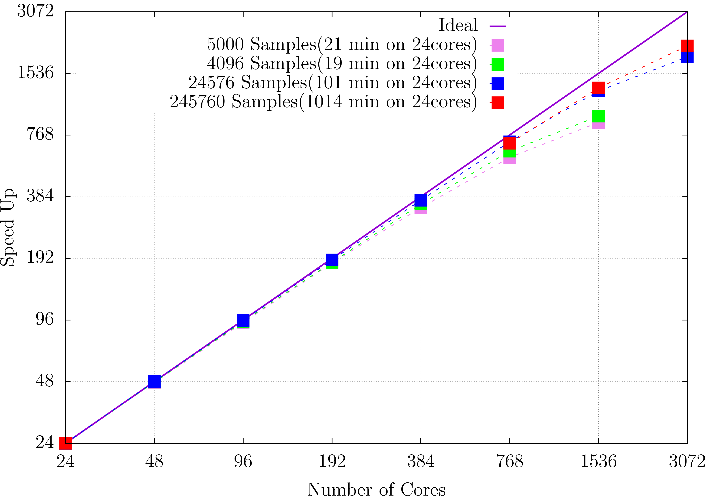
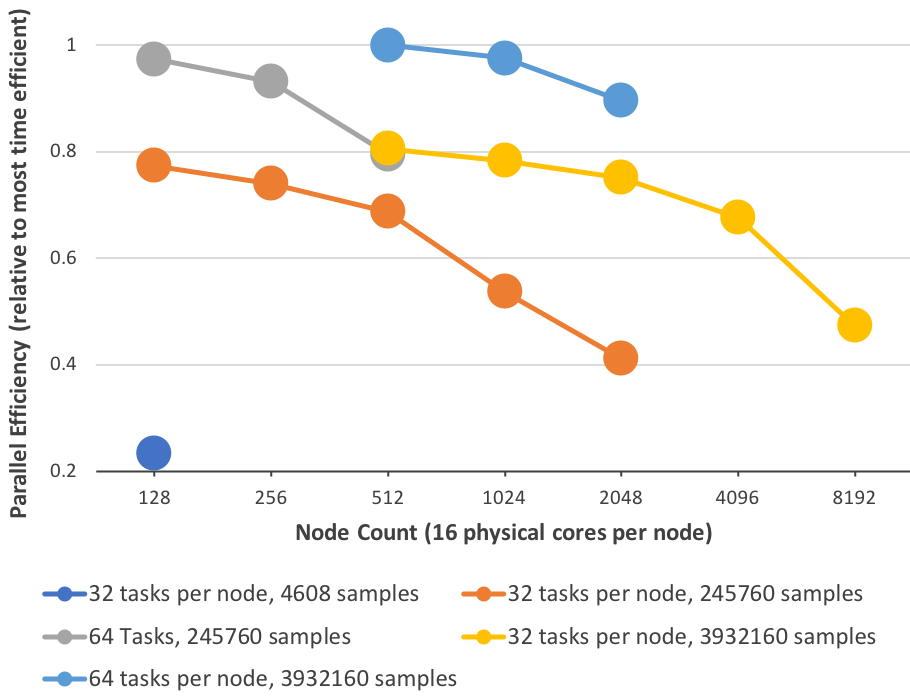

.. _performance:

PaPIM code performance analysis
===============================

Two independent performance analyses of the PaPIM code are reported below. 
They were conducted by Dr. Liang Liang 
(`Maison de la Simulation <http://www.maisondelasimulation.fr/en/index.php?a>`_
and `IDRIS <http://www.idris.fr>`_), and by Dr. Alan O'Cais  
(`Jülich Supercomputing Center <http://www.fz-juelich.de/ias/jsc/EN/Home/home
\_node.html>`_), respectively. 

A strong scaling analysis of the PaPIM code using the 
`Scalasca <http://www.scalasca.org>`_ analysis tools, and the internal 
PaPIM code calculation time outputs was conducted on the :math:`\text{CH}_{5}^{+}` 
system and performed 
on the `JURECA <http://www.fz-juelich.de/ias/jsc/EN/Expertise/Supercomputers/
JURECA/Configuration/Configuration_node.html>`_ 
cluster at the JSC_. 
:ref:`Figure 1 <fig1>` displays the results of the performed tests. 

.. _fig1:

   Figure 1: PaPIM strong scaling test.

A parallel efficiency test was made on the `JUQUEEN <http://www.fz-juelich.de/
ias/jsc/EN/Expertise/Supercomputers/JUQUEEN/Configuration/Configuration_node.html>`_ 
cluster at JSC_ also using the :math:`\text{CH}_{5}^{+}` system. 
Results are displayed in :ref:`Figure 2 <fig2>`.

.. _fig2:

   Figure 2: PaPIM parallel efficiency test.

PaPIM scaling performance increases by increasing the number of sampling points. 

Up to date the PaPIM code has been successfully run on 131,072 processor cores at 
JUQUEEN. 

.. _JSC: http://www.fz-juelich.de/ias/jsc/EN/Home/home\_node.html

