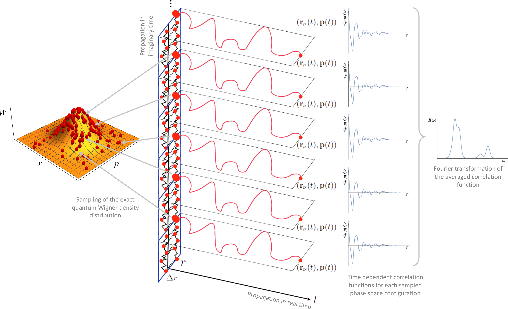

.. _PaPIM:

####################
PaPIM
####################

.. sidebar:: Software Technical Information

  Language
    Fortran 90/95

  Licence
    MIT license (MIT)

  Documentation Tool
    Doxygen

.. contents:: :local:

.. This is an example of what a *module* for E-CAM looks like. Please add to this template any additional items that are
.. straightforward to fill out in the general case. You are free add any level of complexity you wish (within the bounds of
.. what ReST_ can do).

.. To add your module, fork this GitLab repository to your account on GitLab. Clone your repository, make a feature branch
.. and add a directory that will contain your module information. Copy this :download:`readme.rst` file there. Push your
.. changes back to GitLab and immediately open a merge request from your feature branch against our repository. We can
.. discuss your module in the merge request and help you get it accepted.

.. Add technical info as a sidebar and allow text below to wrap around it

Purpose of Module
_________________

PaPIM is a code for calculation of time-dependent correlation functions and sampling of the phase space. 
It samples the phase space either classically or quantum mechanically. 
For the classical sampling of the phase space a Monte Carlo algorithm samples the Boltzmann distribution function, 
while for the quantum sampling a Phase Integration Method (PIM) [Mon1]_ [Mon2]_ is utilized for an exact sampling of the quantum 
Wigner density distribution. 
From the sampled phase space points trajectories are propagated in time using classical molecular dynamics 
in order to obtain the corresponding time-dependent correlation functions. 
The code is design in a way for the user to easily coupled it with its own external potential energy code/library 
and/or correlation functions subroutines. 
Example external subroutines are provided for the :math:`\text{OH}` and :math:`\text{CH}_{4}` systems, respectively, whose corresponding 
potential energies are described by the harmonic potential, 
while the electric dipole moments by point charge approximation. An external subroutines for calculation of 
:math:`\text{CH}_{5}^{+}` system potential energy and electric dipole moment, based on fitted values,[Jin]_ is also given. 
The electric dipole moment operator is currently implemented into the code for calculation of the 
electric dipole moment autocorrelation functions from which system IR spectra can be directly obtained. 


Phase Integration Method (PIM)
______________________________

The Phase Integration Method (PIM) is a novel approximate quantum dynamical technique developed for computing 
systems time dependent observables. [Mon1]_ [Mon2]_ [Beu]_ 
PIM employs an algorithm in which the exact sampling of the quantum thermal Wigner density is combined 
with a linearized approximation of the quantum time propagators represented in the path integral formalism 
that reduces the evolution to classical dynamics. The quantities of interest can then be computed by combining 
classical molecular dynamics algorithms with a generalized Monte Carlo sampling scheme for sampling of the 
initial conditions and averaging them over all sampled points in phase space. 




Applications of the Module
__________________________

The PaPIM code has been extensively used for the calculation of the :math:`\text{CH}_{5}^{+}` system infrared absorption 
spectrum in the gas phase. 
These calculations also provided the benchmark of the PIM method as well as the code performance analysis. 
The results obtained on the :math:`\text{CH}_{5}^{+}` system are currently under preparation for publication. 
At the moment, one master thesis was made by applying the code. 
Investigations of the processes shaping the infrared spectrum of small water cluster systems and a protoneted 
water dimer system are currently being investigated using the PaPIM code. 


Compiling
_________

Fortran compiler with a MPI wrapper together with lapack libraries have to be available to successfully compile the code. 
The user is advise to examine the Makefile in the ``./source``` sub-directory prior to code compilation in order to
select an appropriate compiler and to check or adapt the compiler options to his local environment, or to generally
modify the compiler options to his requirements.

::

	cd source

	make

Upon adapting the ``Makefile``, the code compilation is executed by command ``make`` in the ``./source`` sub-directory.
An executable ``PaPIM.exe`` is created upon successful compilation.
For PaPIM test purposes the ``numdiff`` package should be made available before running the tests. 
In case the numdiff is not available on the system the ``diff`` command will be automatically used instead. 
The user is advise to download and install numdiff from `here <http://www.nongnu.org/numdiff/>`_.
The PaPIM documentation can be obtained by executing the ``make`` command in the ./doc sub-directory.


Testing
_______

Tests and corresponding reference values are located in sub-directories ``./tests/``. The tests are performed over 
three systems, the :math:`\text{OH}`, :math:`\text{CH}_{4}` and :math:`\text{CH}_{5}^{+}`. They are located in their corresponding sub-directories, 
``oh``, ``ch4`` and ``ch5``, 
where each sub-directory contains corresponding classical and quantum input files located in ``CLASSICAL`` and ``QUANTUM`` 
sub-directories, respectively. 
Before running the tests the code has to be properly compiled by running the ``make`` command in the 
``./source`` sub-directory. 
The numdiff package is used for automatic comparison purposes and should be made available before running the tests, 
otherwise the diff command will be used automatically instead but the user is warned that the test might fail 
due to numerical differences. 
The tests are performed automatically by executing the command ``./test.sh`` in the ``./tests`` sub-directory 
for all three systems:

::

	cd tests

	./test.sh [number of cores]

Tests are by default performed using two processor cores, which can be changed by setting the value of required 
cores as an integer number after the command ``./test.sh`` (example ``./test.sh 20``, for the use of 20 processor 
cores in the test). The number of processor cores should not exceed 20. 
Due to small numerical discrepancies between generated outputs and reference values which can cause the tests to fail, 
the user is advise to manually examine the numerical differences between generated output and the corresponding 
reference values in case the tests fail. 


Performance and benchmarking
----------------------------

PaPIM is designed as a highly scalable code. Its performance was extensively testes. More information can be 
found at this :doc:`link<performance>`.


Source Code
___________

The PaPIM module source code can be obtained from: https://gitlab.e-cam2020.eu:10443/Quantum-Dynamics/PIM/tree/master/source.


Source Code Documentation
_________________________

The source code documentation is given at this `link <https://gitlab.e-cam2020.eu:10443/Quantum-Dynamics/PIM/tree/master/doc>`_.
The documentation files (html and latex format) are obtained by executing the ``make`` command in the ./doc directory:

::

	cd ./doc

	make


References
__________

.. [Mon1] M. Monteferrante, S. Bonella, G. Ciccotti *Mol. Phys.* **109** (2011) 3015 `DOI: 10.1080/00268976.2011.619506
          <http://dx.doi.org/10.1080/00268976.2011.619506>`_
.. [Mon2] M. Monteferrante, S. Bonella, G. Ciccotti *J. Chem. Phys.* **138** (2013) 054118 `DOI: 10.1063/1.4789760
          <http://dx.doi.org/10.1063/1.4789760>`_
.. [Beu] J. Beutier, M. Monteferrante, S. Bonella, R. Vuilleumier, G. Ciccotti *Mol. Sim.* **40** (2014) 196 `DOI: 
         10.1080/08927022.2013.843776 <http://dx.doi.org/10.1080/08927022.2013.843776>`_
.. [Jin] Z. Jin, B. Braams, J. Bowman *J. Phys. Chem. A* **110** (2006) 1569 `DOI: 10.1021/jp053848o 
         <pubs.acs.org/doi/abs/10.1021/jp053848o>`_


