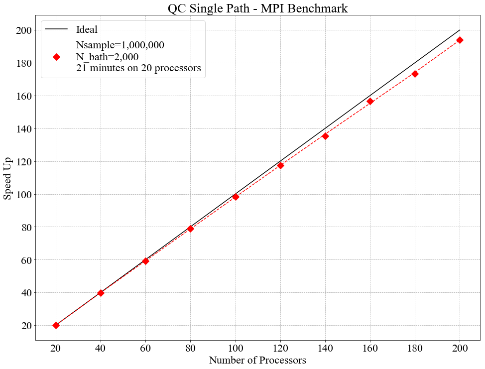

.. _SinglePath:

########################################################################
Trotter Based Quantum Classical Surface Hopping Propagator - Single Path
########################################################################

..  sidebar:: Software Technical Information

  Language
    C++ (C++11 or higher)

  Licence
    MIT licence (MIT)

  Documentation Tool
    Doxygen
    
  Application Documentation
    `Documentation <https://gitlab.e-cam2020.eu/Quantum-Dynamics/Surface-Hopping/blob/master/Doc/html/index.html>`_

  Relevant Training Material
    Not currently available   

  Software Module Developed by
    Sean Kelly, Athina Lange, Philip McGrath, Shrinath Kumar and Donal MacKernan

..  contents:: :local:

Abstract
________
The present module is a highly refactored version of a code based on a highly cited algorithm published by 
D. Mackernan, G.Ciccotti and R. Kapral [Mackernan]_.  
The module software has been entirely refactored in modern C++ (GNU 2011 or higher) so as to: (a) run with high-efficiency on massively parallel platforms 
under OpenMP or MPI; and (b) be at the core of additional software modules aimed at addressing important issues such as improving the speed of convergence of 
estimates using correlated sampling, and much more realistic treatment of the classical bath, and connecting to other problems such as constant pH simulation 
through an effective Hamiltonian.

Purpose of Module
_________________
Quantum rate processes in condensed phase systems are
often computed by combining quantum and classical descriptions of
the dynamics including non-adiabatic coupling, using propagators which
amount to quantum path integrals in a partial Wigner phase space representation, such as
the mixed quantum-classical Dyson equation and variants thereof, or the Trotter decomposition of the quantum-classical propagator.  

Background Information
______________________
An understanding of the dynamical properties of condensed phase
quantum systems underlie the description of a variety of quantum
phenomena in chemical and biological systems. 
The development of schemes for the efficient and
accurate simulation of the quantum dynamics of such systems is an
an active area of research in chemical physics, and is essential 
if problems of chemical interest involving
complex molecular species in the condensed phase are considered.

In investigations of the dynamical properties of quantum
statistical mechanical systems, one is often interested in the
average value of some operator when the system evolves from a
given initially prepared distribution described by the density
matrix :math:`\hat{\rho}(0)`. In such cases the quantum mechanical
average value of an operator :math:`\hat{B}` is given by
:math:`\overline{B(t)}= Tr \hat{B} \hat{\rho}(t)= Tr\hat{B}(t) \hat{\rho}(0)`. Here,
:math:`\hat{B}(t)` evolves in time through the Heisenberg equation of motion.
In many applications, it is useful to partition the system into a subsystem and
a bath. A phase space description of the bath can be obtained by
taking a partial Wigner transform over the bath coordinate :math:`\{Q\}` representation
of the full quantum system. In this partial Wigner representation the expectation value of :math:`\hat{B}(t)` takes the

.. math::
   \overline{B(t)}=  Tr' \int dR dP\;  {B}_W(R,P,t) {\rho}_W(R,P)

where the prime on the trace indicates a trace over the subsystem
degrees of freedom. 

The software module developed here is based on a Trotter-based scheme for simulating
quantum-classical Liouville dynamics in terms of an ensemble of surface-hopping trajectories. The method can be used to compute the dynamics for longer times with fewer trajectories than the
sequential short-time propagation (SSTP) algorithm, which is also based on surface-hopping trajectories. The full derivation of the algorithm is given in [Mackernan]_. 
Here the software focus is to refactor the original code which until now was a purely serial so that it can be used efficiently on massively parallel machines. For mathematical details, 
we refer the reader to eq.30-35 of the paper.

Applications
____________
The applications of quantum surface hopping include, among others, non-adiabatic chemical rate processes
involving electronic, vibrational or other degrees of freedom, decoherence in open quantum systems and quantum transport
processes. Decoherence due to coupling with the environment is a fundamental difficulty in the development of quantum computing. The ability
to predict, control and reduce decoherence requires an adequate description of the associated non-adiabatic processes taking place.
Quantum effects and frequently non-adiabaticity also underlie the study of ultra-fast rate processes in solution.

Algorithms and Software Implementation
______________________________________
The current Single Path code has three main advantages over the original version. First it is separated into files based on function for better readability.
For example the 'transition_matrix.cpp' file is where the transition matrix and associated functions are defined, etc. Secondly input parameters are read from
an Input file, so the code no longer needs to be recompiled to adjust these parameters. And finally the code has been altered to run in parallel which allows for 
a significant reduction in runtime.

Compiling
_________
All current versions of this code use the `GNU scientific library <https://www.gnu.org/software/gsl>`_ version 2.5 for random number generation.

OpenMP version:

With the GNU compiler, gcc version 6.3.0 or greater is required.

On the Kay cluster this can be done as follows:

::

    module load gcc/8.2.0
    module load gsl/gcc/2.5

::

	Compile command;
	g++ -o run main.cpp bath_setup.cpp density.cpp propagation.cpp transition_matrix.cpp opt_parser.cpp -lgsl -lgslcblas -lm -fopenmp -std=c++11

	Run command:
	export OMP_NUM_THREADS=[number of OpenMP threads]; ./run Input

With the Intel compiler:

::

	Compile command;
	icpc -o run main.cpp bath_setup.cpp density.cpp propagation.cpp transition_matrix.cpp opt_parser.cpp -lgsl -lgslcblas -lm -qopenmp -std=c++11

	Run command:
	export OMP_NUM_THREADS=[number of OpenMP threads]; ./run Input

-----------------------------------

MPI version:

::

    module load intel/2018u4
    module load gsl/intel/2.5
    module load gcc/8.2.0

::

	Compile command;
	mpic++ -o run main.cpp bath_setup.cpp density.cpp propagation.cpp transition_matrix.cpp opt_parser.cpp -lgsl -lgslcblas -lm -std=c++11

	Run command:
	mpirun -n [number of MPI processors] ./run Input

Errors:

A frequent error encountered while compiling is:
"fatal error: gsl/gsl_rng.h: No such file or directory"

This can occur if the directory is not installed on the standard search path of the compiler. It can be fixed by adding it's location as a flag in the compile command as exaplained in this link: 
`Using the GSL Library <https://www.gnu.org/software/gsl/doc/html/usage.html>`_. 

On Kay the flags '-I/ichec/packages/gsl/gcc/2.5/include' and '-L/ichec/packages/gsl/gcc/2.5/lib' must be added to the compile command as:

::

    g++ -o run main.cpp bath_setup.cpp density.cpp propagation.cpp transition_matrix.cpp opt_parser.cpp -lgsl -lgslcblas -lm -fopenmp -std=c++11 -I/ichec/packages/gsl/gcc/2.5/include -L/ichec/packages/gsl/gcc/2.5/lib

Checking for accuracy
_____________________
The original serial code was run 1000 times to generate an expected output and variance. These can be found in the ./Regression_testing sub-directory. 
A regression test is built into both the OpenMP and MPI versions which checks if their output is within five standard deviations
of the expected output (given a specific set of input parameters). If any part of the output goes outside that limit the regression test will fail. 
(Note: To run a test 'Regression_test=1' must be set in the Input file along with a standard set of parameters. All of this is specified in the Input file).

Testing, Performance and Scaling
________________________________
Testing was performed on the Kay supercomputer from ICHEC. Kay is separated into nodes, each of which has 2 x (20 core) sockets. To test the parallel efficiency of both the OpenMP and MPI versions
of the code they were benchmarked on 20 - 200 cores (1 - 5 nodes).

The OpenMP version was run for 10,000,000 samples (Nsample = 10,000,000) and for a bath size of 200 (N_bath = 200). As can be seen in the graph below OpenMP scales perfectly on a single node (i.e. less than 40 cores), but provides little to no benefit over multiple nodes.

The MPI version was run for 1,000,000 samples (Nsample = 1,000,000) and for a bath size of 2,000 (N_bath = 2,000). 
MPI scales very well over the entire benchmark (up to 200 cores), with an average efficiency of 96.3%.
   

Source Code
___________

The source codes for the OpenMP and MPI versions of the code are: 
`OpenMP <https://gitlab.e-cam2020.eu/Quantum-Dynamics/Surface-Hopping/tree/master/Code_Parallel_Omp>`_, 
`MPI <https://gitlab.e-cam2020.eu/Quantum-Dynamics/Surface-Hopping/tree/master/Code_Parallel_MPI>`_.

Source Code Documentation
_________________________

The source code documentation is given at https://gitlab.e-cam2020.eu/Quantum-Dynamics/Surface-Hopping/tree/master/Doc.
These documentation files can be updated by executing the ``make`` command in the ``Doc`` directory.

References
__________

.. [Mackernan] D.Mackernan, G.Ciccotti, R.Kapral, `Trotter-Based Simulation of Quantum-Classical Dynamics`_, *J. Phys. Chem. B*, **2008**, 112 (2), pp 424-432.

.. _Trotter-Based Simulation of Quantum-Classical Dynamics: http://dx.doi.org/10.1021/jp0761416