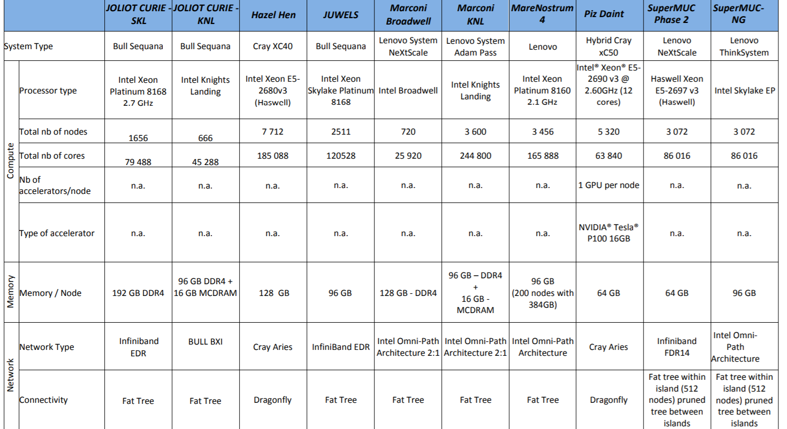

.. _hpc_resources:

Accessing HPC Resources in Europe
---------------------------------

As far as the Partnership for Advanced Computing in Europe (PRACE) initiative is concerned, the complete list of
available resources are shown in the figure below.

Access to PRACE resources can be obtained by application to the `PRACE calls <http://www.prace-ri.eu/call-announcements/>`_.

Moreover, the Distributed European Computing Initiative (DECI) is designed for projects requiring access to resources
not currently available in the PI’s own country but where those projects do not require resources on the very largest
(Tier-0) European Supercomputers or very large allocations of CPU. To obtain resources from the DECI program,
applications should be made via the `DECI calls <http://www.prace-ri.eu/deci-13-call/>`_.
