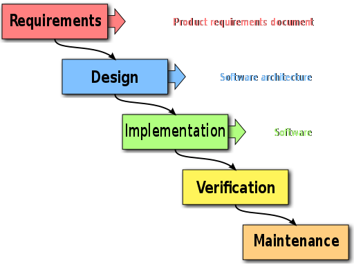

.. E-CAM documentation master file, created by
   sphinx-quickstart on Thu Sep 15 17:56:17 2016.
   You can adapt this file completely to your liking, but it should at least
   contain the root `toctree` directive.

.. _best_practices:

==================================
Scientific Software Best Practices
==================================

.. sidebar:: General Information

    .. contents:: :local:

    * :ref:`contributing`
    * :ref:`search`

This text is not meant to be a set of rules, but a set of guidelines that have been formed on the basis of
hard-earned experience. We welcome contributions from anyone, anywhere on any of the topics discussed here. The home
repository for this documentation is within the `E-CAM Software Library
<https://gitlab.e-cam2020.eu/e-cam/E-CAM-Library>`_.

It began as a starting point for guidelines for contributions to the Extended Software Development Workshops (ESDWs)
of E-CAM but can be considered as a collection of best practice advice for scientific software development.
The scope of these workshops was always expected to vary significantly depending on the research area, as well as over
the project lifetime. For this reason the document itself is quite broad and (in many places) introductory in nature.

General Programming Guidelines
==============================

Firstly let us consider some guidelines that are applicable regardless of the type of software project you are working
on.

.. Let's start here

.. toctree::
    :glob:
    :maxdepth: 3

    ./general/general_programming_guidelines

Programming for an HPC Environment
==================================

Due to the nature of the HPC environment (novel hardware, latest techniques, remote resources,...). There are many
specific things that need to be considered that impact the software development process.

.. toctree::
    :glob:
    :maxdepth: 3

    ./hpc/hpc_programming_guidelines

.. * Software
..    * Programming Paradigms
..    * Languages
..    * Applications and Libraries
..    * Portability and Optimisation
..    * Scalability
..    * Reproducability
.. * Hardware
..    * General Architecture
..    * Where is the compute power on modern HPC machines?
..    * Memory
..    * I/O
.. * Workflow
..    * Acquiring resources (getting compute time)
..    * Accessing resources (ssh, gui's,...)
..    * Resource management (slurm, UNICORE, ...)
..    * Moving data
