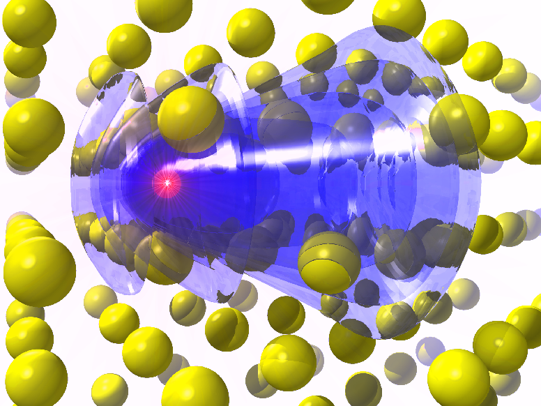

.. E-CAM documentation master file, created by
   sphinx-quickstart on Thu Sep 15 17:56:17 2016.
   You can adapt this file completely to your liking, but it should at least
   contain the root `toctree` directive.

.. _readme:

**************************
The E-CAM Software Library
**************************

.. sidebar:: Scientific Areas

    * :ref:`readme_classical_md`
    * :ref:`readme_electronic_structure`
    * :ref:`readme_quantum_dynamics`
    * :ref:`readme_meso_multi`   

    **Best Practices**

    * :ref:`best_practices`

    **Quicklinks**

    .. contents:: :local:

    * :ref:`search`

This is a collection of the software modules that have been documented by E-CAM_ (http://www.e-cam2020.eu) community
within the four initial target areas of E-CAM_:

.. toctree::
    :maxdepth: 1

    ./Classical-MD-Modules/index
    ./Electronic-Structure-Modules/index
    ./Quantum-Dynamics-Modules/index
    ./Meso-Multi-Scale-Modelling-Modules/index
 

What is a module?
=================

In the context of E-CAM_, the definition of a software module is any piece of software that could be of use to the
E-CAM_ community and that encapsulates some additional functionality, enhanced performance or improved usability for
people performing computational simulations in the domain areas of interest to us.

This definition is deliberately broader than the traditional concept of a module as defined in the semantics of most
high-level programming languages and is intended to capture inter alia workflow scripts, analysis tools and test suites
as well as traditional subroutines and functions. Because such E-CAM_ modules will form a heterogeneous collection we
prefer to refer to this as an E-CAM_ software repository rather than a library (since the word library carries a
particular meaning in the programming world). The modules do however share with the traditional computer science
definition the concept of hiding the internal workings of a module behind simple and well-defined interfaces. It is
probable that in many cases the modules will result from the abstraction and refactoring of useful ideas from existing
codes rather than being written entirely de novo.

Perhaps more important than exactly what a module is, is how it is written and used. A final E-CAM_ module adheres to
current best-practice programming style conventions, is well documented and comes with either regression or unit tests
(and any necessary associated data). E-CAM_ modules should be written in such a way that they can potentially take
advantage of anticipated hardware developments in the near future (and this is one of the training objectives of
E-CAM_).

Scientific Software Development Best Practices
----------------------------------------------

We have attempted to gather a set of best practice guidelines for scientific software development in order to assist
people to develop high quality modules. These guidelines are not specific to E-CAM and gather together best practices
from a number of different sources that can help increase the quality and reusability of the software developed by
scientists.

.. toctree::
    :maxdepth: 1

    ./best-practices/index

E-CAM Activities
================

The software stored in E-CAM_ repositories is developed via two main activities: the work of post-docs in the context of
*pilot projects* with industrial partners; and the work of the participants at *Extended Software Development Workshops*
(ESDWs).

Pilot Projects
--------------

One of primary activity of E-CAM_ is to engage with pilot projects with industrial partners. These projects are conceived
together with the partner and typically are to facilitate or improve the scope of computational simulation within the
partner. The related code development for the pilot projects are open source (where the licence of the underlying
software allows this) and are described in the modules associated with the pilot projects.

Below is a list of the current pilot projects within E-CAM_:

* :ref:`readme_classical_md`

  * `Binding kinetics <https://www.e-cam2020.eu/pilot-project-biki/>`_
  * `Food Proteins <https://www.e-cam2020.eu/pilot-project-food-proteins/>`_

* :ref:`readme_electronic_structure`

  * `Calculations for Applications in Photovoltaic Devices <https://www.e-cam2020.eu/pilot-project-merck/>`_
  * `Quantum Mechanical Parameterisation of Metal Ions in Proteins <https://www.e-cam2020.eu/pilot-project-biki-2/>`_
  * Wannier90

* :ref:`readme_quantum_dynamics`

  * `Quantum Computing <https://www.e-cam2020.eu/pilot-project-ibm/>`_

* :ref:`readme_meso_multi`

  * `Polarizable Mesoscale Models <https://www.e-cam2020.eu/pilot-project-unilever/>`_
  * `Rheological Properties of New Composite Materials <https://www.e-cam2020.eu/pilot-project-michelin/>`_
  * `The GC-AdResS scheme <https://www.e-cam2020.eu/pilot-project-gc-adress/>`_

Extended Software Development Workshops
---------------------------------------

E-CAM_ carries out 2 week software development workshops. These workshops train scientists in the development of modular
codes for high performance machines. Documentation and testing are key components of the workshops and the associated
on-line manuals and test cases are made available through the E-CAM_ module library. ESDWs are open to postdocs, senior
graduate students and early career researchers in industry and academia. E-CAM_ carries out 4 ESDWs per year on each of
the four scientific areas, with a maximum 2 weeks duration. For more information see http://www.e-cam2020.eu/events/

Contributing to this documentation
==================================

This documentation is created using ReStructured Text and the git repository for the documentation source files can be
found at https://gitlab.e-cam2020.eu/e-cam/E-CAM-Library which are open to contributions from anyone in the E-CAM_
community. If you would like to contribute to this effort then please follow the contribution guidelines that are
linked here to allow us to include your contribution.

.. toctree::
    :glob:
    :maxdepth: 1

    ./contributing

.. _E-CAM: https://www.e-cam2020.eu/

